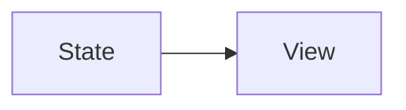
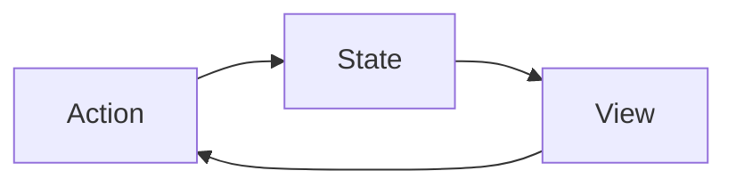
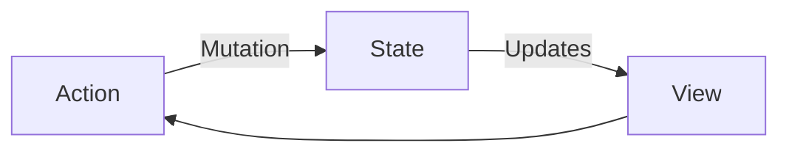
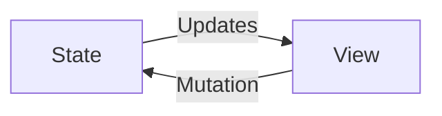
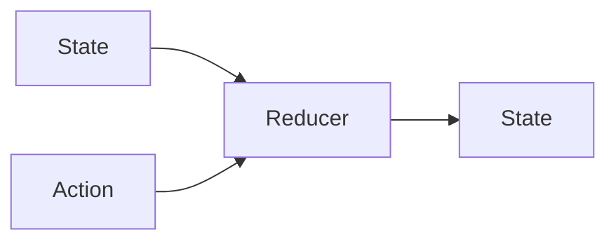
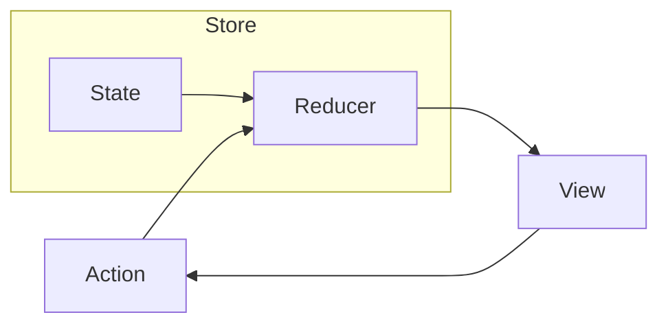

# ImmutableData

Before we open Xcode and start working, let’s begin with a little strategy and philosophy about what we are trying to build and how we plan to build it.

This tutorial project is meant to be “hands on”: instead of giving you the infra and then showing you how to use it, we start by building the infra from scratch *à la* [*Build Yourself a Redux*][^1]. After building the *infra* together, we shift our attention to building *products* with that infra.

We have a few principles we want to keep in mind while engineering together:

* We write code from scratch. There will be a few times that we present the option to import a new open-source library or external dependency, but these are for specialized tasks, like building a local HTTP server to simulate a network response, or specialized data structures for improving performance at scale. The core `ImmutableData` infra does not require any external dependencies: it’s just you and the Apple SDK.

* We prefer simple code instead of less code. We are not optimizing for total lines of code when we work. We are optimizing for clearly communicating to engineers what this code is doing. We want to choose efficient data structures and algorithms, but we don’t look for opportunities to write “clever” code if simple code runs at the same time and space complexity.

* Our infra should be lightweight, and the API our products use to communicate with that infra should also be lightweight. We aren’t trying to “fight the framework” with syntax or design that feels out of place with “traditional” SwiftUI applications. Our goal is to teach a new way of thinking about state management and data flow for SwiftUI. That does not mean you should have to un-learn or throw away the knowledge you already have. Most of what you already know will transfer over to this “new” way of thinking about things. You already know how to put SwiftUI on screen; what we’re teaching is a new way of getting the events *out* of SwiftUI and turning those events into transformations on your state.

* Our `ImmutableData` infra will deploy to any Apple platform that supports SwiftUI. To save ourselves some time, our sample application products will build SwiftUI optimized only for macOS. Learning how to build SwiftUI in a way that is optimized for multiple platforms is an important skill, but this is orthogonal to our goal of teaching a new way of thinking about state management and data flow. You are welcome to use our macOS sample application products as a starting point if you would like to build SwiftUI products that are also optimized for iOS, iPadOS, tvOS, visionOS, or watchOS.

* We write code that is testable, but we don’t teach you how to write tests. We like unit testing,[^2][^3] but we understand that some of you might have different opinions or learning styles when it comes to engineering. Instead of teaching engineers how to build this infra and these products *and* the tests that go along with them, we give engineers the opportunity to write as many tests as they choose. The `main` branch and the `chapter` branches of the [`ImmutableData-Samples`](https://github.com/Swift-ImmutableData/ImmutableData-Samples) repo contain the completed tests. You are welcome to reference our tests if you would like to see for yourself how an engineer might test a product built on `ImmutableData`.

* This project is intended to be completed linearly: from beginning to end. You are welcome to complete every chapter at your own pace, but each chapter will build on what we learned previously. If you skip ahead, you might lose some important context or insight and the tutorial might be more challenging than we intended.

After completing this tutorial, we will have built multiple Swift Modules together. These modules are our “infra”, the shared libraries that are used to build sample applications, and our “products”, the sample applications that depend on our shared libraries. Here is what we are going to build:

* `ImmutableData`: This is the “data” infra module to power our `ImmutableData` architecture. This module builds the `Store` where we save our global application state.
* `ImmutableUI`: This is the “UI” infra module that we use to read from and write to our `Store` from SwiftUI.
* `Counter`: This is a sample application product similar to a “Hello World” for our `ImmutableData` architecture. This application is very simple, but is good practice to see the architecture in action before we build more complex products.
* `Animals`: This is a sample application product cloning the Animals SwiftUI sample application from Apple.[^4] The application from Apple demonstrates how to read and write model data to a SwiftData store. We rebuild this application using the `ImmutableData` infra and architecture. In addition to persisting data on disk across app launches, we also demonstrate how the `ImmutableData` architecture can read and write model data to a remote server.
* `Quakes`: This is a sample application product cloning the Quakes SwiftUI sample application from Apple.[^5] The application from Apple demonstrates fetching data from a remote server and caching that data locally using SwiftData. We rebuild this application using the `ImmutableData` infra and architecture.

We’re almost ready to get started. The recommended approach is to clone the `ImmutableData-Samples` repo and checkout the `chapter-00` branch. From this commit, you have the option to open `Workspace.xcworkspace` for a starting point to begin our engineering. The workspace is a collection of modules and application projects. To save ourselves some time and stay focused on teaching the `ImmutableData` architecture, these modules and application projects are already configured with the correct dependencies between each other. When it is time to add new types to a module, all we have to do is add a new file in the correct place.

Every chapter in this tutorial is focused on a different module. Think of these like a series of pair-programming sessions. Once you open the Workspace from the `ImmutableData-Samples` repo, we can focus our attention on the module we work through in that chapter.

Once you clone the `ImmutableData-Samples` repo locally, you have the option to view the completed project from the latest `main` commit. You also have the option to view the completed work for every chapter: the `chapter-01` branch contains all the work needed to complete `Chapter 01` in the book. Referencing the repo as you complete chapters also gives you the opportunity to view the complete unit tests which you have the option to use as a starting point for writing unit tests against the `ImmutableData` architecture in your own products.

## Store

The `Store` class will save the current state of our data models. Our `Store` class is a long-lived object. You might think of a `Store` as behaving similar in some ways to a `ModelContext` from SwiftData. Unlike `ModelContext`, we expect applications to build just one `Store` instance for every app lifecycle, but you can create multiple instances when testing.

Our `Store` instance will be our “source of truth” for all global state in our application. This does *not* mean our `Store` instance will need to be the source of truth for ephemeral, local, or component state. Building our sample applications will give us practice choosing what state belongs in `Store` and what state can be saved directly in our SwiftUI component tree.

Before we write some code, let’s learn a little more about some of the basic types that we use to model and transform our global state over time. Our `ImmutableData` architecture is inspired by Flux and Redux. While we do not assume any prior experience with Flux and Redux before beginning this tutorial, you might want to familiarize yourself with the basic ideas behind these architectures before we build `ImmutableData`. We recommend [*The Case for Flux*][^6] by Dan Abramov and [*A Cartoon Intro to Redux*][^7] by Lin Clark to learn more.

### State

Our `Store` class is responsible for saving a State value: this is the source of truth for all global state at a moment in time. This data model is a graph of immutable data structures: we build State by composing Swift value types like `struct` and `enum`.



In SwiftUI, our View can be thought of as a function of State. Our components define a `body` property to construct a declarative description of our UI at this moment in time. It is the responsibility of the infra engineer building SwiftUI to map those declarative descriptions to View objects. When our State updates, our component recomputes our `body` property.

For this chapter, our State value is where we keep global state. We continue to keep local state saved directly in our component tree. Suppose we were building an application similar to the Contacts application on macOS. A `Person` data model might represent one person in our application. A customer opening our application would expect changes to their saved contacts to persist across app launches. A customer would also expect that opening their saved contacts in multiple windows would display the same contacts. This implies that our `Person` data models are what we call global state. While our customer opens their saved contacts in multiple windows, our customer has the ability to display the same contacts in different ways. One window may sort contacts by first name, another window may sort contacts by last name, and another window may filter contact names with a matching substring. These are examples of local state. This state will be saved in our SwiftUI component tree using the conventional patterns (like `SwiftUI.State` and `SwiftUI.Binding`) you are already familiar with.

When we build our sample application products, we will see how we build different State types which are customized for specific product domains. For now, our goal is to build an infra generalized across *any* State type; we build infra in a way that can be shared across multiple products.

Our State serves a similar role as the State type in Redux.[^8]

### Action

In a SwiftUI application using SwiftData, our data models were objects that could be mutated directly from our component tree using imperative logic. Let’s try and “think declaratively” and rebuild our mental model for mapping important events to transformations on our source of truth.

Using SwiftData, you might build a Contacts application that displays a detail component for one person. This detail component might have the ability to add or edit information on one person. You might have the ability to add or edit an email address, a phone number, or a name. These user events are then mapped at the component level to imperative instructions on the `Person` reference. Your “functional” and “declarative” programming model for building and updating this component tree with SwiftUI is then paired with a “object-oriented” and “imperative” programming model for building and updating your graph of data models with SwiftData.



In applications built from SwiftUI, we want data to flow in one direction: this helps product engineers write code that is simple, predictable, easy to reason about, and easy to make changes to. We pass our State to our Component to render a View. Our View responds to a User Event with an Action. Our Action performs a mutation on our State. Our new State then updates our Components to render a new View.



Let’s think through one important step: How exactly does an Action perform a mutation on our State? The earliest public demos of React built a simple application to increment and decrement an integer value. The earliest public demos of SwiftUI built a simple application to toggle a boolean value. What these early demos have in common is that our View responds to a User Event with an imperative mutation. The product engineer building the component builds the imperative logic to mutate State directly in the component itself.



At this point, we are leveraging a functional and declarative programming model for building and updating our component tree, but we are leveraging an object-oriented and imperative programming model for building and updating our global state.

Our approach for building the `ImmutableData` architecture is inspired by Flux and Redux. Instead of our component tree mutating our global state with imperative logic, our component tree *declares* when user events happen. At the data layer of our products, these user events then become the imperative instructions that lead to a transformation of global state.

Our user events, such as a SwiftUI button component being tapped, are instances of Action types, but Action types are not limited to user events. Action types could represent system events like a location alert when moving your device, server events like an incoming push notification or web-socket message, or other events like timers.

We model Action types as immutable data structures. Our Action types can contain context and payloads that carry information from the component tree. When thinking about Action types, try not to think about Action types as “replacements” for imperative mutations on state. An Action type declares an event that just took place; we map that event to a transformation on state using our next type.

Similar to State, we build our infra generalized across any Action type; we will see concrete examples of what Action values look like when we build our sample application products.

Our Action serves a similar role as the Action type in Redux.[^9]

### Reducer

When our Actions were imperative mutations, the product engineer building the component builds the imperative logic to mutate State directly in the component itself. When our Actions are declarative, we still need some place to define that imperative logic.

Let’s think back to our mental model for Views: our View can be thought of as a function of State. Let’s think about a similar approach for State. If we pair a State with an Action, let’s construct a function to define the imperative logic we need to transform our State.



Our Reducer is a pure function with no side effects that maps from a State and an Action to a new State.

This is the “Fundamental Theorem of `ImmutableData`” and the most important concept in Redux. The job of a Reducer is to use Action values to transform State over time. Because our State is an immutable value type, we don’t mutate that State in-place; we return a new State value. Because our Reducer is a pure function with no side effects, our Reducer is deterministic, stable, and predictable.

We can now begin to visualize how the global state of our contacts application is transformed over time. We begin with a State type. This is an immutable value type. Let’s assume every `Person` in our contacts application is assigned a unique `id` property. We can then model our global state with a `Dictionary` where keys are the set of all `id` properties and values are the set of all `Person` values.

We can visualize a person detail component which displays the name of a `Person` value. Our `Person` is an immutable value type: unlike a `SwiftData.PersistentModel`, we don’t have the ability to mutate our global state with imperative logic when the user edits the name in our detail component. Instead, we forward an Action to our Reducer. Our Action tells our Reducer what just happened: “the user did tap the edit person button”. Our Action also tells our Reducer any important information like the `id` of the `Person` and new `name` value. With a `Dictionary` value as our current source of truth, our Reducer can then transform that source of truth into a new global state: a new `Dictionary` value.

Our product engineer will construct the actual Reducer function needed for our product domain. Our infra is generalized across any Reducer function.

Our Reducer serves a similar role as the Reducer function type in Redux.[^10]

### Store

Our State and Action types are immutable value types. Our Reducer is a pure function with no side effects. Our global state is displayed across multiple components and even multiple windows; we need a long-lived object to save a State value to represent the state of our system at a moment in time. This will be our `Store` class.



Here are some of the basic behaviors we want a `Store` class to implement:

* We want to save a State value to represent the state of our system at a moment in time.
* We want to give product engineers the ability to dispatch an Action value when an important event occurs. The current state of our system and the action are passed to a Reducer to determine the next state of our system.
* We want to give product engineers the ability to select an arbitrary slice of state at a moment in time and apply an arbitrary transformation to that slice of state.
* We want to give product and infra engineers the ability to listen as new Action values are dispatched to the `Store`.

With these four behaviors, we can build a whole new architecture for delivering global state to SwiftUI. We can build an architecture that is predictable, testable, and scalable.

Our `Store` serves a similar role as the `Store` type in Redux.[^11]

---

We’re ready to start engineering. Let’s open `Workspace.xcworkspace` and build our first type. Select the `ImmutableData` package and add a new Swift file under `Sources/ImmutableData`. Name this file `Store.swift`:

```text
ImmutableData
├── Sources
│   └── ImmutableData
│       ├── ImmutableData.swift
│       └── Store.swift
└── Tests
    └── ImmutableDataTests
        └── ImmutableDataTests.swift
```

Here’s the first step to building our `Store`:

```swift
//  Store.swift

@MainActor final public class Store<State, Action> : Sendable where State : Sendable, Action : Sendable {
  private var state: State
  private let reducer: @Sendable (State, Action) throws -> State
  
  public init(
    initialState state: State,
    reducer: @escaping @Sendable (State, Action) throws -> State
  ) {
    self.state = state
    self.reducer = reducer
  }
}
```

Our `Store` is a class with two generic type parameters: `State` and `Action`. The only constraints we make on `State` and `Action` are both types must be `Sendable`. Our State and Action will always be immutable value types, but we lack an easy ability to formalize this constraint in Swift 6.0.

Our UI component tree will select arbitrary slices of state to display from our `Store`. These operations will be synchronous and blocking. Isolating our `Store` to `MainActor` gives us an easy way to pass values to component `body` properties which are also isolated to `MainActor`.

Our `Store` initializer takes two parameters: a State and a Reducer. Our sample application products will use this initializer to customize their `Store` for their own domain. A contacts application would have a different `initialState` value than a photo library application. A photo library application would have a different Reducer than a contacts application. This `Store` class is flexible and composable; we can use the same implementation across all our sample application products without subclassing.

## Dispatcher

Let’s think back to the four behaviors we wanted for our `Store`. We already have a type that represents the state of our system: we define `state` as a variable that can change over time. Let’s work on the ability to dispatch an Action when an important event occurs.

Before adding functionality to our `Store` class, let’s begin by defining our new function in a protocol. Add a new Swift file under `Sources/ImmutableData`. Name this file `Dispatcher.swift`.

Here is what our new `Dispatcher` protocol looks like to dispatch an Action when an important event occurs:

```swift
//  Dispatcher.swift

public protocol Dispatcher<Action> : Sendable {
  associatedtype Action : Sendable
  
  @MainActor func dispatch(action: Action) throws
}
```

We can now switch back to `Store` and adopt this new protocol:

```swift
//  Store.swift

extension Store : Dispatcher {
  public func dispatch(action: Action) throws {
    self.state = try self.reducer(self.state, action)
  }
}
```

The `Dispatcher` protocol is at the heart of the `ImmutableData` architecture. This function is the “funnel” that all transformations on global state must pass through.

The `dispatch(action:)` function serves a similar role as the `dispatch(action)` function in Redux.[^12]

Consistent with the philosophy from Redux, our Reducer functions are pure functions and free of side effects. Our Reducer functions are also synchronous and blocking. What if we *did* want to perform some asynchronous work or side effects along with the work our Reducer performs to transform state? How would this architecture scale to products that need to fetch data from a server or persist data to a local database?

We adopt two different approaches from Redux for managing asynchronous work and side effects: *Thunks* and *Listeners*. For now, let’s focus on Thunks; we will cover Listeners in a later section.

Suppose we build our contacts application to perform a network fetch for saved contacts from a remote server. When the remote server returns an array of contacts, we save those contacts as `Person` instances in our State. Our Reducer is not an appropriate place for asynchronous logic, we must perform our network fetch before we dispatch an Action value with the contacts returned by our remote server. We still would like a way to define the work to perform a network fetch together with the work to dispatch an Action when that network fetch returns. This is what we think of as a Thunk.[^13]

Our `Dispatcher` currently accepts an Action. What we would like is the ability to also pass a Thunk closure. This closure could perform synchronous or asynchronous work that includes side effects that would not be appropriate for our Reducer. Here is how we define these new functions:

```swift
//  Dispatcher.swift

public protocol Dispatcher<State, Action> : Sendable {
  associatedtype State : Sendable
  associatedtype Action : Sendable
  associatedtype Dispatcher : ImmutableData.Dispatcher<Self.State, Self.Action>
  associatedtype Selector : ImmutableData.Selector<Self.State>
  
  @MainActor func dispatch(action: Action) throws
  @MainActor func dispatch(thunk: @Sendable (Self.Dispatcher, Self.Selector) throws -> Void) rethrows
  @MainActor func dispatch(thunk: @Sendable (Self.Dispatcher, Self.Selector) async throws -> Void) async rethrows
}
```

Here is how we adopt these functions in our `Store`:

```swift
//  Store.swift

extension Store : Dispatcher {
  public func dispatch(action: Action) throws {
    self.state = try self.reducer(self.state, action)
  }
  
  public func dispatch(thunk: @Sendable (Store, Store) throws -> Void) rethrows {
    try thunk(self, self)
  }
  
  public func dispatch(thunk: @Sendable (Store, Store) async throws -> Void) async rethrows {
    try await thunk(self, self)
  }
}
```

Our `thunk` closures accept two parameters: a `Dispatcher` and a `Selector`. Once we define a `thunk` closure, we can then select slices of state, dispatch actions, and even choose to dispatch new `thunk` closures.

Giving our `Dispatcher` the ability to accept these `thunk` closures is a powerful alternative to dispatching Action values, but there is a philosophical shift in our thinking taking place that will limit how and where we use this ability. One of our goals in building the `ImmutableData` architecture is to think declaratively from our UI component tree. Our `thunk` closures are units of *imperative* logic. We will see places in our sample application products where we do want this ability, but it will not be from our UI component tree. Our UI component tree will continue to dispatch Action values. Instead of our UI component tree telling our data layer *how* to behave when an important event occurs, we continue to dispatch Action values to tell our data layer *when* an important event occurs and *what* that event was. Before we finish building our `Store`, we will explore how Listeners will work together with Thunks to factor imperative logic out of our UI component tree.

Our `dispatch(thunk:)` functions serve a similar role as the `Thunk` middleware in Redux.[^14]

## Selector

Our `state` is still a private property. We have the ability to transform our State over time with our Reducer, but we also need a way for our UI component tree to select slices of state for displaying to the user. Let’s add this new function in a protocol. Add a new Swift file under `Sources/ImmutableData`. Name this file `Selector.swift`.

Here is what our `Selector` protocol looks like:

```swift
//  Selector.swift

public protocol Selector<State> : Sendable {
  associatedtype State : Sendable
  
  @MainActor func select<T>(_ selector: @Sendable (Self.State) -> T) -> T where T : Sendable
}
```

Our UI component tree displays data which it “selects” from the current state of our system. This data could be an arbitrary slice of state, such as all contacts with a name beginning with an arbitrary letter. It could be a *transformation* of a slice of state, such as all contacts sorted by name. Our `selector` closure will define what data is returned from our `Store`.

We can now switch back to `Store` and adopt this new protocol:

```swift
//  Store.swift

extension Store : Selector {
  public func select<T>(_ selector: @Sendable (State) -> T) -> T where T : Sendable {
    selector(self.state)
  }
}
```

As a convenience, there might be times we want to return the complete state of our system with no transformation applied. Here is a convenience function that might be helpful for us:

```swift
//  Selector.swift

extension Selector {
  @MainActor public var state: State {
    self.select { state in state }
  }
}
```

As a best practice, we should prefer selecting only the slices of state needed for a UI component to display. Selecting more state than necessary might result in performance penalties where components evaluate their `body` on `state` transformations that do not display new data.

Our `selector` closures serve a similar role as `Selector` functions in Redux.[^15]

## Streamer

The final piece to our `Store` class will be the ability for product and infra engineers to listen as Action values are dispatched to our `Store`.

Our contacts application might launch and display an empty `List` component. To display `Person` instances in this `List`, we might need to perform a network fetch. While `thunk` closures do give us an ability for UI components to perform asynchronous work when an important event occurs, we want to think declaratively: we want to tell our data layer *what* just happened; not *how* it should transform State.

Our solution will be for our UI component tree to continue dispatching Action values to our `Store`. Since we don’t give our Reducer the ability to perform asynchronous work or side effects, we build asynchronous work or side effects in a `Listener` class. Our `Listener` receives Action values as they are dispatched to the `Store`, then has the ability to perform asynchronous work or side effects by passing a `thunk` closure back to the `Store`.

We will see examples of `Listener` types when we build our sample application products. For now, let’s focus on the ability to stream our updates to an arbitrary `Listener`. Add a new Swift file under `Sources/ImmutableData`. Name this file `Streamer.swift`.

Here is what our `Streamer` protocol will look like:

```swift
//  Streamer.swift

public protocol Streamer<State, Action> : Sendable {
  associatedtype State : Sendable
  associatedtype Action : Sendable
  associatedtype Stream : AsyncSequence, Sendable where Self.Stream.Element == (oldState: Self.State, action: Self.Action)
  
  @MainActor func makeStream() -> Self.Stream
}
```

Our `makeStream` function returns an `AsyncSequence`. Every element returned by this `AsyncSequence` is a tuple with a State and an Action. When we dispatch an Action to our `Store`, we will pass that Action to our Reducer before we notify our `Listener` types with this `Stream`. Our `Stream` elements include the previous State of our system — before we returned from our Reducer — along with the Action that was dispatched. Our listeners will then have the ability to compare the previous State of our system with our current State and perform conditional logic: an example might be checking that a `status` value has changed from `nil` to `pending` before beginning a network fetch.

Our `Streamer` serves a similar role as the `Listener` middleware in Redux.[^16]

Before we adopt the `Streamer` in our `Store` class, we need a helper class for creating new streams and disposing of old streams when they are no longer needed. Add a new Swift file under `Sources/ImmutableData`. Name this file `StreamRegistrar.swift`.

Here is our `StreamRegistrar` class:

```swift
//  StreamRegistrar.swift

@MainActor final class StreamRegistrar<Element> : Sendable where Element : Sendable {
  private var count = 0
  private var dictionary = Dictionary<Int, AsyncStream<Element>.Continuation>()
  
  deinit {
    for continuation in self.dictionary.values {
      continuation.finish()
    }
  }
}

extension StreamRegistrar {
  func makeStream() -> AsyncStream<Element> {
    self.count += 1
    return self.makeStream(id: self.count)
  }
}

extension StreamRegistrar {
  func yield(_ element: Element) {
    for continuation in self.dictionary.values {
      continuation.yield(element)
    }
  }
}

extension StreamRegistrar {
  private func makeStream(id: Int) -> AsyncStream<Element> {
    let (stream, continuation) = AsyncStream.makeStream(of: Element.self)
    continuation.onTermination = { [weak self] termination in
      guard let self = self else { return }
      Task {
        await self.removeContinuation(id: id)
      }
    }
    self.dictionary[id] = continuation
    return stream
  }
}

extension StreamRegistrar {
  private func removeContinuation(id: Int) {
    self.dictionary[id] = nil
  }
}
```

The `makeStream` function returns a new `AsyncStream` instance and caches it in a `Dictionary`. The `yield` function passes a new `Element` to all cached `AsyncStream` instances.

One potential limitation with `AsyncStream` is the lack of “back pressure”.[^17] In situations where many actions are being dispatched to our `Store` very rapidly, our `AsyncStream` may “buffer” elements; this might lead to unexpected behavior if that buffer grows very large. One potential workaround might be to specify a `BufferingPolicy` when we construct our `AsyncStream`.[^18] Another potential workaround might be to use an `AsyncAlgorithms.AsyncChannel`, which does support back pressure.[^19] Since our `Streamer` protocol delivers a `Stream` as an `associatedtype`, we have some flexibility here if we decide to migrate our implementation away from `AsyncStream` in the future: our `Store` can deliver an `AsyncChannel` (or a different `AsyncSequence` type) and still conform to `Streamer`.

We can now update our `Store` class. Let’s begin with adding an instance of our `StreamRegistrar`:

```swift
//  Store.swift

@MainActor final public class Store<State, Action> : Sendable where State : Sendable, Action : Sendable {
  private let registrar = StreamRegistrar<(oldState: State, action: Action)>()
  
  private var state: State
  private let reducer: @Sendable (State, Action) throws -> State
  
  public init(
    initialState state: State,
    reducer: @escaping @Sendable (State, Action) throws -> State
  ) {
    self.state = state
    self.reducer = reducer
  }
}
```

We can use this `registrar` instance to adopt the `Streamer` protocol:

```swift
//  Store.swift

extension Store : Streamer {
  public func makeStream() -> AsyncStream<(oldState: State, action: Action)> {
    self.registrar.makeStream()
  }
}
```

The final step is to pass our State and Action to this `registrar` when an Action is dispatched and our Reducer has returned:

```swift
//  Store.swift

extension Store : Dispatcher {
  public func dispatch(action: Action) throws {
    let oldState = self.state
    self.state = try self.reducer(self.state, action)
    self.registrar.yield((oldState: oldState, action: action))
  }
  
  public func dispatch(thunk: @Sendable (Store, Store) throws -> Void) rethrows {
    try thunk(self, self)
  }
  
  public func dispatch(thunk: @Sendable (Store, Store) async throws -> Void) async rethrows {
    try await thunk(self, self)
  }
}
```

Remember that State is an *immutable* value: our Reducer does not have the ability to mutate this value in-place; the job of our Reducer is to return a *new* State value. Value semantics give us local reasoning: we know that `oldState` really is the “old” State of our system.

This `Store` class is small (only about 40 lines of code), but offers us powerful flexibility. With this `Store` built, we can turn our attention to our UI layer. Our next chapter will build the ability for SwiftUI components to read from and write to our shared mutable state.

---

Here is our `ImmutableData` package, including the tests available on our `chapter-01` branch:

```text
ImmutableData
├── Sources
│   └── ImmutableData
│       ├── Dispatcher.swift
│       ├── Selector.swift
│       ├── Store.swift
│       ├── StreamRegistrar.swift
│       └── Streamer.swift
└── Tests
    └── ImmutableDataTests
        └── StoreTests.swift
```

As we discussed, our tutorials are not intended to teach unit testing. We want to keep our tutorials focused on the `ImmutableData` architecture and products built from that architecture. We do feel that building infra and products in a way that supports testing is an important goal, but we let our readers choose to write their own tests to accompany the tutorials.

When you checkout our `chapter-01` branch, you can see the completed work for this chapter. We also include unit tests. You have the option to review our tests; you can also checkout every `chapter` branch to see the tests we choose to include for every chapter of our tutorials.

[^1]: https://zapier.com/engineering/how-to-build-redux/
[^2]: https://github.com/eBay/TDD-Albums
[^3]: https://github.com/vanvoorden/TDD-Albums-II
[^4]: https://developer.apple.com/documentation/swiftdata/adding-and-editing-persistent-data-in-your-app
[^5]: https://developer.apple.com/documentation/swiftdata/maintaining-a-local-copy-of-server-data
[^6]: https://medium.com/swlh/the-case-for-flux-379b7d1982c6
[^7]: https://medium.com/code-cartoons/a-cartoon-intro-to-redux-3afb775501a6
[^8]: https://redux.js.org/understanding/thinking-in-redux/glossary#state
[^9]: https://redux.js.org/understanding/thinking-in-redux/glossary#action
[^10]: https://redux.js.org/understanding/thinking-in-redux/glossary#reducer
[^11]: https://redux.js.org/understanding/thinking-in-redux/glossary#store
[^12]: https://redux.js.org/api/store#dispatchaction
[^13]: https://en.wikipedia.org/wiki/Thunk
[^14]: https://redux.js.org/usage/side-effects-approaches#thunks
[^15]: https://redux.js.org/usage/deriving-data-selectors#calculating-derived-data-with-selectors
[^16]: https://redux.js.org/usage/side-effects-approaches#listeners
[^17]: https://github.com/swiftlang/swift-evolution/blob/main/proposals/0406-async-stream-backpressure.md
[^18]: https://developer.apple.com/documentation/swift/asyncstream/continuation/bufferingpolicy
[^19]: https://github.com/apple/swift-async-algorithms/blob/main/Sources/AsyncAlgorithms/AsyncAlgorithms.docc/Guides/Channel.md
