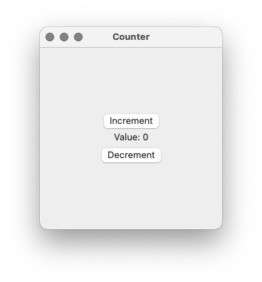
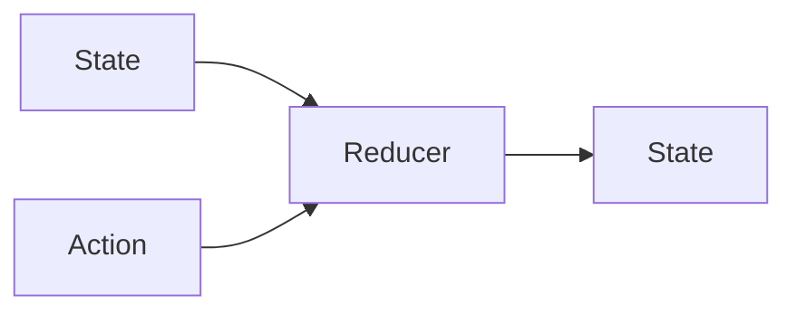

# CounterData

Our `ImmutableData` and `ImmutableUI` modules are the “infra” of our project: these are the modules we share across multiple sample application products. These modules make a minimum amount of assumptions and restrictions about what kind of products are built. There’s a lot of power and flexibility with this approach, but the previous chapters might have felt a little abstract without a concrete example of how this is all actually used in production.

Our first sample application product will be simple; it’s the “Hello World” of Redux. Our application is called Counter. All we do is present a UI to increment and decrement an integer.

<picture>
 <source media="(prefers-color-scheme: light)" srcset="../Assets/Chapter-03-1.png">
 <source media="(prefers-color-scheme: dark)" srcset="../Assets/Chapter-03-2.png">
 
</picture>

There’s no network connection and no persistent data storage in our filesystem, but this very simple application will help us see the infra actually being used in a product. Once we have an introduction and build our first product, we will see how the `ImmutableData` architecture can scale to more complex products.

Our Counter application is inspired by the Counter application for Redux.[^1]

## CounterState

Every product we build on the `ImmutableData` architecture will share the same infra modules. Types like `Store` are generic across the State that a product engineer defines. Now that we are product engineering, it’s our job to define what State looks like for our product domain.

Let’s have a quick review of a concept introduced earlier. We can think of two “buckets” of state that might describe our application at a moment in time. *Local State* — or *Component State* — can be thought of as ephemeral and transient state that reflects details about how our UI is displayed, but not details about the *data* that is driving that UI. We save Local State *locally* in our component graph using `SwiftUI.State`.

Suppose we build an application for displaying a list of contacts. Our list could be very large and our list should support scrolling. The scroll position of our list component would be an example of what we consider Local State. Our list could also support filtering to search for contacts by name. The substring we currently use to search for contacts we consider Local State. Our list could also support sorting by name ascending or descending. Our sort order we consider Local State.

*Global State* can be thought of as state that reflects the intrinsic data that drives our application. We save Global State *globally* in our `Store`.

Suppose our contacts application supports the ability to change the name of a saved contact. We consider the names of our contacts to be Global State. Suppose our contacts application supports the ability to add or delete contacts. We consider the set of all our contacts to be Global State.

There is no “one right way” to distinguish between what should be thought of as Local State and Global State. For the most part, product engineers have the ability to choose what works best for their product domain. We will see plenty of examples of both types of state before our tutorials are complete.

An interesting “thought experiment” for trying to separate these two types of state is what we think of as a “Window Test”. Suppose our contacts application supports multiple windows on macOS. If the user opens two different windows, should those windows display the same contacts? Should the contacts displayed by those windows have consistent names? Should deleting a contact from one window delete the contact from the other window? We consider these to be Global State; these contacts should be saved and shared globally across multiple windows.

Let’s continue with this example. If the user opens two different windows and then scrolls the second window to the last contact in the list, should the first window match the same scroll position? If the user selects the second window and starts to filter for a matching name string, should the first window match to that same name filter? If the user selects the second window and changes the sort order from ascending to descending, should the first window match to that same sort order? We consider these to be Local State; this is transient and ephemeral UI state that is local to one component subgraph.

For our first sample application product, state is going to be very simple. All we need is one integer which can be incremented and decremented. We’ll see much more complex examples in our next sample application products.

Select the `CounterData` package and add a new Swift file under `Sources/CounterData`. Name this file `CounterState.swift`.

Here is our first step:

```swift
//  CounterState.swift

public struct CounterState: Sendable {
  package var value: Int
  
  public init(_ value: Int = 0) {
    self.value = value
  }
}
```

For all products built from the `ImmutableData` architecture, we model State as an immutable value type: typically a `struct`. Any slice of State will also be an immutable value type. Our State types will be complex, but all stored instance properties should map to graphs of value types.

Our `CounterState` is `public` because we import this type in our next package. Our `value` is `package` because we read this property in our test target. Our `value` is not `public`. To read this property in our next package, we define a Selector function. This is a simple function type; our Selector is trivial — we just return the `value`. A complex product with many subgraphs of components might define many different Selectors. Product Engineers have the ability to define as many Selectors as they might need.

You might be wondering: what if every product defines only one Selector and returns the entire global state to every component? We built our `ImmutableUI.Selector` to update our component graph with `Observable` when the selected slice of state changes. As an optimization, we build every component to try and select the smallest slice of state it needs to display its data. If every component selects the *entire* global state this can lead to slower performance: state updates that do not affect a component lead to a component recomputing its `body` more times than necessary.[^2]

Here is our Selector function which returns our `value` to our component graph:

```swift
//  CounterState.swift

extension CounterState {
  public static func selectValue() -> @Sendable (Self) -> Int {
    { state in state.value }
  }
}
```

Our `selectValue` function takes no parameters and returns a closure. That closure takes a `CounterState` as a parameter and returns an `Int`.

The closures returned by our Selectors will always be pure functions: no side effects and no non-deterministic behavior. We also must return synchronously.

This is all we need to build `CounterState` for our product. This is a very simple product, but think of this as good practice to see this architecture being used before we move on to move complex products.

## CounterAction

As previously discussed, a goal with the `ImmutableData` architecture is to take the experience you have “thinking declaratively” for building graphs of view components and then use that experience to begin thinking declaratively about global state.

In a SwiftUI application using SwiftData, our view component graph uses imperative logic on mutable model objects when it wants to transform global state. SwiftUI encourages you to think of “the what not the how” for building your view component graph. Let’s then think of “the what not the how” for managing our global state.

Our SwiftUI counter application is very simple: an “Increment” button, a “Decrement” button, and a component to display the current value. Let’s start with the Increment Button. What happens when a user taps the Increment Button? In a SwiftData application, we could then perform some imperative logic on a mutable model object. Let’s think about how we would make this more declarative. How would a view component declare to a `Store` that a user taps the Increment Button? What would this action be called? Suppose you were to just tell me or another person what this action is for. What is the message you want to dispatch when a user taps the Increment Button? Let’s try to brainstorm some ideas about this.

What about `IncrementValue`? When the user taps the Increment Button, we dispatch the `IncrementValue` action to a `Store`. Our view component is no longer performing its own imperative logic, but is instead just passing that imperative logic to the `Store` in another form. Let’s keep trying new ideas. Our goal right now is to *think declaratively*. Focus on “the what not the how”. Think of *what* just happened. Try thinking in the past tense. What just happened?

What about `DidIncrementValue`? We’re thinking in the past tense, but we’re just moving our imperative logic into the past tense. We’re trying to *think declaratively*. We’re not trying to “rephrase” our imperative logic. All we are doing is “publishing the news”. What just happened? Why is this action being dispatched? Don’t try and overthink it — just literally try and think of what we tell our `Store` when the user taps the Increment Button.

What about `DidTapIncrementButton`? Doesn’t that sound kind of “weird”? Well… it’s not weird; it actually does a great job at telling our `Store` what just happened: the user just tapped the Increment Button. We shouldn’t be overthinking things when we name this action. On the other hand, your instincts might be telling you this action is not “imperative” enough, or that this action somehow will not do a good job at “communicating” how the `Store` should behave. Remember, our goal right now is to *think declaratively*. Our goal is not to communicate *the how*. Our goal is to communicate *the what*. What just happened to cause this action to dispatch to our `Store`? The user just tapped the Increment Button.

From our time spent teaching engineers the Flux and Redux architectures, exercises like what we just completed help work through one of the biggest obstacles we see. Engineers that completely understand how to think declaratively when it’s time to put their view components on screen seem to keep coming back to imperative thinking when it’s time to notify their `Store` when an important event occurred.

Our experience is that thinking of these actions as a statement in the past tense is one of the tricks to help keep your mind thinking declaratively. One more important trick is to not try and overthink things. Try and literally name your action what just happened: `DidTapIncrementButton` and `DidTapDecrementButton`.

Add a new Swift file under `Sources/CounterData`. Name this file `CounterAction.swift`.

```swift
//  CounterAction.swift

public enum CounterAction : Sendable {
  case didTapIncrementButton
  case didTapDecrementButton
}
```

Like our State, we model our Action as an immutable value type — not an object. Modeling our Action as an `enum` helps for building our Reducer functions. You *could* try and model your Action as a `struct`, but we very strongly recommend modeling your Action as an `enum`. If a specific `case` requires some payload or context to be delivered along with it, we can pass this payload as associated values: we will see many examples of this in our more complex sample application products.

## CounterReducer

Let’s review the role of Reducer function types in the `ImmutableData` architecture:



Just like Redux, our Reducer function types are pure functions without side effects that map a State and an Action to the next State of our system. In SwiftData, the global state of our system can be mutated at any time by any view component in our graph. In the `ImmutableData` architecture, *any and all* transformations of global state happen *only* because of an Action that is dispatched to our Reducer through our `Store`.

When we built our Action, our goal was to *think declaratively*. Instead of building Action values that tell our `Store` *how* to behave, we build Action values that tell our `Store` *what* just happened. Now that we are building a Reducer, this *is* the appropriate place to think imperatively. Our goal will be to transform the declarative messages from our component graph to imperative logic that returns a new State.

Our first sample application product is very simple; this is by design. The concepts and patterns we see in this chapter demonstrate some of the most important opinions and philosophies in the `ImmutableData` architecture. Instead of just writing code, take some time to think through what it is we are building. What opinions are we making? How are those opinions different than what you might have experienced working with SwiftData?

Add a new Swift file under `Sources/CounterData`. Name this file `CounterReducer.swift`.

```swift
//  CounterReducer.swift

public enum CounterReducer {
  @Sendable public static func reduce(
    state: CounterState,
    action: CounterAction
  ) -> CounterState {
    switch action {
    case .didTapIncrementButton:
      var state = state
      state.value += 1
      return state
    case .didTapDecrementButton:
      var state = state
      state.value -= 1
      return state
    }
  }
}
```

Our `reduce` function takes two parameters: a `CounterState` and an `CounterAction`. We return a new `CounterState`. This pure function is synchronous, deterministic, and free of side effects.

Modeling our `CounterAction` as an enum gives us the quick and easy ability to `switch` over potential Action values. The total set of all Action values can be very large in complex products; we will discuss some strategies in our future chapters to keep these Reducers approachable and organized.

Once we `switch` over our Action value, we can then define our own imperative logic on every case. This logic transforms the previous state of our system to the next state of our system. In this example, every `case` maps to one transformation; in practice, is it totally legit for an Action value to “fall through” and result in no transformation. In that situation, we just return the original state. We will see examples of this technique in our next sample application product.

Our `reduce` function is modeled as a `static` function on a `enum` type. Another option would be to model our `reduce` function as a “standalone” or “free” function outside of any type. We don’t have a very strong opinion here. Our `reduce` function is stateless by design; it could be modeled as a standalone function. Our convention will be to define our `reduce` functions on a type, but you can choose a different approach if this is more consistent with style throughout your own projects.

---

Here is our `CounterData` package, including the tests available on our `chapter-03` branch:

```text
CounterData
├── Sources
│   └── CounterData
│       ├── CounterAction.swift
│       ├── CounterReducer.swift
│       └── CounterState.swift
└── Tests
    └── CounterDataTests
        ├── CounterReducerTests.swift
        └── CounterStateTests.swift
```

These three types represent the data model layer of our first sample application product. We are ready to build the view component graph in our next steps. Let’s quickly review some important concepts we discussed that will also apply to all products we build on this architecture:

* We model our State as an immutable value type. Our recommendation is to use a `struct`.
* We model our Action as an immutable value type. Our recommendation is to use an `enum`.
* We model our Reducer as a stateless and synchronous function with no side effects and no non-deterministic behavior.

Our previous chapters built the infra modules that are shared across sample application products. This chapter was our first experience building code tied to the specific domain of just one product, but we discussed some important opinions and philosophies that we will use throughout our tutorials.

[^1]: https://redux.js.org/tutorials/quick-start
[^2]: https://swiftui-lab.com/random-lessons/#data-5
