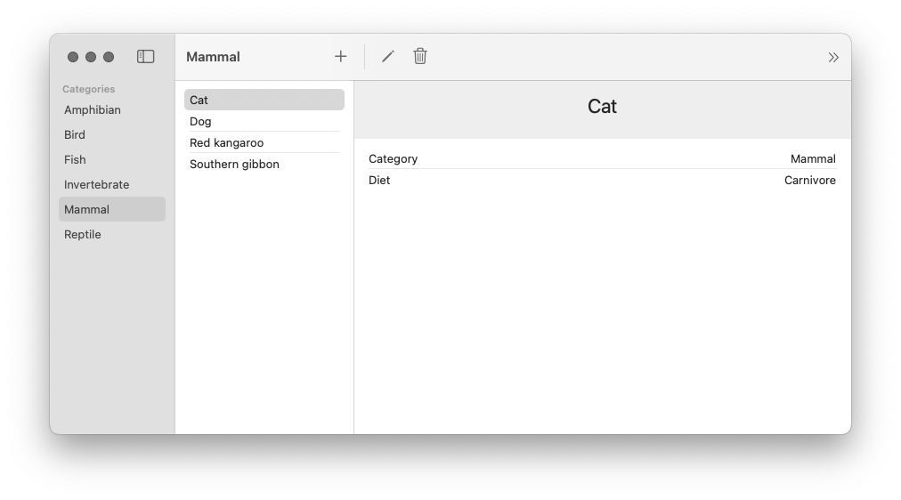

# AnimalsData

Our Counter application was an introduction to what product engineering looks like when using the `ImmutableData` architecture. The application was meant to be simple; our goal for presenting this application was to begin to build the “muscle memory” for thinking declaratively.

You’ve seen one example of what `ImmutableData` looks like as a product engineer, but you might have some important questions about how well an architecture like this scales to complex applications. Our `CounterReducer` performs all its work synchronously and free of side effects. For an application that saves all of its data in-memory, this might be all we need. Many of us are going to be shipping complex products that must perform asynchronous fetching to query data from a server. Our products might need to save data to a persistent store for it to be available across app launches. These are examples of side effects that should not happen from a Reducer. Our goal for these next chapters will be to learn how to use `ImmutableData` for products that need to perform asynchronous work and side effects.

Our product will be called Animals. It is a direct clone of the Animals sample application shipped by Apple.[^1] Go ahead and clone the Apple project repo, build the application, and look around to see the functionality. The Apple project supports multiple platforms, but we are going to focus our attention on macOS.

<picture>
 <source media="(prefers-color-scheme: light)" srcset="../Assets/Chapter-06-1.png">
 <source media="(prefers-color-scheme: dark)" srcset="../Assets/Chapter-06-2.png">
 
</picture>

Our Animals product is a catalog of animals and animal categories. The set of all animal category values is fixed, but animals can be added, deleted, and edited. Every animal comes with a name, an animal category, and a diet classification (the diet values are also fixed).

The application loads with a set of sample data. There are the six animal categories and six animals. Selecting a category from the category list displays all animals assigned to that category. Selecting an animal from the list displays an animal detail page with the data for that animal. The animal detail page displays buttons to edit or delete the animal. The toolbar also displays a button to add a new animal and a button to reload the sample data that was displayed when the app was first launched.

The Animals application leverages SwiftUI to display data and SwiftData to persist that data across app launches. Pairing SwiftUI with SwiftData is a very common pattern, so this application is a great example for us to practice using `ImmutableData` for these more advanced use cases.

Similar to our previous application, we will start with our data layer and our data models. This will also be the layer where we build our support for adding asynchronous side effects when we dispatch Action values to our Reducer. We build a user-interface layer that depends on that data layer to display data. Our final step will be a thin app layer that ties everything together.

## Category

There are two basic data model types represented in our state: Animals and Categories. Let’s begin by adding a Category data model. Select the `AnimalsData` package and add a new Swift file under `Sources/AnimalsData`. Name this file `Category.swift`.

```swift
//  Category.swift

public struct Category: Hashable, Sendable {
  public let categoryId: String
  public let name: String
  
  package init(
    categoryId: String,
    name: String
  ) {
    self.categoryId = categoryId
    self.name = name
  }
}

extension Category: Identifiable {
  public var id: String {
    self.categoryId
  }
}
```

This type is pretty simple: just a `categoryId` and a `name`. We conform to `Identifiable` to indicate the `categoryId` value represents the unique identifier of this instance. We conform to `Hashable` for the ability to test for equality and create stable hash values.

Our `Category` is `public` for us to use it from different packages (like `AnimalsUI`). Our `init` is `package` to imply instances will only be created from this package. Packages like `AnimalsUI` should not have the ability to create or mutate these instances directly; we will dispatch Action values through a Reducer to affect changes in our global state.

Similar to the Apple sample project, we want to generate some sample data on the initial app launch. Here are some `Category` values for that:

```swift
//  Category.swift

extension Category {
  public static var amphibian: Self {
    Self(
      categoryId: "Amphibian",
      name: "Amphibian"
    )
  }
  public static var bird: Self {
    Self(
      categoryId: "Bird",
      name: "Bird"
    )
  }
  public static var fish: Self {
    Self(
      categoryId: "Fish",
      name: "Fish"
    )
  }
  public static var invertebrate: Self {
    Self(
      categoryId: "Invertebrate",
      name: "Invertebrate"
    )
  }
  public static var mammal: Self {
    Self(
      categoryId: "Mammal",
      name: "Mammal"
    )
  }
  public static var reptile: Self {
    Self(
      categoryId: "Reptile",
      name: "Reptile"
    )
  }
}
```

## Animal

Let’s add the Animal data model. Add a new Swift file under `Sources/AnimalsData`. Name this file `Animal.swift`.

```swift
//  Animal.swift

public struct Animal: Hashable, Sendable {
  public let animalId: String
  public let name: String
  public let diet: Diet
  public let categoryId: String
  
  package init(
    animalId: String,
    name: String,
    diet: Diet,
    categoryId: String
  ) {
    self.animalId = animalId
    self.name = name
    self.diet = diet
    self.categoryId = categoryId
  }
}

extension Animal {
  public enum Diet: String, CaseIterable, Hashable, Sendable {
    case herbivorous = "Herbivore"
    case carnivorous = "Carnivore"
    case omnivorous = "Omnivore"
  }
}

extension Animal: Identifiable {
  public var id: String {
    self.animalId
  }
}
```

Let’s add the sample data values:

```swift
//  Animal.swift

extension Animal {
  public static var dog: Self {
    Self(
      animalId: "Dog",
      name: "Dog",
      diet: .carnivorous,
      categoryId: "Mammal"
    )
  }
  public static var cat: Self {
    Self(
      animalId: "Cat",
      name: "Cat",
      diet: .carnivorous,
      categoryId: "Mammal"
    )
  }
  public static var kangaroo: Self {
    Self(
      animalId: "Kangaroo",
      name: "Red kangaroo",
      diet: .herbivorous,
      categoryId: "Mammal"
    )
  }
  public static var gibbon: Self {
    Self(
      animalId: "Bibbon",
      name: "Southern gibbon",
      diet: .herbivorous,
      categoryId: "Mammal"
    )
  }
  public static var sparrow: Self {
    Self(
      animalId: "Sparrow",
      name: "House sparrow",
      diet: .omnivorous,
      categoryId: "Bird"
    )
  }
  public static var newt: Self {
    Self(
      animalId: "Newt",
      name: "Newt",
      diet: .carnivorous,
      categoryId: "Amphibian"
    )
  }
}
```

## Status

Our `AnimalsData` module will perform asynchronous operations to persist state to the filesystem in a database. When performing these asynchronous reads and writes, there are opportunities for edge-casey bugs where two different components are attempting to read from or write to the same value. To help defend against this from happening, let’s define a small `Status` type for marking the progress of our asynchronous operations. Add a new Swift file under `Sources/AnimalsData`. Name this file `Status.swift`.

```swift
//  Status.swift

public enum Status: Hashable, Sendable {
  case empty
  case waiting
  case success
  case failure(error: String)
}
```

Consistent with a convention from Redux JS, we adopt an `enum` instead of an `isLoading` boolean value.[^2] This gives us more flexibility to indicate when an attempted load has succeeded or failed.

## AnimalsState

Our `Animal` and `Category` types are the basic data models of our product. We still need to define a root State type which will be passed to our Reducer.

Our convention for modeling state will follow a recommended convention from Redux JS. We “normalize” our data models.[^3] We conceptualize our root state as “domains” that can be thought of similarly to tables in a database. Each domain saves its data models through key-value pairs. For our product, these slices would be `Animals` and `Categories`. Let’s see what this looks like. Add a new Swift file under `Sources/AnimalsData`. Name this file `AnimalsState.swift`.

```swift
//  AnimalsState.swift

import Foundation

public struct AnimalsState: Hashable, Sendable {
  package var categories: Categories
  package var animals: Animals
  
  package init(
    categories: Categories,
    animals: Animals
  ) {
    self.categories = categories
    self.animals = animals
  }
}

extension AnimalsState {
  public init() {
    self.init(
      categories: Categories(),
      animals: Animals()
    )
  }
}
```

Our `AnimalsState` is `public`, but the `animals` and `categories` are only `package`. We want these properties exposed to our test target, but our component graph should not be able to directly access the raw data. Following a convention from Redux, our Selectors will expose slices of state to our component graph. Our Selectors are `public`, but the exact structure of that state remains an opaque implementation detail.[^4]

Let’s add our `Categories` domain:

```swift
//  AnimalsState.swift

extension AnimalsState {
  package struct Categories: Hashable, Sendable {
    package var data: Dictionary<Category.ID, Category> = [:]
    package var status: Status? = nil
    
    package init(
      data: Dictionary<Category.ID, Category> = [:],
      status: Status? = nil
    ) {
      self.data = data
      self.status = status
    }
  }
}
```

Our `data` property is a `Dictionary` for efficient reading and writing of `Category` values by a `key`. Our `status` property will be used to represent the loading status of our `Category` values. When an asynchronous operation to read `Category` values from our persistent database is taking place, this value will be `waiting`. When our persistent database returns data, this value will be `success`.

Let’s turn our attention to `Animals`:

```swift
//  AnimalsState.swift

extension AnimalsState {
  package struct Animals: Hashable, Sendable {
    package var data: Dictionary<Animal.ID, Animal> = [:]
    package var status: Status? = nil
    package var queue: Dictionary<Animal.ID, Status> = [:]
    
    package init(
      data: Dictionary<Animal.ID, Animal> = [:],
      status: Status? = nil,
      queue: Dictionary<Animal.ID, Status> = [:]
    ) {
      self.data = data
      self.status = status
      self.queue = queue
    }
  }
}
```

Similar to `Categories`, we define a `data` property for efficient reading and writing of `Animal` values by a `key` and a `status` property to represent the loading status of our `Animal` values. Unlike our `Category` value, our `Animal` values can be edited and deleted. To save a loading status for specific `Animal` values, we can define a new `queue` property.

These two domains are all we need to model the global state of our product. Do these two domains represent the *complete* state of our product? Our product offers the ability to edit and delete existing animals with a form. We also have the ability to add new animals. Does the state of this form belong in global state? Consistent with the convention from Redux JS, we choose to model this form data as component state.[^5] For additional state, we remember our “Window Test”. If our user opens two windows to see their data in two places at once, should a currently selected animal be reflected across both windows? We believe that it would be more appropriately modeled as component state; each window can track its own currently selected animal independently.

We use `Dictionary` values to map `key` values to our data models. You might have questions about the performance of this data structure when our application grows very large. Swift Collections (like `Dictionary`) are copy-on-write data structures; when we copy the data structure and mutate the copy, our data structure copies all `n` elements. In Chapter 18, we investigate how we can add external dependencies to our module and import specialized data structures for improving CPU and memory usage. In Chapter 19, we benchmark and measure the performance of immutable data structures against SwiftData. For now, we will continue working just with the Standard Library (and `Dictionary`).

---

Our next step is to define the `public` Selectors which select slices of state for displaying in our component graph. The sample application from Apple will be our guide: we clone the functionality. Let’s start by conceptualizing two “buckets” of Selectors: Selectors that operate on our `Categories` domain and Selectors that operate on our `Animals` domain. In more complex applications, Selectors might need to aggregate and deliver data across multiple domains all at once; we’re going to try and keep things simple for now while we are still learning.

Let’s begin with our `Categories` domain. Let’s think through the different operations needed to display data from our `Categories` domain in our component graph:

* `SelectCategoriesValues`: The `CategoryList` displays `Category` values in sorted alphabetical order.
* `SelectCategories`: We will also define a selector to return the `Dictionary` of all `Category` values without sorting applied; we will see how these two selectors work together to improve the performance of our `CategoryList` component.
* `SelectCategoriesStatus`: We return the status of our most recent request to fetch `Category` values. We will use this to defend against some edge-casey behavior in our component graph and disable certain user events while `Category` values are being fetched.
* `SelectCategory`: We return a `Category` value for a given `Category.ID` key. We would also like a selector to return a `Category` value for a given `Animal.ID` key: to return a `Mammal` for a `Cat`.

We perform similar work for our `Animals` domain:

* `SelectAnimalsValues`: The `AnimalList` component displays `Animal` values for a specific `Category.ID` value in sorted alphabetical order.
* `SelectAnimals`: Similar to `SelectCategories`, we define a Selector to return the `Dictionary` of `Animal` values for a specific `Category.ID` value without sorting applied.
* `SelectAnimalsStatus`: Similar to `SelectCategoriesStatus`, we return the status of our most recent request to fetch `Animal` values.
* `SelectAnimal`: We return a `Animal` value for a given `Animal.ID` key.
* `SelectAnimalStatus`: Unlike `Category` values, `Animal` values can be edited and deleted. We track a `Status` for each `Animal.ID` value with an update pending. We use this value to defend against edge-casey behavior in our component graph where two windows might try to edit the same `Animal` at the same time.

These Selectors might seem a little abstract for now, but these will make more sense once we see them in action in our component graph. We could take a different approach and define these Selectors while we build our component graph. It’s a tradeoff; we prefer this approach for now to keep our focus on building the `AnimalsData` package before we turn our attention to our component graph.

Let’s begin with the `SelectCategories` Selector. This one will be one of the more simple Selectors.

```swift
//  AnimalsState.swift

extension AnimalsState {
  fileprivate func selectCategories() -> Dictionary<Category.ID, Category> {
    self.categories.data
  }
}

extension AnimalsState {
  public static func selectCategories() -> @Sendable (Self) -> Dictionary<Category.ID, Category> {
    { state in state.selectCategories() }
  }
}
```

All we need to do here is return the `Dictionary` representation of our `Category` graph. The Selector we pass to our `Store` instance is a `static` function that takes an `AnimalsState` instance as a parameter. As a style convention, we define a private helper on our `AnimalsState` instance to pair with our `static` Selector. You are welcome to follow this convention in your own products if it helps you keep code simple and organized.

Let’s add `SelectCategoriesValues`. This is a Selector for returning a sorted array of `Category` values. There is no “one right way” to design a function that offers sorting; for this product, we will choose an approach consistent with `SwiftData.Query`.[^6] We offer the ability to pass a `KeyPath` and a `SortOrder`.

```swift
//  AnimalsState.swift

extension AnimalsState {
  fileprivate func selectCategoriesValues(
    sort descriptor: SortDescriptor<Category>
  ) -> Array<Category> {
    self.categories.data.values.sorted(using: descriptor)
  }
}

extension AnimalsState {
  fileprivate func selectCategoriesValues(
    sort keyPath: KeyPath<Category, some Comparable> & Sendable,
    order: SortOrder = .forward
  ) -> Array<Category> {
    self.selectCategoriesValues(
      sort: SortDescriptor(
        keyPath,
        order: order
      ))
  }
}

extension AnimalsState {
  public static func selectCategoriesValues(
    sort keyPath: KeyPath<Category, some Comparable> & Sendable,
    order: SortOrder = .forward
  ) -> @Sendable (Self) -> Array<Category> {
    { state in state.selectCategoriesValues(sort: keyPath, order: order) }
  }
}
```

Here is the `SelectCategoriesStatus` Selector for returning the status of our most recent fetch.

```swift
//  AnimalsState.swift

extension AnimalsState {
  fileprivate func selectCategoriesStatus() -> Status? {
    self.categories.status
  }
}

extension AnimalsState {
  public static func selectCategoriesStatus() -> @Sendable (Self) -> Status? {
    {state in state.selectCategoriesStatus() }
  }
}
```

For a given `Category.ID` (which could be `nil`), we would like a Selector to return the `Category` value (if it exists). Here is our `SelectCategory` Selector:

```swift
//  AnimalsState.swift

extension AnimalsState {
  fileprivate func selectCategory(categoryId: Category.ID?) -> Category? {
    guard
      let categoryId = categoryId
    else {
      return nil
    }
    return self.categories.data[categoryId]
  }
}

extension AnimalsState {
  public static func selectCategory(categoryId: Category.ID?) -> @Sendable (Self) -> Category? {
    { state in state.selectCategory(categoryId: categoryId) }
  }
}
```

Is this Selector really necessary? We already built `SelectCategories` to return all the `Category` values. Could we return all the `Category` values in our component graph and then choose our desired `Category` from that `Dictionary`? We could… but this could lead to performance problems. We want our component to recompute its `body` when the data returned by its Selectors changes. If we only care about *one* `Category` value, but our component is depending on *all* `Category` values, we are missing an opportunity to “scope” down our Selector to depend on only the data needed in that component. Our `Category` values are constant, but we still follow this convention because it is going to be very important for performance as we build more complex products that depend on state that changes over time.

In addition to returning the `Category` value for a `Category.ID`, we would also like an easy way to return the `Category` value for an `Animal.ID`.

```swift
//  AnimalsState.swift
extension AnimalsState {
  fileprivate func selectCategory(animalId: Animal.ID?) -> Category? {
    guard
      let animalId = animalId,
      let animal = self.animals.data[animalId]
    else {
      return nil
    }
    return self.categories.data[animal.categoryId]
  }
}

extension AnimalsState {
  public static func selectCategory(animalId: Animal.ID?) -> @Sendable (Self) -> Category? {
    { state in state.selectCategory(animalId: animalId) }
  }
}
```

A legit question a this point would be why we would need an extra Selector to return the `Category` an `Animal` belongs to. Why is the `Category` an `Animal` belongs to not saved on the `Animal` itself? One important goal and philosophy to keep in mind is that our infra and patterns for state-management are built from *Immutable* Data. If every `Animal` instance saved the `Category` it belongs to as a property, that `Category` would be an immutable `struct`. When multiple `Animal` instances belong to the same `Category`, those `Animal` instances duplicate `Category` values across multiple places; there is more than one “source of truth”.

In this product, `Category` values are constant; they do not change over time. While we could probably get away with saving `Category` values as properties on `Animal`, you could see how we would run into problems once `Category` values are no longer constant. When a `Category` value would update state, we have to update that state across more than one source of truth.

Our preference and convention for this product is to normalize our data models consistent with a convention from Redux.[^3] Instead of each `Animal` saving its `Category` value, each `Animal` saves only its `Category.ID` value.

Let’s turn our attention to our `Animals` domain. Here is our Selector for returning all `Animal` values belonging to a `Category.ID`:

```swift
//  AnimalsState.swift

extension AnimalsState {
  fileprivate func selectAnimals(categoryId: Category.ID?) -> Dictionary<Animal.ID, Animal> {
    guard
      let categoryId = categoryId
    else {
      return [:]
    }
    return self.animals.data.filter { $0.value.categoryId == categoryId }
  }
}

extension AnimalsState {
  public static func selectAnimals(categoryId: Category.ID?) -> @Sendable (Self) -> Dictionary<Animal.ID, Animal> {
    { state in state.selectAnimals(categoryId: categoryId) }
  }
}
```

Our `SelectAnimals` selector performs a `filter` transformation on our `data`; we iterate through all our `Animal` values and return those that match our `Category.ID`. This operation is linear time. Should we be “caching” these values so we can return them in constant time? Maybe. For the most part, we follow the Redux convention that a filtered set of `Animal` values is *derived* state and does not belong stored in our Redux state.[^7] As we continue building our product, we will see how `AnimalsFilter` can help reduce the amount of times we perform this operation.

There *could* be times when the best option is to cache derived data. We are not opposed to this approach, but keep in mind there is going to be additional complexity now that you are potentially duplicating data across multiple sources of truth; when your data updates you are now responsible for correctly keeping that data in-sync across multiple places. Caching derived data is not always going to be the wrong tool, but we believe it should not always be the first tool you reach for.

Let’s add a Selector for returning sorted `Animal` values.

```swift
//  AnimalsState.swift

extension AnimalsState {
  fileprivate func selectAnimalsValues(categoryId: Category.ID?) -> Array<Animal> {
    guard
      let categoryId = categoryId
    else {
      return []
    }
    return self.animals.data.values.filter { $0.categoryId == categoryId }
  }
}

extension AnimalsState {
  fileprivate func selectAnimalsValues(
    categoryId: Category.ID?,
    sort descriptor: SortDescriptor<Animal>
  ) -> Array<Animal> {
    self.selectAnimalsValues(categoryId: categoryId).sorted(using: descriptor)
  }
}

extension AnimalsState {
  fileprivate func selectAnimalsValues(
    categoryId: Category.ID?,
    sort keyPath: KeyPath<Animal, some Comparable> & Sendable,
    order: SortOrder = .forward
  ) -> Array<Animal> {
    self.selectAnimalsValues(
      categoryId: categoryId,
      sort: SortDescriptor(
        keyPath,
        order: order
      ))
  }
}

extension AnimalsState {
  public static func selectAnimalsValues(
    categoryId: Category.ID?,
    sort keyPath: KeyPath<Animal, some Comparable> & Sendable,
    order: SortOrder = .forward
  ) -> @Sendable (Self) -> Array<Animal> {
    { state in state.selectAnimalsValues(
      categoryId: categoryId,
      sort: keyPath,
      order: order
    ) }
  }
}
```

Similar to our approach for `SelectCategoriesValues`, we pass a `KeyPath` and a `SortOrder` to return sorted `Animal` values for a `Category.ID`.

Similar to `SelectCategoriesStatus`, we define a Selector to return the status of our most recent request to fetch `Animal` values. We will use this value to control around any user events that might lead to edge-casey behavior if we should not be performing this event before a request has completed.

```swift
//  AnimalsState.swift

extension AnimalsState {
  fileprivate func selectAnimalsStatus() -> Status? {
    self.animals.status
  }
}

extension AnimalsState {
  public static func selectAnimalsStatus() -> @Sendable (Self) -> Status? {
    {state in state.selectAnimalsStatus() }
  }
}
```

Let’s add a Selector for returning a `Animal` value for a given `Animal.ID`:

```swift
//  AnimalsState.swift

extension AnimalsState {
  fileprivate func selectAnimal(animalId: Animal.ID?) -> Animal? {
    guard
      let animalId = animalId
    else {
      return nil
    }
    return self.animals.data[animalId]
  }
}

extension AnimalsState {
  public static func selectAnimal(animalId: Animal.ID?) -> @Sendable (Self) -> Animal? {
    { state in state.selectAnimal(animalId: animalId) }
  }
}
```

Our last Selector returns a `Status` value for a given `Animal.ID`. We will use this to track when an `Animal` value might be waiting for a mutation; this value can be used in our component graph to prevent an edit from taking place while we are already trying to edit that same `Animal` value from another component.

```swift
//  AnimalsState.swift

extension AnimalsState {
  fileprivate func selectAnimalStatus(animalId: Animal.ID?) -> Status? {
    guard
      let animalId = animalId
    else {
      return nil
    }
    return self.animals.queue[animalId]
  }
}

extension AnimalsState {
  public static func selectAnimalStatus(animalId: Animal.ID?) -> @Sendable (Self) -> Status? {
    {state in state.selectAnimalStatus(animalId: animalId) }
  }
}
```

These Selectors are `public` and deliver the data and state we need to display in our component graph. We wrote a lot of code, but we also learned some important things along the way that will help us when we build Selectors for more complex products.

## AnimalsAction

We learned some important lessons while building `CounterAction`. In that chapter, our action values represented user events from our component graph. Those user events were received by our Reducer, which mapped those user events to transformations on our State. The `ImmutableData` architecture requires that Reducer functions are synchronous and free of side effects. Let’s see how we build Action values when our product will perform work that is asynchronous.

Let’s build and run the existing Animals sample app from Apple. Let’s run through the functionality and sketch out the user events we can document taking place from our component graph. Let’s think carefully and document only the user events that should affect our global state; events that should only affect local component state may be omitted.

* The `CategoryList` component displays a button to reload the sample data from first launch.
* The `AnimalList` component allows swiping on an Animal to delete. The option to delete a selected Animal is also available from the Menu Bar.
* The `AnimalDetail` component displays a button to delete the selected Animal.
* The `AnimalEditor` displays a button to either edit an existing Animal or save a new Animal.

This is not a complete set of *all* user events — just the user events that should affect our global state. The `AnimalDetail` component displays a button to present the `AnimalEditor` component. This is an example of local component state; we choose to save this state at our component level — not in `ImmutableData`.

There are two more subtle user events. When our `CategoryList` will be displayed, we want to fetch our Categories. When our `AnimalList` will be displayed, we want to fetch our Animals. We choose to transform our global state for efficiency and performance. A user can launch our product and open multiple windows on their macOS desktop. If every window performed an independent fetch, we would be fetching the same data multiple times. Transforming global state means we can keep track of our most recent fetch and prevent unnecessary fetches from consuming system resources.

These Action values tell one side of our story: user events coming from our component graph. There is one more domain we want to support: data events coming from our persistent store. This product will need to support asynchronous operations to save its global state to a persistent store on our filesystem. We’re going to pass operations to our persistent store, wait for a response, and then dispatch an Action value back to our Reducer. In the same way that our “User Interface” domain was for action values that came from our component graph, our “Data” domain is for action values that come from our persistent store. Before we complete this chapter, we will see exactly how User Events are transformed into Data Events. For now, let’s concentrate on just defining what action values our persistent store would need to dispatch to our Reducer.

* The `Category` values were fetched.
* The `Animal` values were fetched.
* The Sample Data from first launch was reloaded and the previously stored data was deleted.
* An `Animal` value was added.
* An `Animal` value was updated.
* An `Animal` value was deleted.

Let’s put these together and see what our Action values look like. Add a new Swift file under `Sources/AnimalsData`. Name this file `AnimalsAction.swift`.

Before we start writing code, let’s think a little about our approach to naming these actions. Remember: our goal is to think declaratively. These action values tell our Reducer *what* just happened — not *how* it should behave. One convention we adopt in this tutorial is to name our Action values by where they came from. An action from the UI domain indicating that the Category List will be displayed could be named: `uiCategoryListOnAppear`. This works, but let’s try a slightly different approach. We’re going to model our Action values not as “one big” `enum` type, but as a set of “nested” `enum` types. When we build our Reducer, we can see how pattern-matching against these `enum` types enables a natural pattern of composition to keep code organized.

Let’s start with our domains and then work down to specific actions:

```swift
//  AnimalsAction.swift

public enum AnimalsAction: Hashable, Sendable {
  case ui(_ action: UI)
  case data(_ action: Data)
}
```

Our `UI` domain will be for action values coming from our component graph. Our `Data` domain will be for action values coming from our persistent store.

Let’s start with our `UI` domain. We define four sub-domains under `UI`: these map to four components.

```swift
//  AnimalsAction.swift

extension AnimalsAction {
  public enum UI: Hashable, Sendable {
    case categoryList(_ action: CategoryList)
    case animalList(_ action: AnimalList)
    case animalDetail(_ action: AnimalDetail)
    case animalEditor(_ action: AnimalEditor)
  }
}
```

Under the `UI.CategoryList` domain, we define two actions: the action for when the component will be displayed, and the action for when the user confirms to reload sample data:

```swift
//  AnimalsAction.swift

extension AnimalsAction.UI {
  public enum CategoryList: Hashable, Sendable {
    case onAppear
    case onTapReloadSampleDataButton
  }
}
```

Under the `UI.AnimalList` domain, we define two actions: the action for when the component will be displayed, and the action for when the user confirms to delete an `Animal`.

```swift
//  AnimalsAction.swift

extension AnimalsAction.UI {
  public enum AnimalList: Hashable, Sendable {
    case onAppear
    case onTapDeleteSelectedAnimalButton(animalId: Animal.ID)
  }
}
```

The `onTapDeleteSelectedAnimalButton` passes an `Animal.ID` as an associated value; without this value, our Reducer would not know which `Animal` the user just attempted to delete. Associated values can be important tools for passing critical information to your Reducer, but take care to keep these “clean” and avoid passing data that is not necessary to process your action.

Under the `UI.AnimalDetail` domain, we define one action: the action for when the user confirms to delete an `Animal`.

```swift
//  AnimalsAction.swift

extension AnimalsAction.UI {
  public enum AnimalDetail: Hashable, Sendable {
    case onTapDeleteSelectedAnimalButton(animalId: Animal.ID)
  }
}
```
Under the `UI.AnimalEditor` domain, we define two actions: the action for when the user confirms to add an `Animal`, and the action for when the user confirms to update an `Animal`:

```swift
//  AnimalsAction.swift

extension AnimalsAction.UI {
  public enum AnimalEditor: Hashable, Sendable {
    case onTapAddAnimalButton(
      id: Animal.ID,
      name: String,
      diet: Animal.Diet,
      categoryId: Category.ID
    )
    case onTapUpdateAnimalButton(
      animalId: Animal.ID,
      name: String,
      diet: Animal.Diet,
      categoryId: Category.ID
    )
  }
}
```

Let’s turn our attention to our `Data` domain. We will define a `PersistentSession` sub-domain to indicate these actions are from events in the session we use to manage our persistent store:

```swift
//  AnimalsAction.swift

extension AnimalsAction {
  public enum Data: Hashable, Sendable {
    case persistentSession(_ action: PersistentSession)
  }
}
```

Here are the six action values we define under `Data.PersistentSession`:

```swift
//  AnimalsAction.swift

extension AnimalsAction.Data {
  public enum PersistentSession: Hashable, Sendable {
    case didFetchCategories(result: FetchCategoriesResult)
    case didFetchAnimals(result: FetchAnimalsResult)
    case didReloadSampleData(result: ReloadSampleDataResult)
    case didAddAnimal(
      id: Animal.ID,
      result: AddAnimalResult
    )
    case didUpdateAnimal(
      animalId: Animal.ID,
      result: UpdateAnimalResult
    )
    case didDeleteAnimal(
      animalId: Animal.ID,
      result: DeleteAnimalResult
    )
  }
}
```

For every asynchronous operation on our persistent store, we assume that the operation could either succeed or fail. Our associated values will contain valid data when our operation succeeds or an error string when our operation fails. Here are those result types:

```swift
//  AnimalsAction.swift

extension AnimalsAction.Data.PersistentSession {
  public enum FetchCategoriesResult: Hashable, Sendable {
    case success(categories: Array<Category>)
    case failure(error: String)
  }
}

extension AnimalsAction.Data.PersistentSession {
  public enum FetchAnimalsResult: Hashable, Sendable {
    case success(animals: Array<Animal>)
    case failure(error: String)
  }
}

extension AnimalsAction.Data.PersistentSession {
  public enum ReloadSampleDataResult: Hashable, Sendable {
    case success(
      animals: Array<Animal>,
      categories: Array<Category>
    )
    case failure(error: String)
  }
}

extension AnimalsAction.Data.PersistentSession {
  public enum AddAnimalResult: Hashable, Sendable {
    case success(animal: Animal)
    case failure(error: String)
  }
}

extension AnimalsAction.Data.PersistentSession {
  public enum UpdateAnimalResult: Hashable, Sendable {
    case success(animal: Animal)
    case failure(error: String)
  }
}

extension AnimalsAction.Data.PersistentSession {
  public enum DeleteAnimalResult: Hashable, Sendable {
    case success(animal: Animal)
    case failure(error: String)
  }
}
```

An alternative approach would be to use [`Swift.Result`][^8] instead of custom types. We build custom types as a convention for our sample products, but we don’t have a very strong opinion about what would be best for your own products; if you prefer to use `Swift.Result`, you can use `Swift.Result`. We also take a very “lightweight” approach to error handling in these sample products: our `error` is just a `String` value. At production scale, error reporting would probably need to add extra payloads and context for improved debugging.

## PersistentSession

Let’s turn our attention to building support for asynchronous operations. Our Animals product will perform asynchronous operations to persist state to the filesystem in a database. We model these operations as *thunks*.[^9] Let’s begin with a quick review: here is our `Dispatcher` protocol from our `ImmutableData` package:

```swift
//  Dispatcher.swift

public protocol Dispatcher<State, Action> : Sendable {
  associatedtype State : Sendable
  associatedtype Action : Sendable
  associatedtype Dispatcher : ImmutableData.Dispatcher<Self.State, Self.Action>
  associatedtype Selector : ImmutableData.Selector<Self.State>
  
  @MainActor func dispatch(action: Action) throws
  @MainActor func dispatch(thunk: @Sendable (Self.Dispatcher, Self.Selector) throws -> Void) rethrows
  @MainActor func dispatch(thunk: @Sendable (Self.Dispatcher, Self.Selector) async throws -> Void) async rethrows
}
```

Our `dispatch` function supports passing `thunk` closures. These closures take two arguments: a `Dispatcher` and a `Selector`. We will see these closures in action when we build our asynchronous operations to persist state. Let’s begin with a type to return these `thunk` closures. Add a new Swift file under `Sources/AnimalsData`. Name this file `PersistentSession.swift`. Here is the first step:

```swift
//  PersistentSession.swift

import ImmutableData

public protocol PersistentSessionPersistentStore: Sendable {
  func fetchAnimalsQuery() async throws -> Array<Animal>
  func addAnimalMutation(
    name: String,
    diet: Animal.Diet,
    categoryId: String
  ) async throws -> Animal
  func updateAnimalMutation(
    animalId: String,
    name: String,
    diet: Animal.Diet,
    categoryId: String
  ) async throws -> Animal
  func deleteAnimalMutation(animalId: String) async throws -> Animal
  func fetchCategoriesQuery() async throws -> Array<Category>
  func reloadSampleDataMutation() async throws -> (
    animals: Array<Animal>,
    categories: Array<Category>
  )
}

final actor PersistentSession<PersistentStore> where PersistentStore : PersistentSessionPersistentStore {
  private let store: PersistentStore

  init(store: PersistentStore) {
    self.store = store
  }
}
```

Our `PersistentSession` is an `actor`; this means that we can perform serialized asynchronous operations and deliver `thunk` closures which are `Sendable`. We create our `PersistentSession` instance with a `PersistentStore`, which is a type that conforms to the `PersistentSessionPersistentStore` protocol. Our `PersistentSessionPersistentStore` protocol defines the six operations (two queries and four mutations) we need to perform to keep our state persisted.

Let’s build our first thunk. We begin with `fetchAnimalsQuery`. This is a thunk that performs an asynchronous fetch from our `PersistentStore` to fetch an `Array` of `Animal` instances.

```swift
//  PersistentSession.swift

extension PersistentSession {
  func fetchAnimalsQuery<Dispatcher, Selector>() -> @Sendable (
    Dispatcher,
    Selector
  ) async throws -> Void where Dispatcher : ImmutableData.Dispatcher<AnimalsState, AnimalsAction>, Selector : ImmutableData.Selector<AnimalsState> {
    { dispatcher, selector in
      try await self.fetchAnimalsQuery(
        dispatcher: dispatcher,
        selector: selector
      )
    }
  }
}

extension PersistentSession {
  private func fetchAnimalsQuery(
    dispatcher: some ImmutableData.Dispatcher<AnimalsState, AnimalsAction>,
    selector: some ImmutableData.Selector<AnimalsState>
  ) async throws {
    let animals = try await {
      do {
        return try await self.store.fetchAnimalsQuery()
      } catch {
        try await dispatcher.dispatch(
          action: .data(
            .persistentSession(
              .didFetchAnimals(
                result: .failure(
                  error: error.localizedDescription
                )
              )
            )
          )
        )
        throw error
      }
    }()
    try await dispatcher.dispatch(
      action: .data(
        .persistentSession(
          .didFetchAnimals(
            result: .success(
              animals: animals
            )
          )
        )
      )
    )
  }
}
```

This might look like a lot of code, but it’s not so difficult if we break things down step-by-step:

* We attempt to run the `fetchAnimalsQuery` operation from our `PersistentStore` instance.
* If the `fetchAnimalsQuery` operation fails, we dispatch a `failure` action value to our `dispatcher`. In this product, we take a short-cut with our error handling: we only save the `localizedDescription` string value. In a legit production application, this would be an opportunity to pass extra context that would be important for debugging this error at runtime.
* If the `fetchAnimalsQuery` operation succeeds, we dispatch a `success` action value to our `dispatcher` with the `Array` of `Animal` values as an associated value payload.

The closure returned by `fetchAnimalsQuery` is passed to our `Dispatcher`. We will see this in our next section when we build our `Listener` class.

Let’s see a more complex example. Our `addAnimalMutation` will accept four parameters:

```swift
//  PersistentSession.swift

extension PersistentSession {
  func addAnimalMutation<Dispatcher, Selector>(
    id: String,
    name: String,
    diet: Animal.Diet,
    categoryId: String
  ) -> @Sendable (
    Dispatcher,
    Selector
  ) async throws -> Void where Dispatcher : ImmutableData.Dispatcher<AnimalsState, AnimalsAction>, Selector : ImmutableData.Selector<AnimalsState> {
    { dispatcher, selector in
      try await self.addAnimalMutation(
        dispatcher: dispatcher,
        selector: selector,
        id: id,
        name: name,
        diet: diet,
        categoryId: categoryId
      )
    }
  }
}

extension PersistentSession {
  private func addAnimalMutation(
    dispatcher: some ImmutableData.Dispatcher<AnimalsState, AnimalsAction>,
    selector: some ImmutableData.Selector<AnimalsState>,
    id: String,
    name: String,
    diet: Animal.Diet,
    categoryId: String
  ) async throws {
    let animal = try await {
      do {
        return try await self.store.addAnimalMutation(
          name: name,
          diet: diet,
          categoryId: categoryId
        )
      } catch {
        try await dispatcher.dispatch(
          action: .data(
            .persistentSession(
              .didAddAnimal(
                id: id,
                result: .failure(
                  error: error.localizedDescription
                )
              )
            )
          )
        )
        throw error
      }
    }()
    try await dispatcher.dispatch(
      action: .data(
        .persistentSession(
          .didAddAnimal(
            id: id,
            result: .success(
              animal: animal
            )
          )
        )
      )
    )
  }
}
```

It looks like a lot of code, but let’s try and break things down step-by-step:

* The `addAnimalMutation` that is `private` is a helper. It accepts six parameters: a `Dispatcher`, a `Selector`, and the four parameters passed from our component graph (`id`, `name`, `diet`, and `categoryId`). We attempt to run the `addAnimalMutation` operation from our `PersistentStore` instance with `name`, `diet`, and `categoryId` as parameters to the mutation. The `id` passed from our component graph is actually a “temp” id. We keep this for tracking a loading status. Our actual persistent store will be responsible for building its own `id` property on this new `Animal` instance.
* If the `addAnimalMutation` operation from our `PersistentStore` instance fails, we dispatch a `failure` action value to our `dispatcher` with the `id` and `error.localizedDescription` as associated values.
* If the `addAnimalMutation` operation succeeds, we dispatch a `success` action value to our `dispatcher` with the `id` and `Animal` value as associated values.
* The `addAnimalMutation` that is `internal` accepts the four parameters passed from our component graph (`id`, `name`, `diet`, and `categoryId`) and returns a closure that accepts two parameters: a `Dispatcher`, a `Selector`. This closure can then be passed to our `Dispatcher`.

This functional style of programming — where functions return functions — is very common in Redux. The argument could be made that Swift is not a “true” functional programming language,[^10] but neither would be JavaScript. Like the original engineers behind React and Flux, we can bring ideas and concepts from functional programming to our preferred domain — even if our language is “multi-paradigm” and not exclusively functional.

Let’s continue with `updateAnimalMutation`:

```swift
//  PersistentSession.swift

extension PersistentSession {
  func updateAnimalMutation<Dispatcher, Selector>(
    animalId: String,
    name: String,
    diet: Animal.Diet,
    categoryId: String
  ) -> @Sendable (
    Dispatcher,
    Selector
  ) async throws -> Void where Dispatcher : ImmutableData.Dispatcher<AnimalsState, AnimalsAction>, Selector : ImmutableData.Selector<AnimalsState> {
    { dispatcher, selector in
      try await self.updateAnimalMutation(
        dispatcher: dispatcher,
        selector: selector,
        animalId: animalId,
        name: name,
        diet: diet,
        categoryId: categoryId
      )
    }
  }
}

extension PersistentSession {
  private func updateAnimalMutation(
    dispatcher: some ImmutableData.Dispatcher<AnimalsState, AnimalsAction>,
    selector: some ImmutableData.Selector<AnimalsState>,
    animalId: String,
    name: String,
    diet: Animal.Diet,
    categoryId: String
  ) async throws {
    let animal = try await {
      do {
        return try await self.store.updateAnimalMutation(
          animalId: animalId,
          name: name,
          diet: diet,
          categoryId: categoryId
        )
      } catch {
        try await dispatcher.dispatch(
          action: .data(
            .persistentSession(
              .didUpdateAnimal(
                animalId: animalId,
                result: .failure(
                  error: error.localizedDescription
                )
              )
            )
          )
        )
        throw error
      }
    }()
    try await dispatcher.dispatch(
      action: .data(
        .persistentSession(
          .didUpdateAnimal(
            animalId: animalId,
            result: .success(
              animal: animal
            )
          )
        )
      )
    )
  }
}
```

This should look familiar: we pass four parameters to our `PersistentStore` to update an `Animal` in our database. We dispatch a `failure` action when an error is thrown and we dispatch a `success` action when our updated `Animal` is returned.

Here is `deleteAnimalMutation`:

```swift
//  PersistentSession.swift

extension PersistentSession {
  func deleteAnimalMutation<Dispatcher, Selector>(
    animalId: String
  ) -> @Sendable (
    Dispatcher,
    Selector
  ) async throws -> Void where Dispatcher : ImmutableData.Dispatcher<AnimalsState, AnimalsAction>, Selector : ImmutableData.Selector<AnimalsState> {
    { dispatcher, selector in
      try await self.deleteAnimalMutation(
        dispatcher: dispatcher,
        selector: selector,
        animalId: animalId
      )
    }
  }
}

extension PersistentSession {
  private func deleteAnimalMutation(
    dispatcher: some ImmutableData.Dispatcher<AnimalsState, AnimalsAction>,
    selector: some ImmutableData.Selector<AnimalsState>,
    animalId: String
  ) async throws {
    let animal = try await {
      do {
        return try await self.store.deleteAnimalMutation(
          animalId: animalId
        )
      } catch {
        try await dispatcher.dispatch(
          action: .data(
            .persistentSession(
              .didDeleteAnimal(
                animalId: animalId,
                result: .failure(
                  error: error.localizedDescription
                )
              )
            )
          )
        )
        throw error
      }
    }()
    try await dispatcher.dispatch(
      action: .data(
        .persistentSession(
          .didDeleteAnimal(
            animalId: animalId,
            result: .success(
              animal: animal
            )
          )
        )
      )
    )
  }
}
```

Again, this looks like a lot of code, but we can think through things step-by-step. We `await` an operation on our `PersistentStore` database. We then dispatch a `failure` action when an error is thrown and we dispatch a `success` action when our `Animal` is deleted.

Here is `fetchCategoriesQuery`:

```swift
//  PersistentSession.swift

extension PersistentSession {
  func fetchCategoriesQuery<Dispatcher, Selector>() -> @Sendable (
    Dispatcher,
    Selector
  ) async throws -> Void where Dispatcher : ImmutableData.Dispatcher<AnimalsState, AnimalsAction>, Selector : ImmutableData.Selector<AnimalsState> {
    { dispatcher, selector in
      try await self.fetchCategoriesQuery(
        dispatcher: dispatcher,
        selector: selector
      )
    }
  }
}

extension PersistentSession {
  private func fetchCategoriesQuery(
    dispatcher: some ImmutableData.Dispatcher<AnimalsState, AnimalsAction>,
    selector: some ImmutableData.Selector<AnimalsState>
  ) async throws {
    let categories = try await {
      do {
        return try await self.store.fetchCategoriesQuery()
      } catch {
        try await dispatcher.dispatch(
          action: .data(
            .persistentSession(
              .didFetchCategories(
                result: .failure(
                  error: error.localizedDescription
                )
              )
            )
          )
        )
        throw error
      }
    }()
    try await dispatcher.dispatch(
      action: .data(
        .persistentSession(
          .didFetchCategories(
            result: .success(
              categories: categories
            )
          )
        )
      )
    )
  }
}
```

Here is `reloadSampleDataMutation`:

```swift
//  PersistentSession.swift

extension PersistentSession {
  func reloadSampleDataMutation<Dispatcher, Selector>() -> @Sendable (
    Dispatcher,
    Selector
  ) async throws -> Void where Dispatcher : ImmutableData.Dispatcher<AnimalsState, AnimalsAction>, Selector : ImmutableData.Selector<AnimalsState> {
    { dispatcher, selector in
      try await self.reloadSampleDataMutation(
        dispatcher: dispatcher,
        selector: selector
      )
    }
  }
}

extension PersistentSession {
  private func reloadSampleDataMutation(
    dispatcher: some ImmutableData.Dispatcher<AnimalsState, AnimalsAction>,
    selector: some ImmutableData.Selector<AnimalsState>
  ) async throws {
    let (animals, categories) = try await {
      do {
        return try await self.store.reloadSampleDataMutation()
      } catch {
        try await dispatcher.dispatch(
          action: .data(
            .persistentSession(
              .didReloadSampleData(
                result: .failure(
                  error: error.localizedDescription
                )
              )
            )
          )
        )
        throw error
      }
    }()
    try await dispatcher.dispatch(
      action: .data(
        .persistentSession(
          .didReloadSampleData(
            result: .success(
              animals: animals,
              categories: categories
            )
          )
        )
      )
    )
  }
}
```

We did write a fair amount of code, but we see that these functions are not as complex as they might seem. Our `PersistentSession` actor builds the thunk functions we need to pass to our `Dispatcher`. At this point, our `PersistentSession` does not know much about the implementation details of our `PersistentStore` type; this dependency is generic by design. We’ll come back to this later and build a concrete `PersistentStore` type before our chapter is complete.

## Listener

When we built `ImmutableUI.Listener`, we created a type that could perform work when Action values were dispatched to our `Store`. We’re going to see what a `Listener` looks like for a product domain. This `Listener` type will be specific to our product; it will know about `Animal` and `Category` and the specific domain this product is built on. When actions are dispatched to our `Store`, we will then use our `Listener` — together with our `PersistentSession` — to perform asynchronous operations. Our `Listener` receives Action values after our Reducer has returned; but we can think of these two types “working together” to affect State transformations in our product. When an Action value is dispatched to our `Store`, our Reducer synchronously performs transformations on State. Our `Listener` then has the opportunity to use that Action value to begin asynchronous operations, which could then dispatch new Action values that affect more transformations on State.

Let’s see this in action. Add a new Swift file under `Sources/AnimalsData`. Name this file `Listener.swift`. Here is our main declaration:

```swift
//  Listener.swift

import Foundation
import ImmutableData

@MainActor final public class Listener<PersistentStore> where PersistentStore : PersistentSessionPersistentStore {
  private let session: PersistentSession<PersistentStore>
  
  private weak var store: AnyObject?
  private var task: Task<Void, any Error>?
  
  public init(store: PersistentStore) {
    self.session = PersistentSession(store: store)
  }
  
  deinit {
    self.task?.cancel()
  }
}
```

Our `Listener` class accepts a `PersistentStore` instance on creation. We save a `PersistentSession` as an instance property created from the `PersistentStore` parameter. Our `Listener` will begin listening to an `ImmutableData.Streamer`. We make our `Listener` a `MainActor` type to match the declarations on `ImmutableData.Streamer`.

Here is our declaration to begin listening for Action values:

```swift
//  Listener.swift

extension UserDefaults {
  fileprivate var isDebug: Bool {
    self.bool(forKey: "com.northbronson.AnimalsData.Debug")
  }
}

extension Listener {
  public func listen(to store: some ImmutableData.Dispatcher<AnimalsState, AnimalsAction> & ImmutableData.Selector<AnimalsState> & ImmutableData.Streamer<AnimalsState, AnimalsAction> & AnyObject) {
    if self.store !== store {
      self.store = store
      
      let stream = store.makeStream()
      
      self.task?.cancel()
      self.task = Task { [weak self] in
        for try await (oldState, action) in stream {
#if DEBUG
          if UserDefaults.standard.isDebug {
            print("[AnimalsData][Listener] Old State: \(oldState)")
            print("[AnimalsData][Listener] Action: \(action)")
            print("[AnimalsData][Listener] New State: \(store.state)")
          }
#endif
          guard let self = self else { return }
          await self.onReceive(from: store, oldState: oldState, action: action)
        }
      }
    }
  }
}
```

Our `listen` function takes a Store as a parameter. This Store is generic and adopts the important protocols we need to support our `Listener`. We save the Store to an instance property and begin a `stream`. We then save a `task` to an instance property and begin to `await` on that `stream`. The stream returns tuple values: a State indicating the previous state of our system and an Action indicating the Action that was just dispatched.

To share information for debugging, we add optional `print` statements in debug builds. Being able to see the previous and current states of our system on every Action value can be important when trying to debug unexpected behaviors in our product. Similar to `ImmutableUI.AsyncListener`, we add a custom key on `UserDefaults` for enabling this logging.

We then forward the `store`, the `oldState`, and the `action` to a new function. Here’s what that looks like:

```swift
//  Listener.swift

extension Listener {
  private func onReceive(
    from store: some ImmutableData.Dispatcher<AnimalsState, AnimalsAction> & ImmutableData.Selector<AnimalsState>,
    oldState: AnimalsState,
    action: AnimalsAction
  ) async {
    switch action {
    case .ui(action: let action):
      await self.onReceive(from: store, oldState: oldState, action: action)
    default:
      break
    }
  }
}
```

For our `Listener`, we don’t need to perform asynchronous operations when our `PersistentSession` dispatches Action values; it’s the other way around. When our component graph dispatches Action values, we read those values — after our Reducer has returned — and then begin our asynchronous operations on `PersistentSession`.

We can `break` over all the Action values that are not from the `AnimalsAction.UI` domain. For now, we only care about acting on the values from `AnimalsAction.UI`. Here is our next function:

```swift
//  Listener.swift

extension Listener {
  private func onReceive(
    from store: some ImmutableData.Dispatcher<AnimalsState, AnimalsAction> & ImmutableData.Selector<AnimalsState>,
    oldState: AnimalsState,
    action: AnimalsAction.UI
  ) async {
    switch action {
    case .categoryList(action: let action):
      await self.onReceive(from: store, oldState: oldState, action: action)
    case .animalList(action: let action):
      await self.onReceive(from: store, oldState: oldState, action: action)
    case .animalDetail(action: let action):
      await self.onReceive(from: store, oldState: oldState, action: action)
    case .animalEditor(action: let action):
      await self.onReceive(from: store, oldState: oldState, action: action)
    }
  }
}
```

As an engineering convention and style, we scope our `Listener` down by action domains. This code isn’t really needed; we could just do this in “one big” `switch` statement, but this approach lets us focus on composing smaller functions together. You can choose to follow this convention in your own products.

We now need four small functions to process action values across our `AnimalsAction.UI` domain. Here is `AnimalsAction.UI.CategoryList`:

```swift
//  Listener.swift

extension Listener {
  private func onReceive(
    from store: some ImmutableData.Dispatcher<AnimalsState, AnimalsAction> & ImmutableData.Selector<AnimalsState>,
    oldState: AnimalsState,
    action: AnimalsAction.UI.CategoryList
  ) async {
    switch action {
    case .onAppear:
      if oldState.categories.status == nil,
         store.state.categories.status == .waiting {
        do {
          try await store.dispatch(
            thunk: self.session.fetchCategoriesQuery()
          )
        } catch {
          print(error)
        }
      }
    case .onTapReloadSampleDataButton:
      if oldState.categories.status != .waiting,
         store.state.categories.status == .waiting,
         oldState.animals.status != .waiting,
         store.state.animals.status == .waiting {
        do {
          try await store.dispatch(
            thunk: self.session.reloadSampleDataMutation()
          )
        } catch {
          print(error)
        }
      }
    }
  }
}
```

There are two Action values under the `AnimalsAction.UI.CategoryList` domain. Let’s begin with `onAppear`. We will dispatch `onAppear` when our `CategoryList` is ready to display. Our goal is for this value to then begin an asynchronous operation to fetch `Category` values. For performance, we want to only perform that fetch once: we do not plan to “re-fetch” the second time the `CategoryList` is ready to display.

At this point, we already know a lot about the state of our system at the time this Action value was dispatched: we know the previous state of our system, we know the Action value, and we also have the ability to quickly find the current state of our system. This function receives its values after the Reducer has returned. Because `store` adopts `ImmutableData.Selector`, we can easily ask for `store.state` to know how our Reducer has transformed the previous state of our system.

When a `CategoryList` is ready to display, we begin by checking if the `oldState.categories.status` is `nil`. We expect this to indicate that a fetch has not been attempted; the next fetch will be our first. Next, we check if `store.state.categories.status` is `waiting`. We expect this to indicate that a fetch should be attempted.

If our system has transitioned from a `categories.status` equal to `nil` to `categories.status` equal to `waiting`, this implies that we are going to begin our initial fetch. We dispatch the `fetchCategoriesQuery` thunk we built in our previous section. In the event of an error, we log the error to `print`. In a production application, you should improve error handling and reporting. For the purposes of our tutorial, we will try to keep our focus on the `ImmutableData` architecture; you should explore error handling in a way that makes the most sense for your team and your product.

For `onTapReloadSampleDataButton`, we perform a similar operation. We can begin by checking if we are already waiting for a fetch to complete. If we are not waiting for a fetch to complete, we begin a new one. Unlike `onAppear`, we *do* want our user to have the option to dispatch this operation more than once. We perform this check against our `Categories` and `Animals` domains, then set both domains to `waiting` to indicate there is an active fetch.

That’s the basic idea of our `Listener`. We receive Action values after our Reducer has returned, and then have the option to perform asynchronous operations on our `PersistentSession` based on the state of our system.

Here is our `AnimalList` domain:

```swift
//  Listener.swift

extension Listener {
  private func onReceive(
    from store: some ImmutableData.Dispatcher<AnimalsState, AnimalsAction> & ImmutableData.Selector<AnimalsState>,
    oldState: AnimalsState,
    action: AnimalsAction.UI.AnimalList
  ) async {
    switch action {
    case .onAppear:
      if oldState.animals.status == nil,
         store.state.animals.status == .waiting {
        do {
          try await store.dispatch(
            thunk: self.session.fetchAnimalsQuery()
          )
        } catch {
          print(error)
        }
      }
    case .onTapDeleteSelectedAnimalButton(animalId: let animalId):
      if oldState.animals.queue[animalId] != .waiting,
         store.state.animals.queue[animalId] == .waiting {
        do {
          try await store.dispatch(
            thunk: self.session.deleteAnimalMutation(animalId: animalId)
          )
        } catch {
          print(error)
        }
      }
    }
  }
}
```

Our `onAppear` action value follows a similar pattern to `CategoryList`: if we transitioned from `status` equals `nil` to `status` equals `waiting`, then we dispatch a `fetchAnimalsQuery` thunk.

Our `onTapDeleteSelectedAnimalButton` should begin if we are not already waiting on an operation for this `Animal`. We check to see if the `Status` value saved for this `Animal.ID` transitioned to `waiting` before we dispatch our `deleteAnimalMutation` thunk.

Here is our `AnimalDetail` domain performing a similar dispatch to `deleteAnimalMutation`:

```swift
//  Listener.swift

extension Listener {
  private func onReceive(
    from store: some ImmutableData.Dispatcher<AnimalsState, AnimalsAction> & ImmutableData.Selector<AnimalsState>,
    oldState: AnimalsState,
    action: AnimalsAction.UI.AnimalDetail
  ) async {
    switch action {
    case .onTapDeleteSelectedAnimalButton(animalId: let animalId):
      if oldState.animals.queue[animalId] != .waiting,
         store.state.animals.queue[animalId] == .waiting {
        do {
          try await store.dispatch(
            thunk: self.session.deleteAnimalMutation(animalId: animalId)
          )
        } catch {
          print(error)
        }
      }
    }
  }
}
```

Here is our `AnimalEditor` domain:

```swift
//  Listener.swift

extension Listener {
  private func onReceive(
    from store: some ImmutableData.Dispatcher<AnimalsState, AnimalsAction> & ImmutableData.Selector<AnimalsState>,
    oldState: AnimalsState,
    action: AnimalsAction.UI.AnimalEditor
  ) async {
    switch action {
    case .onTapAddAnimalButton(id: let id, name: let name, diet: let diet, categoryId: let categoryId):
      if oldState.animals.queue[id] != .waiting,
         store.state.animals.queue[id] == .waiting {
        do {
          try await store.dispatch(
            thunk: self.session.addAnimalMutation(id: id, name: name, diet: diet, categoryId: categoryId)
          )
        } catch {
          print(error)
        }
      }
    case .onTapUpdateAnimalButton(animalId: let animalId, name: let name, diet: let diet, categoryId: let categoryId):
      if oldState.animals.queue[animalId] != .waiting,
         store.state.animals.queue[animalId] == .waiting {
        do {
          try await store.dispatch(
            thunk: self.session.updateAnimalMutation(animalId: animalId, name: name, diet: diet, categoryId: categoryId)
          )
        } catch {
          print(error)
        }
      }
    }
  }
}
```

This should look familiar: we check if the `Status` of the `Animal` value we are interested in just transitioned to `waiting`; this indicates we are ready to dispatch our thunk operation.

Our `Listener` will be created on app launch at the same time we create our `Store`. Our `Listener` is built for receiving action values, but you can think creatively about more use cases. Think about situations that need to receive events over time. We could build a `PushListener` that is designed to receive push notification payloads from Apple. We could build a `WebSocketListener` that is designed to receive web-socket data from our server. We could build a `AppIntentListener` or `WidgetListener` that is designed to listen to events from our system. These are outside the scope of this tutorial, but these `Listener` classes can be composed together in powerful ways when building complex products.

## AnimalsReducer

For our previous product, our `CounterReducer` was a synchronous function without any side effects. Operating under those same constraints, our Animals product also needs to accommodate asynchronously fetching from and writing to a persistent store on our filesystem. We’re going to build a Reducer that operates under the constraints of our `ImmutableData` architecture; we will see how this fits together with our `Listener` class to handle side effects.

Our `CounterReducer` was one `switch` statement. Since our `CounterAction` was only two `case` values, this was easy. In complex products, the set of Action values can grow to the point that one big `switch` statement is no longer easy: we want a way to break this work into smaller pieces. We will see a few techniques that can help when you scale your own products to many Action values.

Add a new Swift file under `Sources/AnimalsData`. Name this file `AnimalsReducer.swift`. Here is the first `reduce` function:

```swift
//  AnimalsReducer.swift

public enum AnimalsReducer {
  @Sendable public static func reduce(
    state: AnimalsState,
    action: AnimalsAction
  ) throws -> AnimalsState {
    switch action {
    case .ui(action: let action):
      return try self.reduce(state: state, action: action)
    case .data(action: let action):
      return try self.reduce(state: state, action: action)
    }
  }
}
```

Our `reduce` function takes an `AnimalsState` and an `AnimalsAction` as parameters. The return value is an `AnimalsState`. Our `reduce` function also `throws` errors. We `switch` over the Action value. Our `case` statements then forwards the Action value to two new `reduce` functions (which we will build in our next step). This “pattern-matching” allows us one way to scope and compose together small functions; it’s an alternative to putting everything in one big `reduce` function. Our root `reduce` function forwards actions from the `AnimalsAction.UI` domain to the `AnimalsAction.UI` reducer and actions from the `AnimalsAction.Data` domain to the `AnimalsAction.Data` reducer.

Let’s build our next `reduce` function. This is the function that accepts a `AnimalsAction.UI` value:

```swift
//  AnimalsReducer.swift

extension AnimalsReducer {
  private static func reduce(
    state: AnimalsState,
    action: AnimalsAction.UI
  ) throws -> AnimalsState {
    switch action {
    case .categoryList(action: let action):
      return try self.reduce(state: state, action: action)
    case .animalList(action: let action):
      return try self.reduce(state: state, action: action)
    case .animalDetail(action: let action):
      return try self.reduce(state: state, action: action)
    case .animalEditor(action: let action):
      return try self.reduce(state: state, action: action)
    }
  }
}
```

Here, we perform another dimension of pattern-matching: this function knows that its Action value is scoped to the `AnimalsAction.UI` domain. We then forward each of those sub-domains to a new `reduce` function.

Here is our `reduce` function scoped to the `AnimalsAction.UI.CategoryList` domain:

```swift
//  AnimalsReducer.swift

extension AnimalsReducer {
  private static func reduce(
    state: AnimalsState,
    action: AnimalsAction.UI.CategoryList
  ) throws -> AnimalsState {
    switch action {
    case .onAppear:
      if state.categories.status == nil {
        var state = state
        state.categories.status = .waiting
        return state
      }
      return state
    case .onTapReloadSampleDataButton:
      if state.categories.status != .waiting,
         state.animals.status != .waiting {
        var state = state
        state.categories.status = .waiting
        state.animals.status = .waiting
        return state
      }
      return state
    }
  }
}
```

Our `AnimalsAction.UI.CategoryList` domain is a “leaf”; switching over the Action value does not produce additional sub-domains. This is our opportunity to transform our State.

We begin with `onAppear`. This value indicates the `CategoryList` component will display. This is when we would like to begin an asynchronous fetch of our `Category` values from our persistent store. We are blocked on asynchronous side effects in a Reducer. Our solution is to transform our State to indicate that we *should* fetch. If the status of the most recent fetch is `nil`, we set the status of `categories` to `waiting`. When we return from our Reducer, our `Listener` will receive the same State and Action values that were passed to our Reducer. Our `Listener` will then perform the asynchronous operation to fetch `Category` values.

Remember, our Reducer is *not* for performing asynchronous operations or side effects. Our Reducer is for performing synchronous operations without side effects. Our Reducer will transform our State in an appropriate way such that our `Listener` will then perform its asynchronous operations. This is an important concept we will see many times before our tutorial is complete.

Our `onTapReloadSampleDataButton` value is dispatched when a user has confirmed they wish to reload the sample data from initial launch. We set the `status` of our `categories` and our `animals` to `waiting` — after confirming we are not already `waiting` — to indicate we should fetch both domains. The State and Action will then forward to our `Listener` class for us to perform our asynchronous side effects. Remember, all we do for our `reduce` function is set the correct flags for our `Listener`.

Let’s build a Reducer for our `UI.AnimalList` domain:

```swift
//  AnimalsReducer.swift

extension AnimalsReducer {
  package struct Error: Swift.Error {
    package enum Code: Hashable, Sendable {
      case animalNotFound
    }
    
    package let code: Self.Code
  }
}

extension AnimalsState {
  fileprivate func onTapDeleteSelectedAnimalButton(animalId: Animal.ID) throws -> Self {
    guard let _ = self.animals.data[animalId] else {
      throw AnimalsReducer.Error(code: .animalNotFound)
    }
    var state = self
    state.animals.queue[animalId] = .waiting
    return state
  }
}

extension AnimalsReducer {
  private static func reduce(
    state: AnimalsState,
    action: AnimalsAction.UI.AnimalList
  ) throws -> AnimalsState {
    switch action {
    case .onAppear:
      if state.animals.status == nil {
        var state = state
        state.animals.status = .waiting
        return state
      }
      return state
    case .onTapDeleteSelectedAnimalButton(animalId: let animalId):
      return try state.onTapDeleteSelectedAnimalButton(animalId: animalId)
    }
  }
}
```

Our `onAppear` value performs similar work to what we saw from `CategoryList`. Our `onTapDeleteSelectedAnimalButton` value begins by confirming the `Animal.ID` is valid: an `Animal` instance exists for this `Animal.ID`. If no `Animal` instance is found, we `throw` an error. If we *did* find an `Animal` instance, we set a `Status` of `waiting` on our `queue` to indicate there is an asynchronous operation taking place on the `Animal` value.

Our `onAppear` logic appears “inline”: it’s right under our `case` statement. Our `onTapDeleteSelectedAnimalButton` logic appears in a helper function defined on `AnimalsState`. For simple logic that may only need to be defined in one place, writing it directly under your `case` statement might work best for you. For more complex logic, or logic that might be duplicated across multiple Action values, factoring that logic out to a helper function might be the best choice.

Let’s build a Reducer for our `UI.AnimalDetail` domain:

```swift
//  AnimalsReducer.swift

extension AnimalsReducer {
  private static func reduce(
    state: AnimalsState,
    action: AnimalsAction.UI.AnimalDetail
  ) throws -> AnimalsState {
    switch action {
    case .onTapDeleteSelectedAnimalButton(animalId: let animalId):
      return try state.onTapDeleteSelectedAnimalButton(animalId: animalId)
    }
  }
}
```

You can see why it is convenient to factor logic out of individual `case` statements: both of these Action values should map to the same transformation on our State.

A legit question here is why are we choosing to define two different Action values. Is the `onTapDeleteSelectedAnimalButton` value *one* action that happens from two different components, or is it *two* actions that happen from two different components?

In larger applications built from Flux and Redux, it is common to “reuse” action values across components. Two different components might display a Delete Animal button that dispatch the same action value. This is not an abuse of the architecture — this is ok.

For our tutorial, we continue with the convention that we name actions by the component where they happened from. We don’t have a strong opinion about whether or not your own products should follow this convention, but we have some reasons for preferring this approach in our tutorials. One of the biggest skills we want engineers to practice is thinking declaratively. For engineers with experience building SwiftUI and SwiftData together, the natural instinct might be to tightly couple presentational component logic — which is declarative — with the imperative mutations needed to transform their global state. This is a very different approach from what we teach in `ImmutableData`. Your component graph should declaratively dispatch action values on important user events. Your component graph should not be thinking about *how* this action value will transform state; your component graph should be thinking about communicating *what* just happened.

In complex products, you might map multiple component user events to just one action value. You must continue to think of your action value as a declarative event — *not* an imperative instruction. If you introduce an implicit “mental map” where multiple components dispatch one action value, that mental map should continue to tell the infra what happened — not how it should handle that event. If you try to map multiple components to one action value, and your action value subtly — or not so subtly — begins to look like an imperative instruction, slow down and think through what exactly this action value is communicating.

With more experience, engineers learn more about how to “feel” when action values skew too far in the direction of imperative thinking. For our tutorial, we attempt to help enforce declarative thinking. Naming action values after the component where they happened is an attempt to help teach this concept. If this convention works for you and is appropriate for your own products, you can bring this convention with you after our tutorial is complete.

Here is our `UI.AnimalEditor` domain reducer:

```swift
//  AnimalsReducer.swift

extension AnimalsState {
  fileprivate func onTapAddAnimalButton(
    id: Animal.ID,
    name: String,
    diet: Animal.Diet,
    categoryId: String
  ) -> Self {
    var state = self
    state.animals.queue[id] = .waiting
    return state
  }
}

extension AnimalsState {
  fileprivate func onTapUpdateAnimalButton(
    animalId: Animal.ID,
    name: String,
    diet: Animal.Diet,
    categoryId: Category.ID
  ) throws -> Self {
    guard let _ = self.animals.data[animalId] else {
      throw AnimalsReducer.Error(code: .animalNotFound)
    }
    var state = self
    state.animals.queue[animalId] = .waiting
    return state
  }
}

extension AnimalsReducer {
  private static func reduce(
    state: AnimalsState,
    action: AnimalsAction.UI.AnimalEditor
  ) throws -> AnimalsState {
    switch action {
    case .onTapAddAnimalButton(id: let id, name: let name, diet: let diet, categoryId: let categoryId):
      return state.onTapAddAnimalButton(id: id, name: name, diet: diet, categoryId: categoryId)
    case .onTapUpdateAnimalButton(animalId: let animalId, name: let name, diet: let diet, categoryId: let categoryId):
      return try state.onTapUpdateAnimalButton(animalId: animalId, name: name, diet: diet, categoryId: categoryId)
    }
  }
}
```

Our `onTapAddAnimalButton` action sets a `Status` of `waiting` on our `queue` for the `id` passed in as a temporary `id`. This will not be the same `id` once our `Animal` instance has been created from our `PersistentStore`; it is just for keeping track of the `Status` of this operation. Our `onTapUpdateAnimalButton` action throws an error if the `Animal.ID` is not found in our State. If the `Animal.ID` was found, we set a `Status` of `waiting` on our `queue` for this `id`.

These two functions on `AnimalsState` are only going to be used one place. Because this logic would not need to be duplicated across multiple `case` statements, you might choose to write this inline. Try to find the correct balance for code that is easy to read and easy to maintain for your product.

Let’s try building a `AnimalsAction.Data` Reducer with a slightly different approach:

```swift
//  AnimalsReducer.swift

extension AnimalsReducer {
  private static func reduce(
    state: AnimalsState,
    action: AnimalsAction.Data
  ) throws -> AnimalsState {
    switch action {
    case .persistentSession(.didFetchCategories(result: let result)):
      return self.persistentSessionDidFetchCategories(state: state, result: result)
    case .persistentSession(.didFetchAnimals(result: let result)):
      return self.persistentSessionDidFetchAnimals(state: state, result: result)
    case .persistentSession(.didReloadSampleData(result: let result)):
      return self.persistentSessionDidReloadSampleData(state: state, result: result)
    case .persistentSession(.didAddAnimal(id: let id, result: let result)):
      return self.persistentSessionDidAddAnimal(state: state, id: id, result: result)
    case .persistentSession(.didUpdateAnimal(animalId: let animalId, result: let result)):
      return try self.persistentSessionDidUpdateAnimal(state: state, animalId: animalId, result: result)
    case .persistentSession(.didDeleteAnimal(animalId: let animalId, result: let result)):
      return try self.persistentSessionDidDeleteAnimal(state: state, animalId: animalId, result: result)
    }
  }
}
```

Our `AnimalsAction.Data` domain has one sub-domain: `AnimalsAction.Data.PersistentSession`. One option here would be to `switch` over our Action, and then forward the `AnimalsAction.Data.PersistentSession` to a new reducer. An alternative is to directly pattern-match and `switch` over both dimensions at once. Is this the right approach for your product? It depends. Suppose we do need a new domain on `AnimalsAction.Data`: `PushNotification` or `WebSocket`. A single `switch` statement over all the action values across three domains might need several more `case` statements. How many `case` statements before one `switch` statement becomes “too big”? This is a question for you to answer when you build your own products.

In our previous Reducers, we mapped Action values to pure functions on `AnimalsState` to perform our imperative logic. Here, we see a different approach. We define additional pure functions on `AnimalsReducer`. There isn’t necessarily a strong argument in favor of either approach, but we can see them both together as an example of the different ways of building Reducers.

Here is our `persistentSessionDidFetchCategories` function:

```swift
//  AnimalsReducer.swift

extension AnimalsReducer {
  private static func persistentSessionDidFetchCategories(
    state: AnimalsState,
    result: AnimalsAction.Data.PersistentSession.FetchCategoriesResult
  ) -> AnimalsState {
    var state = state
    switch result {
    case .success(categories: let categories):
      var data = state.categories.data
      for category in categories {
        data[category.id] = category
      }
      state.categories.data = data
      state.categories.status = .success
    case .failure(error: let error):
      state.categories.status = .failure(error: error)
    }
    return state
  }
}
```

When our `FetchCategoriesResult` equals `success`, we insert every `Category` value in our `categories.data` property. We also set our `categories.status` property to `success`. On a `failure`, we set our `categories.status` property to `failure` with the `String` representation of our error.

Here is a similar function for `Animal` values:

```swift
//  AnimalsReducer.swift

extension AnimalsReducer {
  private static func persistentSessionDidFetchAnimals(
    state: AnimalsState,
    result: AnimalsAction.Data.PersistentSession.FetchAnimalsResult
  ) -> AnimalsState {
    var state = state
    switch result {
    case .success(animals: let animals):
      var data = state.animals.data
      for animal in animals {
        data[animal.id] = animal
      }
      state.animals.data = data
      state.animals.status = .success
    case .failure(error: let error):
      state.animals.status = .failure(error: error)
    }
    return state
  }
}
```

Here is `persistentSessionDidReloadSampleData`:

```swift
//  AnimalsReducer.swift

extension AnimalsReducer {
  private static func persistentSessionDidReloadSampleData(
    state: AnimalsState,
    result: AnimalsAction.Data.PersistentSession.ReloadSampleDataResult
  ) -> AnimalsState {
    var state = state
    switch result {
    case .success(animals: let animals, categories: let categories):
      do {
        var data: Dictionary<Animal.ID, Animal> = [:]
        for animal in animals {
          data[animal.id] = animal
        }
        state.animals.data = data
        state.animals.status = .success
      }
      do {
        var data: Dictionary<Category.ID, Category> = [:]
        for category in categories {
          data[category.id] = category
        }
        state.categories.data = data
        state.categories.status = .success
      }
    case .failure(error: let error):
      state.animals.status = .failure(error: error)
      state.categories.status = .failure(error: error)
    }
    return state
  }
}
```

Unlike our previous functions, our `success` case implies we should build new `animals.data` and `categories.data` values; we throw away the old values.

Here is `persistentSessionDidAddAnimal`:

```swift
//  AnimalsReducer.swift

extension AnimalsReducer {
  private static func persistentSessionDidAddAnimal(
    state: AnimalsState,
    id: Animal.ID,
    result: AnimalsAction.Data.PersistentSession.AddAnimalResult
  ) -> AnimalsState {
    var state = state
    switch result {
    case .success(animal: let animal):
      state.animals.data[animal.id] = animal
      state.animals.queue[id] = .success
    case .failure(error: let error):
      state.animals.queue[id] = .failure(error: error)
    }
    return state
  }
}
```

The `id` value is meant to be used as a “placeholder” identifier. We will see in our component graph where we generate this from. This does not map to the *actual* `Animal.ID` of this instance; that comes from our `PersistentStore` when the `Animal` is created. When we set our `animal` instance on our `animals.data` value, our `key` is the `animal.id` that came from our `PersistentStore`. Our `Status` values — `success` or `failure` — are saved on our `animals.queue` by the same `id` that was passed by our component graph.

Here is a very similar function when our `Animal` value has been updated:

```swift
//  AnimalsReducer.swift

extension AnimalsReducer {
  private static func persistentSessionDidUpdateAnimal(
    state: AnimalsState,
    animalId: Animal.ID,
    result: AnimalsAction.Data.PersistentSession.UpdateAnimalResult
  ) throws -> AnimalsState {
    guard let _ = state.animals.data[animalId] else {
      throw AnimalsReducer.Error(code: .animalNotFound)
    }
    var state = state
    switch result {
    case .success(animal: let animal):
      state.animals.data[animal.id] = animal
      state.animals.queue[animalId] = .success
    case .failure(error: let error):
      state.animals.queue[animalId] = .failure(error: error)
    }
    return state
  }
}
```

When this Action value is dispatched, the `Animal.ID` *should* map to a legit `Animal` instance. This is not a placeholder identifier; our Action should have dispatched with a real identifier. If this identifier is not valid, we should throw an error.

Here is our last function:

```swift
//  AnimalsReducer.swift

extension AnimalsReducer {
  private static func persistentSessionDidDeleteAnimal(
    state: AnimalsState,
    animalId: Animal.ID,
    result: AnimalsAction.Data.PersistentSession.DeleteAnimalResult
  ) throws -> AnimalsState {
    guard let _ = state.animals.data[animalId] else {
      throw AnimalsReducer.Error(code: .animalNotFound)
    }
    var state = state
    switch result {
    case .success(animal: let animal):
      state.animals.data[animal.id] = nil
      state.animals.queue[animal.id] = .success
    case .failure(error: let error):
      state.animals.queue[animalId] = .failure(error: error)
    }
    return state
  }
}
```

When products grow in scale, more Action values will be needed; this is just going to be a fact-of-life when engineering with the `ImmutableData` architecture. Your “root” Reducer accepts any Action value in your product domain; that doesn’t mean your root Reducer is just one function. Remember the constraints every root Reducer must follow:

* A root Reducer is a pure function with no side effects.
* A root Reducer returns synchronously.

Your root Reducer is `public`; this is passed to your `Store` instance at app launch. That still means you have a lot of ability to creatively compose `private` and `fileprivate` functions together to build your root Reducer. Building complex Reducers for large products is an advanced topic; covering every strategy and technique is outside the scope of this tutorial. For more thoughts and examples, try looking at how Redux approaches this problem in Javascript.[^11]

One of the benefits of constraining our root Reducer to pure functions is improved testability. Side effects make testing difficult: tests become “flakey” and edge-casey behavior needs to be caught, documented, and tested for. When our root Reducer is a pure function, we can write unit tests against every Action value in our product domain and feel confident that our Reducer will behave correctly for our users.

If you have a complete set on unit tests written against your root Reducer, and those tests all pass, you have a lot of freedom to refactor your root Reducer. As you refactor, continue running your unit tests and confirming your tests pass.

## AnimalsFilter

Our `ImmutableUI.Selector` added the ability to pass a `filter` to guard against unnecessary operations for improving performance. This might have felt a little abstract without a product domain; let’s build some examples to see how Filters work.

Our `CategoryList` component will display a sorted `Array` of `Category` values. This sorting operation is `O(n log n)`. As an optimization, the Selector we use to sort `Category` values can add the `Dictionary` of all `Category` values as a Dependency. If an Action is dispatched to the Reducer, and the `Dictionary` Dependency has not changed, then our sorted `Array` must not have changed. What would have been an additional `O(n log n)` operation is no longer needed. The equality check performed by our `Dictionary` values is `O(n)` in the worst-case. As an optimization, we can build a Filter that prevents unnecessary Action values from performing extra equality checks on our `Dictionary` values; an `O(1)` operation can save us from performing an `O(n)` operation.

The exercise is to document what Action values *might* cause a change in our `Dictionary` of `Category` values. In the `ImmutableData` architecture, all transformations on state occur from dispatching State and Action values to a root Reducer. We built our Reducer and we can see for ourselves all possible transformations that can affect our `Dictionary` of `Category` values. There are only two times we write to this value:

* When our `PersistentSession` successfully fetched `Category` values from its `PersistentStore`.
* When our `PersistentSession` successfully reloaded all sample data.

These are the only two Action values that could result in a sorted `Array` of `Category` values changing over time. If an Action value could only affect our `Animals` values, we don’t need that Action value to pass our Filter.

Add a new Swift file under `Sources/AnimalsData`. Name this file `AnimalsFilter.swift`. Here is the function to Filter on `Category` values:

```swift
//  AnimalsFilter.swift

public enum AnimalsFilter {
  
}

extension AnimalsFilter {
  public static func filterCategories() -> @Sendable (AnimalsState, AnimalsAction) -> Bool {
    { oldState, action in
      switch action {
      case .data(.persistentSession(.didFetchCategories(result: .success))):
        return true
      case .data(.persistentSession(.didReloadSampleData(result: .success))):
        return true
      default:
        return false
      }
    }
  }
}
```

Our Filter functions take two parameters: a State and an Action. Those two parameters will then tell us to return `true`, indicating our `Selector` should continue operating on this Action, or `false`, indicating our `Selector` should *not* continue operating on this Action. The State value parameter represents the *previous* state of our system; this Filter operates after our Reducer has returned.

There are only two Action values that should return `true`. Every other Action can return `false`.

We can build a similar Filter for our `Animal` values. Our `AnimalList` component displays all `Animal` values for a `Category.ID` value. These `Animal` values are sorted, which is an `O(n log n)` operation. Our `Selector` will have the ability to add the `Dictionary` of `Animal` values as a Dependency; the equality operator on these `Dictionary` values is `O(n)`.

To improve performance, we can Filter Action values to control for values that would never transform our `Dictionary` of `Animal` values for a `Category.ID` value. Here are two values that we know can return `true` from a Filter:

* When our `PersistentSession` successfully fetched `Animal` values from its `PersistentStore`.
* When our `PersistentSession` successfully reloaded all sample data.

Unlike our `Category` values, our user has the ability to modify our `Animal` values. A user can add new `Animal` values, delete existing `Animal` values, and update existing `Animal` values. Let’s think through these three operations:

* When our `PersistentSession` successfully added a new `Animal` value and:
  * when the `Category.ID` of the `Animal` value is equal to the `Category.ID` of our Selector.
* When our `PersistentSession` successfully deleted an `Animal` value and:
  * when the `Category.ID` of the `Animal` value is equal to the `Category.ID` of our Selector.
* When our `PersistentSession` successfully update an `Animal` value and:
  * when the `Category.ID` of the `Animal` value is equal to the `Category.ID` of our Selector or:
  * when the `Category.ID` of the *previous* `Animal` value is equal to the `Category.ID` of our Selector.

If an `Animal` value is added or deleted, it would only affect our `AnimalList` component if the `Category.ID` of the `Animal` is equal to the `Category.ID` currently being used to display `Animal` values: if we are viewing all `Mammal` values, and a user adds or deletes a `Reptile` value, that would not affect the `Mammal` values currently displayed in this `AnimalList` component.

It’s a similar approach for updating `Animal` values, but we have one more condition to check for. We check for the `Category.ID` of the `Animal` value *and* the `Category.ID` of the `Animal` value *before* our Reducer returned and transformed state. If we are viewing all `Mammal` values, and a user transforms a `Reptile` to a `Mammal`, this would affect the `Mammal` values currently displayed in this `AnimalList` component. Similarly, if we are viewing all `Mammal` values, and a user transforms a `Mammal` to a `Reptile`, this would also affect the `Mammal` values currently displayed in this `AnimalList` component.

Here is what the implementation of this new Filter looks like:

```swift
//  AnimalsFilter.swift

extension AnimalsFilter {
  public static func filterAnimals(categoryId: Category.ID?) -> @Sendable (AnimalsState, AnimalsAction) -> Bool {
    { oldState, action in
      switch action {
      case .data(.persistentSession(.didFetchAnimals(result: .success))):
        return true
      case .data(.persistentSession(.didReloadSampleData(result: .success))):
        return true
      case .data(.persistentSession(.didAddAnimal(id: _, result: .success(animal: let animal)))):
        return animal.categoryId == categoryId
      case .data(.persistentSession(.didDeleteAnimal(animalId: _, result: .success(animal: let animal)))):
        return animal.categoryId == categoryId
      case .data(.persistentSession(.didUpdateAnimal(animalId: _, result: .success(animal: let animal)))):
        return animal.categoryId == categoryId || oldState.animals.data[animal.animalId]?.categoryId == categoryId
      default:
        return false
      }
    }
  }
}
```

Filters can be powerful tools to improve performance, but we recommend to build your Filters with caution and care. Shipping a bug in a Filter can lead to unexpected results in your component graph: an Action value that *should* update your component seems to “drop on the floor” with no effect.

If you choose to implement Filters in your own Products, we *strongly* recommend that every Filter comes with a complete set of unit tests. These tests should pass every Action value in your domain to confirm this Filter behaves as expected.

When in doubt, build your component graph *without* Filters. After you have tested and confirmed your component graph behaves as expected, you can then choose to introduce Filters.

Our recommendation is that all Filters should return in `O(1)` constant time. Use filters only for quick and efficient checks. This implies that Filters should be prioritized for optimizing Selectors that run above constant time; an example would be a `O(n)` equality operation or `O(n log n)` sorting operation. We don’t see much benefit to allocate engineering resources to build Filters to optimize Selectors that are already running in constant time. This is not your “low hanging fruit” when looking for impact. When we build our component graph, we will see examples of Selectors where we would recommend not to build Filters.

## LocalStore

We built a `PersistentSession` class to perform operations on a generic `PersistentStore` type. Before we complete this chapter, we do want to provide an implementation of a `PersistentStore`.

To clone the functionality of the sample app from Apple, we need to persist our state across app launches. We have multiple technologies and options available to manage that:

* We could use SwiftData to persist our state. SwiftData tutorials often integrate directly from SwiftUI, but there is nothing stopping us from using SwiftData only from our Model Layer.
* We could use Core Data to persist our state. SwiftData is the more “modern” ORM solution from Apple, but there is nothing stopping us from continuing to use the “legacy” ORM.
* We could use SQLite to persist our state. Apple does not ship high-level “wrappers” to make this as easy as working with SwiftData, but we could choose to write all that code (or import an external dependency from the open-source community).
* We could use a flat file format like JSON to persist our state. This code might be simple, but comes with performance implications: writing any mutations to our filesystem is linear time. This is not an *incremental* store; it’s an *atomic* store.

When we built the `ImmutableData` architecture, one important goal is to offer product engineers an alternative to SwiftData for managing global state from their SwiftUI component graph. That does not mean we need to stop using SwiftData — we just recommend using it from a different place. Instead of performing imperative logic on shared mutable state from our component graph directly on SwiftData, we teach how to use *declarative* logic from our component graph to affect transformations on shared mutable state. The data models our component graph sees are *immutable* value types — as opposed to a component graph built on SwiftData and mutable reference types.

We’re going to see how SwiftData can be leveraged as a “back end” of our `ImmutableData` architecture. Inspired by Dave DeLong, our `ImmutableData` architecture can act as a legit abstraction-layer (or “front end”) on top of SwiftData.[^12]

Let’s see an example of what this looks like. Add a new Swift file under `Sources/AnimalsData`. Name this file `LocalStore.swift`. We begin with defining a `PersistentModel` for our `Category` value:

```swift
//  LocalStore.swift

import Foundation
import SwiftData

@Model final package class CategoryModel {
  package var categoryId: Category.ID
  package var name: String
  
  package init(
    categoryId: Category.ID,
    name: String
  ) {
    self.categoryId = categoryId
    self.name = name
  }
}

extension CategoryModel {
  fileprivate func category() -> Category {
    Category(
      categoryId: self.categoryId,
      name: self.name
    )
  }
}

extension Category {
  fileprivate func model() -> CategoryModel {
    CategoryModel(
      categoryId: self.categoryId,
      name: self.name
    )
  }
}
```

Our `CategoryModel` class will represent one `Category` value in our `SwiftData.ModelContext`. We define a `category` function on `CategoryModel` for easy transformation to a `Category` value. We define a `model` function on `Category` for an easy transformation to a `CategoryModel` reference.

Let’s do this again for our `Animal` value:

```swift
//  LocalStore.swift

@Model final package class AnimalModel {
  package var animalId: Animal.ID
  package var name: String
  package var diet: String
  package var categoryId: Category.ID
  
  package init(
    animalId: Animal.ID,
    name: String,
    diet: String,
    categoryId: Category.ID
  ) {
    self.animalId = animalId
    self.name = name
    self.diet = diet
    self.categoryId = categoryId
  }
}

extension AnimalModel {
  fileprivate func animal() -> Animal {
    guard
      let diet = Animal.Diet(rawValue: self.diet)
    else {
      fatalError("missing diet")
    }
    return Animal(
      animalId: self.animalId,
      name: self.name,
      diet: diet,
      categoryId: self.categoryId
    )
  }
}

extension Animal {
  fileprivate func model() -> AnimalModel {
    AnimalModel(
      animalId: self.animalId,
      name: self.name,
      diet: self.diet.rawValue,
      categoryId: self.categoryId
    )
  }
}
```

Inspired by Fatbobman, we transform our `Diet` to its `rawValue` instead of saving the `enum` directly on our `Model`.[^13]

Here are a few simple “utilities” on `SwiftData.ModelContext` that will save us some time when we perform our queries and mutations:

```swift
//  LocalStore.swift

extension ModelContext {
  fileprivate func fetch<T>(_ type: T.Type) throws -> Array<T> where T : PersistentModel {
    try self.fetch(
      FetchDescriptor<T>()
    )
  }
}

extension ModelContext {
  fileprivate func fetch<T>(_ predicate: Predicate<T>) throws -> Array<T> where T : PersistentModel {
    try self.fetch(
      FetchDescriptor(predicate: predicate)
    )
  }
}

extension ModelContext {
  fileprivate func fetchCount<T>(_ type: T.Type) throws -> Int where T : PersistentModel {
    try self.fetchCount(
      FetchDescriptor<T>()
    )
  }
}

extension ModelContext {
  fileprivate func fetchCount<T>(_ predicate: Predicate<T>) throws -> Int where T : PersistentModel {
    try self.fetchCount(
      FetchDescriptor(predicate: predicate)
    )
  }
}
```

Our `LocalStore` will be responsible for assigning identifiers to new `Animal` values as they are created. If you are experienced with writing unit tests, you would expect that generating random identifiers every time your test begins might not be the easiest behavior to test against. We would like a way to “inject” this dependency on our identifiers. For production code, we want a random identifier to be used. For test code, we want the ability to inject a “stub” generator. Let’s define a `protocol` that will help us:

```swift
//  LocalStore.swift

public protocol IncrementalStoreUUID {
  var uuidString: String { get }
  
  init()
}

extension UUID : IncrementalStoreUUID {
  
}
```

The `Foundation.UUID` type will be our production type used to generate identifiers. We will build our own `IncrementalStoreUUID` test double with a stub `uuidString` when testing.

Here is the main declaration of our `LocalStore` class:

```swift
//  LocalStore.swift

final public actor LocalStore<UUID> : ModelActor, PersistentSessionPersistentStore where UUID : IncrementalStoreUUID {
  nonisolated lazy public var modelExecutor: any ModelExecutor = {
    let modelContext = ModelContext(self.modelContainer)
    modelContext.autosaveEnabled = false
    do {
      let count = try modelContext.fetchCount(CategoryModel.self)
      if count == .zero {
        modelContext.insert(Category.amphibian.model())
        modelContext.insert(Category.bird.model())
        modelContext.insert(Category.fish.model())
        modelContext.insert(Category.invertebrate.model())
        modelContext.insert(Category.mammal.model())
        modelContext.insert(Category.reptile.model())
        
        modelContext.insert(Animal.dog.model())
        modelContext.insert(Animal.cat.model())
        modelContext.insert(Animal.kangaroo.model())
        modelContext.insert(Animal.gibbon.model())
        modelContext.insert(Animal.sparrow.model())
        modelContext.insert(Animal.newt.model())
        
        try modelContext.save()
      }
    } catch {
      fatalError("\(error)")
    }
    return DefaultSerialModelExecutor(modelContext: modelContext)
  }()
  nonisolated public let modelContainer: ModelContainer
  
  private init(modelContainer: ModelContainer) {
    self.modelContainer = modelContainer
  }
}
```

Our `LocalStore` actor adopts `ModelActor` and `PersistentSessionPersistentStore`. Our `LocalStore` is generic with a dependency on a `IncrementalStoreUUID`. For the most part, we follow the implementation provided by the `ModelActor` macro. The `ModelActor` macro “eagerly” constructs its `ModelContext`. The implication is that SwiftData performs its work on the same thread that created the `ModelActor`.[^14] We are going to create `LocalStore` on `main`, but we do *not* want SwiftData to block `main` with expensive work. We can add more flexibility by building our `ModelExecutor` with `lazy`. After our `LocalStore` is constructed, we will then create our `ModelExecutor` — and our `ModelContext` — on demand and off `main`.

Our `ModelContext` will perform its operations off `main`, but this seems to lead to some unexpected behaviors in SwiftUI apps when `autosaveEnabled` is `true`.[^15] We set this property to `false` and perform our save operations manually as we dispatch mutations.

If our `ModelContext` returns zero `CategoryModel` references, this is the first time we launched our app: we insert the sample data and save.

We can save ourselves some work with an additional constructor:

```swift
//  LocalStore.swift

extension LocalStore {
  private init(
    schema: Schema,
    configuration: ModelConfiguration
  ) throws {
    let container = try ModelContainer(
      for: schema,
      configurations: configuration
    )
    self.init(modelContainer: container)
  }
}
```

We will use this `private` constructor in two new `public` constructors:

```swift
//  LocalStore.swift

extension LocalStore {
  private static var models: Array<any PersistentModel.Type> {
    [AnimalModel.self, CategoryModel.self]
  }
}

extension LocalStore {
  public init(url: URL) throws {
    let schema = Schema(Self.models)
    let configuration = ModelConfiguration(url: url)
    try self.init(
      schema: schema,
      configuration: configuration
    )
  }
}

extension LocalStore {
  public init(isStoredInMemoryOnly: Bool = false) throws {
    let schema = Schema(Self.models)
    let configuration = ModelConfiguration(isStoredInMemoryOnly: isStoredInMemoryOnly)
    try self.init(
      schema: schema,
      configuration: configuration
    )
  }
}
```

Let’s turn our attention to `PersistentSessionPersistentStore`. We have six functions to implement: two queries and four mutations. Let’s begin with `fetchCategoriesQuery`:

```swift
//  LocalStore.swift

extension LocalStore {
  public func fetchCategoriesQuery() throws -> Array<Category> {
    let array = try self.modelContext.fetch(CategoryModel.self)
    return array.map { model in model.category() }
  }
}
```

Similar to an approach from Dave DeLong,[^12] we fetch all the `CategoryModel` references and transform them to immutable `Category` values. Our component graph does not know that there is any SwiftData business-logic happening behind the curtains. As far as our component graph is concerned, its data models are immutable value types.

Here is `fetchAnimalsQuery`:

```swift
//  LocalStore.swift

extension LocalStore {
  public func fetchAnimalsQuery() throws -> Array<Animal> {
    let array = try self.modelContext.fetch(AnimalModel.self)
    return array.map { model in model.animal() }
  }
}
```

At this point, you might notice an opportunity for an optimization. The `SelectAnimalsValues` Selector displays a sorted `Array` of `Animal` values for a `Category.ID`. Our `fetchAnimalsQuery` fetches *all* `Animal` values from our `PersistentStore`. When our `AnimalList` component will appear, an optimization would be to only fetch the `Animal` values for the `Category.ID` being displayed. This would be an important optimization at production scale. For our tutorial, we can track this optimization as a `TODO`.

Here is `addAnimalMutation`:

```swift
//  LocalStore.swift

extension LocalStore {
  public func addAnimalMutation(
    name: String,
    diet: Animal.Diet,
    categoryId: Category.ID
  ) throws -> Animal {
    let animal = Animal(
      animalId: UUID().uuidString,
      name: name,
      diet: diet,
      categoryId: categoryId
    )
    let model = animal.model()
    self.modelContext.insert(model)
    try self.modelContext.save()
    return animal
  }
}
```

We overloaded the `UUID` type with our generic constraint. In production code, we will use `Foundation.UUID`. Collisions on `Foundation.UUID` — where the same identifier is generated more than once — are possible at a non-zero probability, but optimizing for that scale is outside the scope of this tutorial. You are welcome to explore more robust solutions in your own products if you require more safety.

Here is `updateAnimalMutation`:

```swift
//  LocalStore.swift

extension LocalStore {
  package struct Error: Swift.Error {
    package enum Code: Hashable, Sendable {
      case animalNotFound
    }
    
    package let code: Self.Code
  }
}

extension LocalStore {
  public func updateAnimalMutation(
    animalId: Animal.ID,
    name: String,
    diet: Animal.Diet,
    categoryId: Category.ID
  ) throws -> Animal {
    let predicate = #Predicate<AnimalModel> { model in
      model.animalId == animalId
    }
    let array = try self.modelContext.fetch(predicate)
    guard
      let model = array.first
    else {
      throw Self.Error(code: .animalNotFound)
    }
    model.name = name
    model.diet = diet.rawValue
    model.categoryId = categoryId
    try self.modelContext.save()
    let animal = model.animal()
    return animal
  }
}
```

If we found an `AnimalModel` reference for this `Animal.ID`, we mutate its properties, save the model, and return the updated `Animal` value. If our `Animal.ID` returned no `AnimalModel` reference, we throw an error.

Here is `deleteAnimalMutation`:

```swift
//  LocalStore.swift

extension LocalStore {
  public func deleteAnimalMutation(animalId: Animal.ID) throws -> Animal {
    let predicate = #Predicate<AnimalModel> { model in
      model.animalId == animalId
    }
    let array = try self.modelContext.fetch(predicate)
    guard
      let model = array.first
    else {
      throw Self.Error(code: .animalNotFound)
    }
    self.modelContext.delete(model)
    try self.modelContext.save()
    return model.animal()
  }
}
```

Here is our last mutation:

```swift
//  LocalStore.swift

extension LocalStore {
  public func reloadSampleDataMutation() throws -> (
    animals: Array<Animal>,
    categories: Array<Category>
  ) {
    try self.modelContext.delete(model: CategoryModel.self)
    self.modelContext.insert(Category.amphibian.model())
    self.modelContext.insert(Category.bird.model())
    self.modelContext.insert(Category.fish.model())
    self.modelContext.insert(Category.invertebrate.model())
    self.modelContext.insert(Category.mammal.model())
    self.modelContext.insert(Category.reptile.model())
    
    try self.modelContext.delete(model: AnimalModel.self)
    self.modelContext.insert(Animal.dog.model())
    self.modelContext.insert(Animal.cat.model())
    self.modelContext.insert(Animal.kangaroo.model())
    self.modelContext.insert(Animal.gibbon.model())
    self.modelContext.insert(Animal.sparrow.model())
    self.modelContext.insert(Animal.newt.model())
    
    try self.modelContext.save()
    
    return (
      animals: [
        Animal.dog,
        Animal.cat,
        Animal.kangaroo,
        Animal.gibbon,
        Animal.sparrow,
        Animal.newt,
      ],
      categories: [
        Category.amphibian,
        Category.bird,
        Category.fish,
        Category.invertebrate,
        Category.mammal,
        Category.reptile,
      ]
    )
  }
}
```

We erase all `CategoryModel` and `AnimalModel` references, and then insert our sample data.

This tutorial is not intended to focus on teaching SwiftData, and we don’t intend to spend much time teaching advanced performance optimizations for SwiftData. Our `LocalStore` is a simple — but effective — demonstration of bringing the power of SwiftData and incremental database stores to our `ImmutableData` architecture. We don’t have to abandon SwiftData for good, we just keep it one place: out of our component graph.

You might decide to iterate on this approach. You might decide to update your model schema. You might decide to refactor this whole class on SQLite. Because our component graph only knows about immutable value types delivered through `ImmutableData`, you have a lot of freedom to experiment: your component graph is not locked-down with any kind of hard-coded dependency on any specific strategy to persist data on your filesystem.

---

Here is our `AnimalsData` package (including the tests available on our `chapter-06` branch):

```text
AnimalsData
├── Sources
│   └── AnimalsData
│       ├── Animal.swift
│       ├── AnimalsAction.swift
│       ├── AnimalsFilter.swift
│       ├── AnimalsReducer.swift
│       ├── AnimalsState.swift
│       ├── Category.swift
│       ├── Listener.swift
│       ├── LocalStore.swift
│       ├── PersistentSession.swift
│       └── Status.swift
└── Tests
    └── AnimalsDataTests
        ├── AnimalsFilterTests.swift
        ├── AnimalsReducerTests.swift
        ├── AnimalsStateTests.swift
        ├── ListenerTests.swift
        ├── LocalStoreTests.swift
        └── TestUtils.swift
```

We spent a lot of time completing this package, but we also learned a lot. Our Animals product shows us how the `ImmutableData` architecture scales to asynchronous operations and side effects that are not allowed from Reducer functions. We build a `LocalStore` implementation on SwiftData, but we could have chosen SQLite, Core Data, or another solution for a persistent database. In Chapter 14, we will even see how easy it is to implement this product on a remote store: we build a server for persisting state.

[^1]: https://developer.apple.com/documentation/swiftdata/adding-and-editing-persistent-data-in-your-app
[^2]: https://redux.js.org/tutorials/fundamentals/part-7-standard-patterns#loading-state-enum-values
[^3]: https://redux.js.org/usage/structuring-reducers/normalizing-state-shape
[^4]: https://redux.js.org/usage/deriving-data-selectors#encapsulating-state-shape-with-selectors
[^5]: https://redux.js.org/tutorials/fundamentals/part-5-ui-react#global-state-component-state-and-forms
[^6]: https://developer.apple.com/documentation/swiftdata/filtering-and-sorting-persistent-data#Add-a-sort-parameter-to-order-data
[^7]: https://redux.js.org/style-guide/#keep-state-minimal-and-derive-additional-values
[^8]: https://developer.apple.com/documentation/swift/result
[^9]: https://redux.js.org/usage/writing-logic-thunks
[^10]: https://robnapier.net/swift-is-not-functional
[^11]: https://redux.js.org/usage/structuring-reducers/splitting-reducer-logic
[^12]: https://davedelong.com/blog/2021/04/03/core-data-and-swiftui/
[^13]: https://fatbobman.com/en/posts/reinventing-core-data-development-with-swiftdata-principles/#enums-and-codable
[^14]: https://fatbobman.com/en/posts/concurret-programming-in-swiftdata/#the-secret-of-the-modelactor-macro
[^15]: https://developer.apple.com/forums/thread/761637
