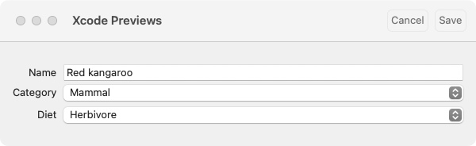
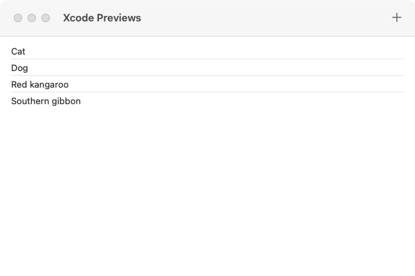
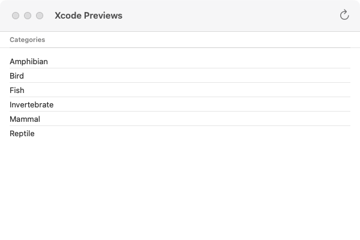

# AnimalsUI

We completed a lot of work to build the data models of our Animals product. Before we build our component tree, it might be helpful to rebuild the sample project from Apple to remember what we are cloning. We can count four main custom components for our product:

* `CategoryList`: A component to display our `Category` values sorted by name.
* `AnimalList`: A component to display our `Animal` values for one `Category` sorted by name.
* `AnimalDetail`: A component for displaying the properties of one `Animal` value.
* `AnimalEditor`: A component for adding a new `Animal` values or updating an existing one.

Our Counter product was very simple. It was just one screen with just a few components. There are many more components we will compose together to build our Animals product, but much of the complexity has already been built in our `AnimalsData` module. Our `AnimalsUI` components will — for the most part — be “regular” SwiftUI. This is by design; you shouldn’t have to re-learn SwiftUI to build apps on `ImmutableData`. Most of what you already know about SwiftUI will still be relevant; you don’t have to “throw away” knowledge.

## StoreKey

Similar to our Counter product, let’s begin with a little code to help us configure `ImmutableData` for our product domain. We begin with defining the `Environment` value where we will save our `Store` instance. Select the `AnimalsUI` package and add a new Swift file under `Sources/AnimalsUI`. Name this file `StoreKey.swift`.

Here is the first step:

```swift
//  StoreKey.swift

import AnimalsData
import ImmutableData
import ImmutableUI
import SwiftUI

@MainActor fileprivate struct StoreKey : @preconcurrency EnvironmentKey {
  static let defaultValue = ImmutableData.Store(
    initialState: AnimalsState(),
    reducer: AnimalsReducer.reduce
  )
}

extension EnvironmentValues {
  fileprivate var store: ImmutableData.Store<AnimalsState, AnimalsAction> {
    get {
      self[StoreKey.self]
    }
    set {
      self[StoreKey.self] = newValue
    }
  }
}
```

Once we define our `Environment` value, we can configure `ImmutableUI` to use this `Store` instance. Let’s begin with `ImmutableUI.Provider`:

```swift
//  StoreKey.swift

extension ImmutableUI.Provider {
  public init(
    _ store: Store,
    @ViewBuilder content: () -> Content
  ) where Store == ImmutableData.Store<AnimalsState, AnimalsAction> {
    self.init(
      \.store,
       store,
       content: content
    )
  }
}
```

Here is `ImmutableUI.Dispatcher`:

```swift
//  StoreKey.swift

extension ImmutableUI.Dispatcher {
  public init() where Store == ImmutableData.Store<AnimalsState, AnimalsAction> {
    self.init(\.store)
  }
}
```

Here is `ImmutableUI.Selector`:

```swift
//  StoreKey.swift

extension ImmutableUI.Selector {
  public init(
    id: some Hashable,
    label: String? = nil,
    filter isIncluded: (@Sendable (Store.State, Store.Action) -> Bool)? = nil,
    dependencySelector: repeat DependencySelector<Store.State, each Dependency>,
    outputSelector: OutputSelector<Store.State, Output>
  ) where Store == ImmutableData.Store<AnimalsState, AnimalsAction> {
    self.init(
      \.store,
       id: id,
       label: label,
       filter: isIncluded,
       dependencySelector: repeat each dependencySelector,
       outputSelector: outputSelector
    )
  }
}

extension ImmutableUI.Selector {
  public init(
    label: String? = nil,
    filter isIncluded: (@Sendable (Store.State, Store.Action) -> Bool)? = nil,
    dependencySelector: repeat DependencySelector<Store.State, each Dependency>,
    outputSelector: OutputSelector<Store.State, Output>
  ) where Store == ImmutableData.Store<AnimalsState, AnimalsAction> {
    self.init(
      \.store,
       label: label,
       filter: isIncluded,
       dependencySelector: repeat each dependencySelector,
       outputSelector: outputSelector
    )
  }
}
```

Our Animals product is simple enough that we will build our component tree all in one module. For larger projects, individual pieces of your product might have their own module: `AnimalsMessengerUI`, `AnimalsPhotosUI`, `AnimalsFeedUI`, and more. To save us from duplicating code, these extensions on `ImmutableUI` could live in just one place: `AnimalsUICore` or `AnimalsUIInfra`. Remember: the State of any product should save in just one `Store` instance; all components should be calling `ImmutableUI` with the same `Environment` value.

## Dispatch

Our `ImmutableUI.Dispatcher` returns an `ImmutableData.Dispatcher` type. This means we can dispatch action values *and* thunks. Our convention is that our product should only dispatch action values from its component tree; thunks should be dispatched from a `Listener`. We saw a similar approach for our Counter product.

Add a new Swift file under `Sources/AnimalsUI`. Name this file `Dispatch.swift`.

```swift
//  Dispatch.swift

import AnimalsData
import ImmutableData
import ImmutableUI
import SwiftUI

@MainActor @propertyWrapper struct Dispatch: DynamicProperty {
  @ImmutableUI.Dispatcher() private var dispatcher
  
  init() {
    
  }
  
  var wrappedValue: (AnimalsAction) throws -> Void {
    self.dispatcher.dispatch
  }
}
```

There might be some interesting use cases for a component tree to dispatch thunks directly, but we strongly feel that the right approach will almost always be to keep that work in a proper `Listener`. If you *really* want to dispatch a thunk from a component, you do have that ability; we just strongly recommend you build a `Listener`.

## Select

We defined several Selectors when we built `AnimalsState`. We will forward those Selectors to our component tree for displaying data. Add a new Swift file under `Sources/AnimalsUI`. Name this file `Select.swift`.

Our `ImmutableUI.Selector` requires us to define a `didChange` function to indicate that our slice of State has changed. Similar to our Counter product, we will define value equality to be our “default” `didChange` function.

```swift
//  Select.swift

import AnimalsData
import ImmutableData
import ImmutableUI
import SwiftUI

extension ImmutableUI.DependencySelector {
  init(select: @escaping @Sendable (State) -> Dependency) where Dependency : Equatable {
    self.init(select: select, didChange: { $0 != $1 })
  }
}

extension ImmutableUI.OutputSelector {
  init(select: @escaping @Sendable (State) -> Output) where Output : Equatable {
    self.init(select: select, didChange: { $0 != $1 })
  }
}

extension ImmutableUI.Selector {
  init(
    id: some Hashable,
    label: String? = nil,
    filter isIncluded: (@Sendable (Store.State, Store.Action) -> Bool)? = nil,
    dependencySelector: repeat @escaping @Sendable (Store.State) -> each Dependency,
    outputSelector: @escaping @Sendable (Store.State) -> Output
  ) where Store == ImmutableData.Store<AnimalsState, AnimalsAction>, repeat each Dependency : Equatable, Output : Equatable {
    self.init(
      id: id,
      label: label,
      filter: isIncluded,
      dependencySelector: repeat DependencySelector(select: each dependencySelector),
      outputSelector: OutputSelector(select: outputSelector)
    )
  }
}

extension ImmutableUI.Selector {
  init(
    label: String? = nil,
    filter isIncluded: (@Sendable (Store.State, Store.Action) -> Bool)? = nil,
    dependencySelector: repeat @escaping @Sendable (Store.State) -> each Dependency,
    outputSelector: @escaping @Sendable (Store.State) -> Output
  ) where Store == ImmutableData.Store<AnimalsState, AnimalsAction>, repeat each Dependency : Equatable, Output : Equatable {
    self.init(
      label: label,
      filter: isIncluded,
      dependencySelector: repeat DependencySelector(select: each dependencySelector),
      outputSelector: OutputSelector(select: outputSelector)
    )
  }
}
```

We can now begin to define the Selectors of our component tree. These will map to the Selectors we defined from `AnimalsState`. Let’s begin with `SelectCategoriesValues`:

```swift
//  Select.swift

@MainActor @propertyWrapper struct SelectCategoriesValues: DynamicProperty {
  @ImmutableUI.Selector(
    label: "SelectCategoriesValues",
    filter: AnimalsFilter.filterCategories(),
    dependencySelector: AnimalsState.selectCategories(),
    outputSelector: AnimalsState.selectCategoriesValues(sort: \AnimalsData.Category.name)
  ) var wrappedValue
  
  init() {
    
  }
}
```

Let’s think through this step-by-step. It might help if we look through these parameters from back-to-front:

* Our `outputSelector` to fetch the sorted `Category` values will be `AnimalsState.selectCategoriesValues`. This function takes a sort parameter, so we pass `\AnimalsData.Category.name` to indicate we sort `Category` values by name.
* Our `outputSelector` runs in `O(n log n)` time. To improve performance, our `dependencySelector` will compare the `Dictionary` values returned by `AnimalsState.selectCategories`.
* Our `dependencySelector` compares `Dictionary` values is `O(n)` time. To improve performance, our `filter` will pass the Action and State values to `filterCategories`. This means we can skip over Action values that would never affect the value returned by `AnimalsState.selectCategories`.
* Our `label` value will be helpful when we enable debug logging in our next chapter.

Let’s define `SelectCategoriesStatus`:

```swift
//  Select.swift

@MainActor @propertyWrapper struct SelectCategoriesStatus: DynamicProperty {
  @ImmutableUI.Selector(
    label: "SelectCategoriesStatus",
    outputSelector: AnimalsState.selectCategoriesStatus()
  ) var wrappedValue: Status?
  
  init() {
    
  }
}
```

This one is easy: all we need is an `outputSelector`. Because this selector runs in constant time, we choose to skip defining a `dependencySelector`. We pass a `label` to enable debug logging.

Here is `SelectCategory`:

```swift
//  Select.swift

@MainActor @propertyWrapper struct SelectCategory: DynamicProperty {
  @ImmutableUI.Selector<ImmutableData.Store<AnimalsState, AnimalsAction>, AnimalsData.Category?> var wrappedValue: AnimalsData.Category?
  
  init(categoryId: AnimalsData.Category.ID?) {
    self._wrappedValue = ImmutableUI.Selector(
      id: categoryId,
      label: "SelectCategory(categoryId: \(categoryId ?? "nil"))",
      outputSelector: AnimalsState.selectCategory(categoryId: categoryId)
    )
  }
  
  init(animalId: Animal.ID?) {
    self._wrappedValue = ImmutableUI.Selector(
      id: animalId,
      label: "SelectCategory(animalId: \(animalId ?? "nil"))",
      outputSelector: AnimalsState.selectCategory(animalId: animalId)
    )
  }
}
```

The `AnimalsState.selectCategory` selector we defined takes a `Category.ID` as a parameter. We also built a selector that takes a `Animal.ID` as a parameter and returns the correct `Category` value for that `Animal`. We define `SelectCategory` to accept both: we can `init` with a `Category.ID` or a `Animal.ID`. We then forward that parameter to the correct version of `AnimalsState.selectCategory`.

When building SwiftUI components, it is common for the SwiftUI infra to keep the *identity* of a component consistent while the *value* of a component changes. Because our `ImmutableUI.Selector` is built on top of `SwiftUI.State`, the lifetime of its storage is tied to the lifetime of our component. Similar to a component built directly on `SwiftUI.State`, this can lead to problems. If the identity of our component remains the same, but the *data* we use to create that component changes, the values saved in our `SwiftUI.State` can look “stale”. If the value saved in our `SwiftUI.State` is derived from a parameter passed when our component value is created — which can happen multiple times without changing component identity — we need another way to “reset” that `SwiftUI.State`. The `id` parameter passed to `ImmutableUI.Selector` gives us that flexibility. If the identity of our component remains the same, but the `Category.ID` or `Animal.ID` changed, this will reset the `SwiftUI.State` used in `ImmutableUI.Selector`.

Here is `SelectAnimalsValues`:

```swift
//  Select.swift

@MainActor @propertyWrapper struct SelectAnimalsValues: DynamicProperty {
  @ImmutableUI.Selector<ImmutableData.Store<AnimalsState, AnimalsAction>, Dictionary<Animal.ID, Animal>, Array<Animal>> var wrappedValue: Array<Animal>
  
  init(categoryId: AnimalsData.Category.ID?) {
    self._wrappedValue = ImmutableUI.Selector(
      id: categoryId,
      label: "SelectAnimalsValues(categoryId: \(categoryId ?? "nil"))",
      filter: AnimalsFilter.filterAnimals(categoryId: categoryId),
      dependencySelector: AnimalsState.selectAnimals(categoryId: categoryId),
      outputSelector: AnimalsState.selectAnimalsValues(
        categoryId: categoryId,
        sort: \Animal.name
      )
    )
  }
}
```

This is very similar to what we built for `SelectCategoriesValues`. The biggest difference is that we need to pass a `Category.ID`. Similar to our previous example, this `Category.ID` should be passed as an `id`. If the identity of our component remains the same, but the `Category.ID` has been changed, we should reset our `SwiftUI.State` to prevent displaying stale data.

Here is `SelectAnimalsStatus`:

```swift
//  Select.swift

@MainActor @propertyWrapper struct SelectAnimalsStatus: DynamicProperty {
  @ImmutableUI.Selector(
    label: "SelectAnimalsStatus",
    outputSelector: AnimalsState.selectAnimalsStatus()
  ) var wrappedValue: Status?
  
  init() {
    
  }
}
```

This one is easy: all we need is an `outputSelector`. Similar to `SelectCategoriesStatus`, we skip defining a `dependencySelector` because we know this `outputSelector` will run in constant time.

Here is `SelectAnimal`:

```swift
//  Select.swift

@MainActor @propertyWrapper struct SelectAnimal: DynamicProperty {
  @ImmutableUI.Selector<ImmutableData.Store<AnimalsState, AnimalsAction>, Animal?> var wrappedValue: Animal?
  
  init(animalId: Animal.ID?) {
    self._wrappedValue = ImmutableUI.Selector(
      id: animalId,
      label: "SelectAnimal(animalId: \(animalId ?? "nil"))",
      outputSelector: AnimalsState.selectAnimal(animalId: animalId)
    )
  }
}
```

Here is `SelectAnimalStatus`:

```swift
//  Select.swift

@MainActor @propertyWrapper struct SelectAnimalStatus: DynamicProperty {
  @ImmutableUI.Selector<ImmutableData.Store<AnimalsState, AnimalsAction>, Status?> var wrappedValue: Status?
  
  init(animalId: Animal.ID?) {
    self._wrappedValue = ImmutableUI.Selector(
      id: animalId,
      label: "SelectAnimalStatus(animalId: \(animalId ?? "nil"))",
      outputSelector: AnimalsState.selectAnimalStatus(animalId: animalId)
    )
  }
}
```

There isn’t a rule telling you that Selectors have to be defined in one file away from the declaration of your components. Each Selector could be defined in the same place as the component that needs it — just keep in mind that we encourage you to reuse Selectors if you need the same data in more than one place. Do not define multiple Selectors that select the same identical slices of state; this can lead to unexpected behaviors if an engineer on your team ever updates one Selector but forgets to update the other ones. We also encourage you to think about discoverability when you organize these Selectors. Think about an engineer on your team building a new component that needs to display a sorted list of categories. Where would they go to search if that Selector has already been implemented? How could this Selector be placed in a way that your engineer would reuse the existing Selector before duplicating that work in a second place?

## PreviewStore

Before we build and run our application, we will use Xcode Previews to see our component tree as we work. It will be helpful to build a way for Previews to run against a `Store` with our sample data already loaded. We already have this sample data loading in our `LocalStore`, but we would prefer something more lightweight just for Previews: `LocalStore` creates a SwiftData `ModelContext`. All we want is to load some data in-memory. We will only use this for Xcode Previews; we don’t plan to ship this to production.

Add a new Swift file under `Sources/AnimalsUI`. Name this file `PreviewStore.swift`. We’re going to build a component that forwards a `Store` to a `Provider`. We can then wrap the component we wish to preview with a `PreviewStore` component for it to read against sample data.

```swift
//  PreviewStore.swift

import AnimalsData
import ImmutableData
import ImmutableUI
import SwiftUI

@MainActor struct PreviewStore<Content> where Content : View {
  @State private var store: ImmutableData.Store<AnimalsState, AnimalsAction> = {
    do {
      let store = ImmutableData.Store(
        initialState: AnimalsState(),
        reducer: AnimalsReducer.reduce
      )
      try store.dispatch(
        action: .data(
          .persistentSession(
            .didFetchCategories(
              result: .success(
                categories: [
                  .amphibian,
                  .bird,
                  .fish,
                  .invertebrate,
                  .mammal,
                  .reptile,
                ]
              )
            )
          )
        )
      )
      try store.dispatch(
        action: .data(
          .persistentSession(
            .didFetchAnimals(
              result: .success(
                animals: [
                  .dog,
                  .cat,
                  .kangaroo,
                  .gibbon,
                  .sparrow,
                  .newt,
                ]
              )
            )
          )
        )
      )
      return store
    } catch {
      fatalError("\(error)")
    }
  }()
  private let content: Content
  
  init(@ViewBuilder content: () -> Content) {
    self.content = content()
  }
}

extension PreviewStore: View {
  var body: some View {
    Provider(self.store) {
      self.content
    }
  }
}
```

After we create our `Store`, we pass a `didFetchCategories` action with our `Category` values and a `didFetchAnimals` action with our `Animal` values. We use this to simulate what will happen in production without going to the trouble of building a real `LocalStore`.

Xcode Previews can be powerful tools for engineering your SwiftUI products, but your decision to build Previews can be orthogonal to your decision to build from `ImmutableData`. We use Xcode Previews as a convention for our tutorials, but we don’t have a very strong opinion about how you would choose to implement Xcode Previews in your own products. You might prefer to build and run your app live on-device. Choose the approach that works best for your team and your product.

## Debug

Before we start building components, there is more little piece that will help for debugging. SwiftUI ships a function called `_printChanges` that can help us track when the infra is computing the `body` property of a component.[^1] Let’s add a way to turn this on and off from `UserDefaults`.

Add a new Swift file under `Sources/AnimalsUI`. Name this file `Debug.swift`.

```swift
//  Debug.swift

import SwiftUI

extension UserDefaults {
  fileprivate var isDebug: Bool {
    self.bool(forKey: "com.northbronson.AnimalsUI.Debug")
  }
}

extension View {
  static func debugPrint() {
#if DEBUG
    if UserDefaults.standard.isDebug {
      self._printChanges()
    }
#endif
  }
}
```

When we build our components, we can call `debugPrint` from our `body` property. If the `com.northbronson.AnimalsUI.Debug` flag is false, nothing happens.

We use the `debugPrint` function liberally for components in our sample products, but we don’t have a very strong opinion about bringing this to your own products. You might have a different pattern or convention to follow for tracking component lifecycle. Choose the approach that works best for your team and your product.

## AnimalEditor

We’re about to build our first component for this product. Our `AnimalEditor` component will be displayed when the user requests to edit an existing `Animal` value or create a new `Animal` value. This is a simple form-style component with options to select a name, a category, and a diet. The `Cancel` button should dismiss the component with no mutations to our global state. The `Save` button should attempt to mutate our global state with the selected parameters.

<picture>
 <source media="(prefers-color-scheme: light)" srcset="../Assets/Chapter-08-1.png">
 <source media="(prefers-color-scheme: dark)" srcset="../Assets/Chapter-08-2.png">
 
</picture>

The components we build for this product will be much more complex that what we built for our Counter application. This makes sense: our Data Model is more complex. Before we begin writing code, let’s explain what our approach to components will look like.

Engineers from the ReactJS community had a pattern you might have heard about: Presenters and Containers.[^2] This patterns means different things to different people, but let’s just quickly focus on this observation from Dan Abramov:

* Presenter Components are concerned with *how things look*.
* Container Components are concerned with *how things work*.

As Dan mentions in this essay, presenters and containers are not explicitly encouraged in “modern” React applications, but this pattern can still be available and legit as a matter of personal engineering style.

Our pattern for building components in the `ImmutableData` tutorial will follow a similar pattern: Presenter Components for how things look and Container Components for how things work. We follow this convention for our sample products, but we don’t have a strong opinion whether or not this belongs in your own products. One advantage we do like about this pattern is that breaking apart our mental model between Presenters and Containers gives us two “domains” to think about. Since our Presenter Domains are regular SwiftUI, it gives us a chance to focus our attention on making `ImmutableData` work alongside the traditional SwiftUI you already know about.

In addition to Presenters and Containers, we also build a “root” component, which is responsible for building our Container. There are three basic roles we plan to use these three categories for:

* Root Components build Container Components. Root Components also manage component state that is needed for our Selectors. This is “local” state that we do not choose to save in our `Store`, but it is local state that our Selectors depend on. An example could be a component that displays a `List` of `Person` values. We might have the ability to sort these values by first name or last name. The state to manage what parameter is used for our sorting algorithm is local state: this belongs in our component and not in our `Store`. Because our Selector to return the sorted `Array` of `Person` values needs the parameter to use for sorting, we manage this in our Root Component and pass it to our Container Component.
* Container Components build Presenter Components. Container Components are where we concentrate on integrating SwiftUI with `ImmutableData`. Here is where we define the Selectors this component will depend on, and here is where we `dispatch` Action values back to our `Store` when an important user event occurs.
* Presenter Components build Presenter Components. Presenter Components can also leverage SwiftUI navigation to bring the user to new Root Components. What we want to concentrate on is keeping `ImmutableData` *out* of our Presenter Components. Building Presenter Components should look like regular SwiftUI as much as possible. Presenter Components will also manage local state that does not drive our Selectors. An example would be a `Form` component with options to select new parameters on a `Person` value. When the user selects to save that `Form` data, we should `dispatch` that data to our `Store` with an Action value, but the ephemeral state of that `Form` data does not drive our Selectors while it is being edited.

This might sound a little abstract, but it will make more sense once we see some examples. Let’s get started and see what this looks like. Add a new Swift file under `Sources/AnimalsUI`. Name this file `AnimalEditor.swift`.

Let’s begin with a `AnimalEditor` Root Component:

```swift
//  AnimalEditor.swift

import AnimalsData
import SwiftUI

@MainActor struct AnimalEditor {
  @State private var id: Animal.ID
  @Binding private var isPresented: Bool
  
  init(
    id: Animal.ID?,
    isPresented: Binding<Bool>
  ) {
    self._id = State(initialValue: id ?? UUID().uuidString)
    self._isPresented = isPresented
  }
}

extension AnimalEditor: View {
  var body: some View {
    let _ = Self.debugPrint()
    Container(
      id: self.id,
      isPresented: self.$isPresented
    )
  }
}
```

We create our Root Component with two parameters: a `Animal.ID` value and a `SwiftUI.Binding` to a `Bool`. Our `id` parameter represents the `Animal` value being edited. Our `isPresented` binding will be used to dismiss this component when our `Animal` value is saved.

Before we construct our Container Component, we perform one extra step on our `Animal.ID` value. When a user chooses to begin creating a new `Animal` value, we don’t have an `Animal.ID`. If the user passed a `nil` value for `id` when this Root Component was created, we still would like a “placeholder” value here for us to use when tracking the `Status` of our asynchronous operation to save the new `Animal` to our `PersistentStore`. We save this placeholder values as a `UUID` value in `SwiftUI.State`. We use `SwiftUI.State` to keep this placeholder value consistent if the infra recreates this component value: we don’t want this value to change out from underneath us before our `PersistentStore` has completed its asynchronous operation.

There is a small performance optimization we can discuss for a future fix. The lifetime of this `SwiftUI.State` value is tied to the lifetime of our component identity. The *value* of our component could be created many times for one identity. The work in `init` should be kept as small — and as fast — as possible. Even though the lifetime of our `SwiftUI.State` could outlive the lifetime of our component value, creating a new component value can still produce a new `UUID` value. Because the *identity* of our component has not changed, this value was not needed; it’s just thrown away. An optimization would be to not have created it at all when the component identity has not changed.[^3] This is something that happens to any SwiftUI component that creates `SwiftUI.State` with a default value. There’s nothing specific to `ImmutableData` about why this happens, and strategies and techniques to optimize this can be orthogonal to our work on `ImmutableData`. This would be good to optimize in a production application, but for our purposes — keeping a tutorial moving to teach the `ImmutableData` architecture — we will optimize for keeping this code short and file a mental `TODO` to investigate this more another day.

Let’s turn our attention to our Container Component. This will be where we integrate with the `ImmutableData` architecture. This is where our Selectors will live and where we `dispatch` action values back to our `Store`. Here is our first step:

```swift
//  AnimalEditor.swift

extension AnimalEditor {
  @MainActor fileprivate struct Container {
    @SelectAnimal private var animal: Animal?
    @SelectAnimalStatus private var status: Status?
    @SelectCategoriesValues private var categories: Array<AnimalsData.Category>
    
    private let id: Animal.ID
    @Binding private var isPresented: Bool
    
    @Dispatch private var dispatch
    
    init(
      id: Animal.ID,
      isPresented: Binding<Bool>
    ) {
      self._animal = SelectAnimal(animalId: id)
      self._status = SelectAnimalStatus(animalId: id)
      self._categories = SelectCategoriesValues()

      self.id = id
      self._isPresented = isPresented
    }
  }
}
```

Our Container Component is constructed with an `id` value — which will be a placeholder value when we create a new `Animal` value — and a `isPresented` binding that will be used to dismiss this component.

This container constructs three selectors:

* `SelectAnimal`: The `id` value is passed to `SelectAnimal`. If our user is creating a new `Animal` value, this `id` will be a placeholder value. That implies that `SelectAnimal` will return `nil`. As an optimization, we could pass some extra context when our Container is constructed to indicate that this `id` is a placeholder. Since we built `SelectAnimal` to return in constant time, we will not spend too much time optimizing this.
* `SelectAnimalStatus`: Editing an `Animal` value or creating a new one will begin an asynchronous operation on our `PersistentSession`. We can track the `Status` value of that operation here.
* `SelectCategoriesValues`: Our `Form` will give users the ability to choose a `Category` value for this `Animal`. This selector will return all `Category` values sorted by name. This Selector takes no parameters, which means we could choose to skip an explicit construct in `init` to save some space.

In addition to our Selectors, our Container Component also constructs a `Dispatch` value. We will use this to respond to user events. Let’s begin with a user event to indicate we want to add a new `Animal` value:

```swift
//  AnimalEditor.swift

extension AnimalEditor.Container {
  private func onTapAddAnimalButton(data: AnimalEditor.Presenter.AddAnimalData) {
    do {
      try self.dispatch(
        .ui(
          .animalEditor(
            .onTapAddAnimalButton(
              id: data.id,
              name: data.name,
              diet: data.diet,
              categoryId: data.categoryId
            )
          )
        )
      )
    } catch {
      print(error)
    }
  }
}
```

The `AnimalEditor.Presenter.AddAnimalData` type will be added later. This is just a payload to deliver the data our user selected for this new `Animal`.

As previously discussed, a robust discussion about error handling in production SwiftUI applications is outside the scope of this tutorial. Our focus is on teaching `ImmutableData`; error handling can be learned independently in a separate tutorial. For now, we just `print` an error if our `dispatch` failed.

Remember, our goal here is to *think declaratively*. Our action values are not imperative instructions. Our component tree is not telling our `Store` what to do. Our component tree is telling our `Store` what just happened.

Here is the next action value:

```swift
//  AnimalEditor.swift

extension AnimalEditor.Container {
  private func onTapUpdateAnimalButton(data: AnimalEditor.Presenter.UpdateAnimalData) {
    do {
      try self.dispatch(
        .ui(
          .animalEditor(
            .onTapUpdateAnimalButton(
              animalId: data.animalId,
              name: data.name,
              diet: data.diet,
              categoryId: data.categoryId
            )
          )
        )
      )
    } catch {
      print(error)
    }
  }
}
```

Now, we can build our `body` and our Presenter Component:

```swift
//  AnimalEditor.swift

extension AnimalEditor.Container: View {
  var body: some View {
    let _ = Self.debugPrint()
    AnimalEditor.Presenter(
      animal: self.animal,
      status: self.status,
      categories: self.categories,
      id: self.id,
      isPresented: self.$isPresented,
      onTapAddAnimalButton: self.onTapAddAnimalButton,
      onTapUpdateAnimalButton: self.onTapUpdateAnimalButton
    )
  }
}
```

Because our Presenter Component does not know about `ImmutableData` — we keep that out of Presenters by design — our Presenter Component does not know how to dispatch actions on user events. We pass our `onTapAddAnimalButton` and `onTapUpdateAnimalButton` functions as parameters; these will be called when user events happen.

Let’s build our Presenter. Here is the main declaration:

```swift
//  AnimalEditor.swift

extension AnimalEditor {
  @MainActor fileprivate struct Presenter {
    @State private var name: String
    @State private var diet: Animal.Diet?
    @State private var categoryId: AnimalsData.Category.ID?
    
    private let animal: Animal?
    private let status: Status?
    private let categories: Array<AnimalsData.Category>
    private let id: Animal.ID
    @Binding private var isPresented: Bool
    private let onTapAddAnimalButton: (AddAnimalData) -> Void
    private let onTapUpdateAnimalButton: (UpdateAnimalData) -> Void
    
    init(
      animal: Animal?,
      status: Status?,
      categories: Array<AnimalsData.Category>,
      id: Animal.ID,
      isPresented: Binding<Bool>,
      onTapAddAnimalButton: @escaping (AddAnimalData) -> Void,
      onTapUpdateAnimalButton: @escaping (UpdateAnimalData) -> Void
    ) {
      self._name = State(initialValue: animal?.name ?? "")
      self._diet = State(initialValue: animal?.diet)
      self._categoryId = State(initialValue: animal?.categoryId)

      self.animal = animal
      self.status = status
      self.categories = categories
      self._isPresented = isPresented
      self.id = id
      self.onTapAddAnimalButton = onTapAddAnimalButton
      self.onTapUpdateAnimalButton = onTapUpdateAnimalButton
    }
  }
}
```

The parameters we recognize from our Container Component. We add three `SwiftUI.State` properties for saving the current selections from our `Form`. This is local component state: before a save operation takes place, this state is not part of our global `Store`. Because our Selectors do not need this local state for deriving data, we can define it here in Presenter (as opposed to the Root Component).

Let’s build the two types we use for passing data on user events:

```swift
//  AnimalEditor.swift

extension AnimalEditor.Presenter {
  struct AddAnimalData: Hashable, Sendable {
    let id: Animal.ID
    let name: String
    let diet: Animal.Diet
    let categoryId: AnimalsData.Category.ID
  }
}

extension AnimalEditor.Presenter {
  struct UpdateAnimalData: Hashable, Sendable {
    let animalId: Animal.ID
    let name: String
    let diet: Animal.Diet
    let categoryId: AnimalsData.Category.ID
  }
}
```

We could choose to pass all these parameters directly to the closures from our Container (without building an extra type), but we lose the ability to use argument labels to help keep these parameters in the correct place.[^4] Using custom types to pass this data to our closure gives us a little stricter compile time checking that we are doing the correct thing. You are free to follow this pattern in your own products if you choose.

Our Presenter component is regular SwiftUI: there’s nothing here that needs to know about `ImmutableData`. We assume a familiarity with SwiftUI components and we’re going to go a little fast when we build our Presenters. If any of these SwiftUI components are new to you, please reference the documentation and sample code projects from Apple to learn more.

Here is a `Form` for capturing user selections:

```swift
//  AnimalEditor.swift

extension AnimalEditor.Presenter {
  private var form: some View {
    Form {
      TextField("Name", text: self.$name)
      Picker("Category", selection: self.$categoryId) {
        Text("Select a category").tag(nil as String?)
        ForEach(self.categories) { category in
          Text(category.name).tag(category.categoryId as String?)
        }
      }
      Picker("Diet", selection: self.$diet) {
        Text("Select a diet").tag(nil as Animal.Diet?)
        ForEach(Animal.Diet.allCases, id: \.self) { diet in
          Text(diet.rawValue).tag(diet as Animal.Diet?)
        }
      }
    }
  }
}
```

Here is a `Button` to cancel our edits:

```swift
//  AnimalEditor.swift

extension AnimalEditor.Presenter {
  private var cancelButton: some ToolbarContent {
    ToolbarItem(placement: .cancellationAction) {
      Button("Cancel", role: .cancel) {
        self.isPresented = false
      }
    }
  }
}
```

Here is a `Button` to attempt to save our edits:

```swift
//  AnimalEditor.swift

extension AnimalEditor.Presenter {
  private var saveButton: some ToolbarContent {
    ToolbarItem(placement: .confirmationAction) {
      Button("Save") {
        if let diet = self.diet,
           let categoryId = self.categoryId {
          if self.animal != nil {
            self.onTapUpdateAnimalButton(
              UpdateAnimalData(
                animalId: self.id,
                name: self.name,
                diet: diet,
                categoryId: categoryId
              )
            )
          } else {
            self.onTapAddAnimalButton(
              AddAnimalData(
                id: self.id,
                name: self.name,
                diet: diet,
                categoryId: categoryId
              )
            )
          }
        }
      }
      .disabled(self.isSaveDisabled)
    }
  }
}
```

Our `AnimalEditor` component handles both adding a new `Animal` and editing an existing `Animal`. This means we have some conditional logic to confirm if our user is adding or editing. An alternative would be two different components: a `Creator` and a `Editor`. We don’t have a very strong opinion about the tradeoffs — this is a SwiftUI question, not a `ImmutableData` question. You can choose to design components for your own products using the pattern that works best for you.

There are going to be times we want to prevent the user from attempting a save:
* A save operation is already in progress for this `Animal`.
* The `name` field is empty.
* The `diet` field is empty.
* The `category` field is empty.

Here is what that looks like:

```swift
//  AnimalEditor.swift

extension AnimalEditor.Presenter {
  private var isSaveDisabled: Bool {
    if self.status == .waiting {
      return true
    }
    if self.name.isEmpty {
      return true
    }
    if self.diet == nil {
      return true
    }
    if self.categoryId == nil {
      return true
    }
    return false
  }
}
```

Now, we are ready to build our `body` property:

```swift
//  AnimalEditor.swift

extension AnimalEditor.Presenter: View {
  var body: some View {
    let _ = Self.debugPrint()
    self.form
      .navigationTitle(self.animal != nil ? "Edit Animal" : "Add Animal")
      .onChange(of: self.status) {
        if self.status == .success {
          self.isPresented = false
        }
      }
      .toolbar {
        self.cancelButton
        self.saveButton
      }
      .padding()
  }
}
```

Because our save operation is asynchronous, we don’t dismiss our component as soon as the user taps the save button. If the save completes successfully, our component will refresh with `status` equal to `success`. We can then dismiss our component with the `isPresented` value.

We use Containers and Presenters for teaching `ImmutableData`, but we don’t have a very strong opinion about recommending this pattern for your own products. Could we have merged our Containers and Presenter? There’s nothing stopping us. We did need a Root Component to save a `SwiftUI.State` variable for passing to our Selectors, but there are other SwiftUI patterns you might find for this same situation.

One advantage we see with this approach is Presenters are “free” of `ImmutableData` by design. If you have an engineer on your team who is brand-new to `ImmutableData` and experienced in SwiftUI, having them focus on building Presenters would be one way to keep them shipping measurable impact while they ramp up on learning `ImmutableData`. If you have an engineer that is brand-new to `ImmutableData` *and* SwiftUI, breaking components apart with Containers and Presenters is a way to avoid trying to teach them “two things at once”.

Let’s build some Xcode Previews to see what this component looks like. Here is our Root Component created with an existing `Animal.ID`:

```swift
//  AnimalEditor.swift

#Preview {
  @Previewable @State var isPresented: Bool = true
  NavigationStack {
    PreviewStore {
      AnimalEditor(
        id: Animal.kangaroo.animalId,
        isPresented: $isPresented
      )
    }
  }
}
```

We remember to wrap our `AnimalEditor` component with `PreviewStore` to make the sample data available.

Here is our `AnimalEditor` with no `Animal.ID` to indicate we are creating a new `Animal`:

```swift
//  AnimalEditor.swift

#Preview {
  @Previewable @State var isPresented: Bool = true
  NavigationStack {
    PreviewStore {
      AnimalEditor(
        id: nil,
        isPresented: $isPresented
      )
    }
  }
}
```

Because our Presenter Component has no dependencies on `ImmutableData`, we can build an Xcode Preview for our Presenter without any `PreviewStore`:

```swift
//  AnimalEditor.swift

#Preview {
  @Previewable @State var isPresented: Bool = true
  NavigationStack {
    AnimalEditor.Presenter(
      animal: .kangaroo,
      status: nil,
      categories: [
        .amphibian,
        .bird,
        .fish,
        .invertebrate,
        .mammal,
        .reptile,
      ],
      id: Animal.kangaroo.animalId,
      isPresented: $isPresented,
      onTapAddAnimalButton: { data in
        print("onTapAddAnimalButton: \(data)")
      },
      onTapUpdateAnimalButton: { data in
        print("onTapUpdateAnimalButton: \(data)")
      }
    )
  }
}

#Preview {
  @Previewable @State var isPresented: Bool = true
  NavigationStack {
    AnimalEditor.Presenter(
      animal: nil,
      status: nil,
      categories: [
        .amphibian,
        .bird,
        .fish,
        .invertebrate,
        .mammal,
        .reptile,
      ],
      id: "1234",
      isPresented: $isPresented,
      onTapAddAnimalButton: { data in
        print("onTapAddAnimalButton: \(data)")
      },
      onTapUpdateAnimalButton: { data in
        print("onTapUpdateAnimalButton: \(data)")
      }
    )
  }
}
```

## AnimalDetail

Our `AnimalDetail` component will display the `name`, `category`, and `diet` values of an `Animal`. We also build buttons to edit or delete the `Animal`.

<picture>
 <source media="(prefers-color-scheme: light)" srcset="../Assets/Chapter-08-3.png">
 <source media="(prefers-color-scheme: dark)" srcset="../Assets/Chapter-08-4.png">
 
</picture>

We follow a similar pattern: our Root Component constructs a Container Component, our Container Component constructs Presenter Components, and our Presenter Component constructs Presenter Components. We will also leverage standard SwiftUI navigation to construct a Root Component from our Presenter Component.

Add a new Swift file under `Sources/AnimalsUI`. Name this file `AnimalDetail.swift`. Here is our Root Component:

```swift
//  AnimalDetail.swift

import AnimalsData
import SwiftUI

@MainActor struct AnimalDetail {
  private let selectedAnimalId: Animal.ID?
  
  init(selectedAnimalId: Animal.ID?) {
    self.selectedAnimalId = selectedAnimalId
  }
}

extension AnimalDetail : View {
  var body: some View {
    let _ = Self.debugPrint()
    Container(selectedAnimalId: self.selectedAnimalId)
  }
}
```

We construct our `AnimalDetail` with an optional `Animal.ID`. We pass our `Animal.ID` to our Container:

```swift
//  AnimalDetail.swift

extension AnimalDetail {
  @MainActor fileprivate struct Container {
    @SelectAnimal private var animal: Animal?
    @SelectCategory private var category: AnimalsData.Category?
    @SelectAnimalStatus private var status: Status?
    
    @Dispatch private var dispatch
    
    init(selectedAnimalId: Animal.ID?) {
      self._animal = SelectAnimal(animalId: selectedAnimalId)
      self._category = SelectCategory(animalId: selectedAnimalId)
      self._status = SelectAnimalStatus(animalId: selectedAnimalId)
    }
  }
}
```

For a given `Animal.ID` value, we can select the `Animal`, the `Category`, and the `Status` through `ImmutableData`. On app launch, our `Animal.ID` is `nil`; these values returned by our Selectors will also be `nil`. When that happens, we will build our Presenter to display a special message to the user.

There is one action value we can `dispatch` to our `Store`:

```swift
//  AnimalDetail.swift

extension AnimalDetail.Container {
  private func onTapDeleteSelectedAnimalButton(animal: Animal) {
    do {
      try self.dispatch(
        .ui(
          .animalDetail(
            .onTapDeleteSelectedAnimalButton(
              animalId: animal.id
            )
          )
        )
      )
    } catch {
      print(error)
    }
  }
}
```

Here is our `body`:

```swift
//  AnimalDetail.swift

extension AnimalDetail.Container: View {
  var body: some View {
    let _ = Self.debugPrint()
    AnimalDetail.Presenter(
      animal: self.animal,
      category: self.category,
      status: self.status,
      onTapDeleteSelectedAnimalButton: self.onTapDeleteSelectedAnimalButton
    )
  }
}
```

Here is our Presenter:

```swift
//  AnimalDetail.swift

extension AnimalDetail {
  @MainActor fileprivate struct Presenter {
    @State private var isAlertPresented = false
    @State private var isSheetPresented = false
    
    private let animal: Animal?
    private let category: AnimalsData.Category?
    private let status: Status?
    private let onTapDeleteSelectedAnimalButton: (Animal) -> Void
    
    init(
      animal: Animal?,
      category: AnimalsData.Category?,
      status: Status?,
      onTapDeleteSelectedAnimalButton: @escaping (Animal) -> Void
    ) {
      self.animal = animal
      self.category = category
      self.status = status
      self.onTapDeleteSelectedAnimalButton = onTapDeleteSelectedAnimalButton
    }
  }
}
```

Here is our `body`:

```swift
//  AnimalDetail.swift

extension AnimalDetail.Presenter: View {
  var body: some View {
    let _ = Self.debugPrint()
    if let animal = self.animal,
       let category = self.category {
      VStack {
        Text(animal.name)
          .font(.title)
          .padding()
        List {
          HStack {
            Text("Category")
            Spacer()
            Text(category.name)
          }
          HStack {
            Text("Diet")
            Spacer()
            Text(animal.diet.rawValue)
          }
        }
      }
      .alert("Delete \(animal.name)?", isPresented: self.$isAlertPresented) {
        Button("Yes, delete \(animal.name)", role: .destructive) {
          self.onTapDeleteSelectedAnimalButton(animal)
        }
      }
      .sheet(isPresented: self.$isSheetPresented) {
        NavigationStack {
          AnimalEditor(
            id: animal.id,
            isPresented: self.$isSheetPresented
          )
        }
      }
      .toolbar {
        Button { self.isSheetPresented = true } label: {
          Label("Edit \(animal.name)", systemImage: "pencil")
        }
        .disabled(self.status == .waiting)
        Button { self.isAlertPresented = true } label: {
          Label("Delete \(animal.name)", systemImage: "trash")
        }
        .disabled(self.status == .waiting)
      }
    } else {
      ContentUnavailableView("Select an animal", systemImage: "pawprint")
    }
  }
}
```

This is a lot of code, but we are looking at some standard SwiftUI; there is no `ImmutableData` in our Presenter. You might choose to compose this Presenter from additional components to improve readability. Our goal with this tutorial is to teach `ImmutableData`; for the most part, we don’t have very strong opinions about how you build your Presenter Components in your own Products.

Here are two Previews of our Root Component:

```swift
//  AnimalDetail.swift

#Preview {
  NavigationStack {
    PreviewStore {
      AnimalDetail(selectedAnimalId: Animal.kangaroo.animalId)
    }
  }
}

#Preview {
  NavigationStack {
    PreviewStore {
      AnimalDetail(selectedAnimalId: nil)
    }
  }
}
```

Here are two Previews of our Presenter Component:

```swift
//  AnimalDetail.swift

#Preview {
  NavigationStack {
    AnimalDetail.Presenter(
      animal: .kangaroo,
      category: .mammal,
      status: nil,
      onTapDeleteSelectedAnimalButton: { animal in
        print("onTapDeleteSelectedAnimalButton: \(animal)")
      }
    )
  }
}

#Preview {
  NavigationStack {
    AnimalDetail.Presenter(
      animal: nil,
      category: nil,
      status: nil,
      onTapDeleteSelectedAnimalButton: { animal in
        print("onTapDeleteSelectedAnimalButton: \(animal)")
      }
    )
  }
}
```

## AnimalList

Our `AnimalList` component will display the `Animal` values for a given `Category.ID` sorted by name. We also construct a button to add a new `Animal` to our `Store`.

<picture>
 <source media="(prefers-color-scheme: light)" srcset="../Assets/Chapter-08-5.png">
 <source media="(prefers-color-scheme: dark)" srcset="../Assets/Chapter-08-6.png">
 
</picture>

Add a new Swift file under `Sources/AnimalsUI`. Name this file `AnimalList.swift`. Here is our Root Component:

```swift
//  AnimalList.swift

import AnimalsData
import SwiftUI

@MainActor struct AnimalList {
  private let selectedCategoryId: AnimalsData.Category.ID?
  @Binding private var selectedAnimalId: Animal.ID?
  
  init(
    selectedCategoryId: AnimalsData.Category.ID?,
    selectedAnimalId: Binding<Animal.ID?>
  ) {
    self.selectedCategoryId = selectedCategoryId
    self._selectedAnimalId = selectedAnimalId
  }
}

extension AnimalList : View {
  var body: some View {
    Container(
      selectedCategoryId: self.selectedCategoryId,
      selectedAnimalId: self.$selectedAnimalId
    )
  }
}
```

We construct our Root Component with a `Category.ID` and a `SwiftUI.Binding` to a `Animal.ID`. We choose a `SwiftUI.Binding` because selecting a new `Animal` in this component should also update the `Animal` we display in our `AnimalDetail` component.

Here is our Container:

```swift
//  AnimalList.swift

extension AnimalList {
  @MainActor fileprivate struct Container {
    @SelectAnimalsValues private var animals: Array<Animal>
    @SelectCategory private var category: AnimalsData.Category?
    @SelectAnimalsStatus private var status: Status?
    
    @Binding private var selectedAnimalId: Animal.ID?
    
    @Dispatch private var dispatch
    
    init(
      selectedCategoryId: AnimalsData.Category.ID?,
      selectedAnimalId: Binding<Animal.ID?>
    ) {
      self._animals = SelectAnimalsValues(categoryId: selectedCategoryId)
      self._category = SelectCategory(categoryId: selectedCategoryId)
      self._status = SelectAnimalsStatus()
      
      self._selectedAnimalId = selectedAnimalId
    }
  }
}
```

We pass our `Category.ID` to two selectors: we select the sorted `Animal` values and we select the `Category` value itself. We also select the `Status` of the last time `Animal` values were fetched from our `PersistentStore`, but we don’t pass a `Category.ID` for that.

Our `Category.ID` value will be `nil` on app launch; we will display a special message in our Presenter if that happens.

A legit optimization would be to update this fetch to fetch *only* the `Animal` values for a specific `Category.ID`. If we are about to display all `Reptile` values, we might not need to fetch all `Mammal` values. For larger products with large amounts of data, this optimization would be very important to conserve CPU and Battery. For now, we keep things simple and file a mental `TODO` to improve this with a more efficient option in the future.

There are two action values we can `dispatch` to our `Store`:

```swift
//  AnimalList.swift

extension AnimalList.Container {
  private func onAppear() {
    do {
      try self.dispatch(
        .ui(
          .animalList(
            .onAppear
          )
        )
      )
    } catch {
      print(error)
    }
  }
}

extension AnimalList.Container {
  private func onTapDeleteSelectedAnimalButton(animal: Animal) {
    do {
      try self.dispatch(
        .ui(
          .animalList(
            .onTapDeleteSelectedAnimalButton(
              animalId: animal.id
            )
          )
        )
      )
    } catch {
      print(error)
    }
  }
}
```

Here is our `body`:

```swift
//  AnimalList.swift

extension AnimalList.Container: View {
  var body: some View {
    let _ = Self.debugPrint()
    AnimalList.Presenter(
      animals: self.animals,
      category: self.category,
      status: self.status,
      selectedAnimalId: self.$selectedAnimalId,
      onAppear: self.onAppear,
      onTapDeleteSelectedAnimalButton: self.onTapDeleteSelectedAnimalButton
    )
  }
}
```

Our next step is our Presenter:

```swift
//  AnimalList.swift

extension AnimalList {
  @MainActor fileprivate struct Presenter {
    @State private var isSheetPresented = false
    
    private let animals: Array<Animal>
    private let category: AnimalsData.Category?
    private let status: Status?
    @Binding private var selectedAnimalId: Animal.ID?
    private let onAppear: () -> Void
    private let onTapDeleteSelectedAnimalButton: (Animal) -> Void
    
    init(
      animals: Array<Animal>,
      category: AnimalsData.Category?,
      status: Status?,
      selectedAnimalId: Binding<Animal.ID?>,
      onAppear: @escaping () -> Void,
      onTapDeleteSelectedAnimalButton: @escaping (Animal) -> Void
    ) {
      self.animals = animals
      self.category = category
      self.status = status
      self._selectedAnimalId = selectedAnimalId
      self.onAppear = onAppear
      self.onTapDeleteSelectedAnimalButton = onTapDeleteSelectedAnimalButton
    }
  }
}
```

Here is our `List` component:

```swift
//  AnimalList.swift

extension AnimalList.Presenter {
  var list: some View {
    List(selection: self.$selectedAnimalId) {
      ForEach(self.animals) { animal in
        NavigationLink(animal.name, value: animal.id)
          .deleteDisabled(false)
      }
      .onDelete { indexSet in
        for index in indexSet {
          let animal = self.animals[index]
          self.onTapDeleteSelectedAnimalButton(animal)
        }
      }
    }
  }
}
```

Our `List` component displays our sorted `Animal` values. Every value is built with a `NavigationLink` to indicate we leverage standard SwiftUI navigation patterns when this `Animal` is selected. We also save the value of our `Animal` selection to our `SwiftUI.Binding`.

Swiping on an `Animal` value gives users the opportunity to delete the `Animal`. A potential edge-casey behavior to defend against would be to guarantee that a given `Animal` is not currently `waiting` on an asynchronous operation before attempting to delete. A potential solution to this would be to define a selector to return all `Animal.ID` values that are currently `waiting` on an asynchronous operation, and then use those values to set `deleteDisabled` to `true` when our user should not have the option to delete this `Animal` value. For now, we file a mental `TODO` to keep this in mind for a future update.

Here is a button to add a new `Animal`:

```swift
//  AnimalList.swift

extension AnimalList.Presenter {
  var addButton: some View {
    Button { self.isSheetPresented = true } label: {
      Label("Add an animal", systemImage: "plus")
    }
    .disabled(self.status == .waiting)
  }
}
```

Here is our `body`:

```swift
//  AnimalList.swift

extension AnimalList.Presenter: View {
  var body: some View {
    let _ = Self.debugPrint()
    if let category = self.category {
      self.list
        .navigationTitle(category.name)
        .onAppear {
          self.onAppear()
        }
        .overlay {
          if self.animals.isEmpty {
            ContentUnavailableView {
              Label("No animals in this category", systemImage: "pawprint")
            } description: {
              self.addButton
            }
          }
        }
        .sheet(isPresented: self.$isSheetPresented) {
          NavigationStack {
            AnimalEditor(
              id: nil,
              isPresented: self.$isSheetPresented
            )
          }
        }
        .toolbar {
          ToolbarItem(placement: .primaryAction) {
            self.addButton
          }
        }
    } else {
      ContentUnavailableView("Select a category", systemImage: "sidebar.left")
    }
  }
}
```

Here are two previews:

```swift
//  AnimalList.swift

#Preview {
  @Previewable @State var selectedAnimal: Animal.ID?
  NavigationStack {
    PreviewStore {
      AnimalList(
        selectedCategoryId: Category.mammal.id,
        selectedAnimalId: $selectedAnimal
      )
    }
  }
}

#Preview {
  @Previewable @State var selectedAnimalId: Animal.ID?
  NavigationStack {
    AnimalList.Presenter(
      animals: [
        Animal.cat,
        Animal.dog,
        Animal.kangaroo,
        Animal.gibbon,
      ],
      category: .mammal,
      status: nil,
      selectedAnimalId: $selectedAnimalId,
      onAppear: {
        print("onAppear")
      },
      onTapDeleteSelectedAnimalButton: { animal in
        print("onTapDeleteSelectedAnimalButton: \(animal)")
      }
    )
  }
}
```

## CategoryList

Our `CategoryList` component will display the `Category` values sorted by name. We also construct a button to refresh our application with the sample data built on the initial launch.

<picture>
 <source media="(prefers-color-scheme: light)" srcset="../Assets/Chapter-08-7.png">
 <source media="(prefers-color-scheme: dark)" srcset="../Assets/Chapter-08-8.png">
 
</picture>

Add a new Swift file under `Sources/AnimalsUI`. Name this file `CategoryList.swift`. Here is our Root Component:

```swift
//  CategoryList.swift

import AnimalsData
import SwiftUI

@MainActor struct CategoryList {
  @Binding private var selectedCategoryId: AnimalsData.Category.ID?
  
  init(selectedCategoryId: Binding<AnimalsData.Category.ID?>) {
    self._selectedCategoryId = selectedCategoryId
  }
}

extension CategoryList : View {
  var body: some View {
    let _ = CategoryList.debugPrint()
    Container(selectedCategoryId: self.$selectedCategoryId)
  }
}
```

Our `Category.ID` is a `SwiftUI.Binding`; we will change this selection in our `CategoryList` and this will update the value used to build our `AnimalList`.

Here is our Container:

```swift
//  CategoryList.swift

extension CategoryList {
  @MainActor fileprivate struct Container {
    @SelectCategoriesValues private var categories: Array<AnimalsData.Category>
    @SelectCategoriesStatus private var status: Status?
    
    @Binding private var selectedCategoryId: AnimalsData.Category.ID?
    
    @Dispatch private var dispatch
    
    init(selectedCategoryId: Binding<AnimalsData.Category.ID?>) {
      self._categories = SelectCategoriesValues()
      self._status = SelectCategoriesStatus()
      
      self._selectedCategoryId = selectedCategoryId
    }
  }
}
```

Our Container selects the sorted `Category` values and the `Status` of our most recent attempt to fetch `Category` values.

There are two action values we can `dispatch` to our `Store`:

```swift
//  CategoryList.swift

extension CategoryList.Container {
  private func onAppear() {
    do {
      try self.dispatch(
        .ui(
          .categoryList(
            .onAppear
          )
        )
      )
    } catch {
      print(error)
    }
  }
}

extension CategoryList.Container {
  private func onReloadSampleData() {
    do {
      try self.dispatch(
        .ui(
          .categoryList(
            .onTapReloadSampleDataButton
          )
        )
      )
    } catch {
      print(error)
    }
  }
}
```

Here is our Container `body`:

```swift
//  CategoryList.swift

extension CategoryList.Container: View {
  var body: some View {
    let _ = Self.debugPrint()
    CategoryList.Presenter(
      categories: self.categories,
      status: self.status,
      selectedCategoryId: self.$selectedCategoryId,
      onAppear: self.onAppear,
      onReloadSampleData: self.onReloadSampleData
    )
  }
}
```

Here is the main declaration of our Presenter:

```swift
//  CategoryList.swift

extension CategoryList {
  @MainActor fileprivate struct Presenter {
    @State private var isAlertPresented = false
    
    private let categories: Array<AnimalsData.Category>
    private let status: Status?
    @Binding private var selectedCategoryId: AnimalsData.Category.ID?
    private let onAppear: () -> Void
    private let onReloadSampleData: () -> Void
    
    init(
      categories: Array<AnimalsData.Category>,
      status: Status?,
      selectedCategoryId: Binding<AnimalsData.Category.ID?>,
      onAppear: @escaping () -> Void,
      onReloadSampleData: @escaping () -> Void
    ) {
      self.categories = categories
      self.status = status
      self._selectedCategoryId = selectedCategoryId
      self.onAppear = onAppear
      self.onReloadSampleData = onReloadSampleData
    }
  }
}
```

Here is our `List` component:

```swift
//  CategoryList.swift

extension CategoryList.Presenter {
  var list: some View {
    List(selection: self.$selectedCategoryId) {
      Section("Categories") {
        ForEach(self.categories) { category in
          NavigationLink(category.name, value: category.id)
        }
      }
    }
  }
}
```

Similar to our `AnimalList`, we use `NavigationLink` for the standard SwiftUI navigation pattern when this `Category` is selected.

Here is our `body`:

```swift
//  CategoryList.swift

extension CategoryList.Presenter: View {
  var body: some View {
    let _ = Self.debugPrint()
    self.list
      .alert("Reload Sample Data?", isPresented: self.$isAlertPresented) {
        Button("Yes, reload sample data", role: .destructive) {
          self.onReloadSampleData()
        }
      } message: {
        Text("Reloading the sample data deletes all changes to the current data.")
      }
      .onAppear {
        self.onAppear()
      }
      .toolbar {
        Button { self.isAlertPresented = true } label: {
          Label("Reload sample data", systemImage: "arrow.clockwise")
        }
        .disabled(self.status == .waiting)
      }
  }
}
```

We disable the refresh button when the `Status` of our `Category` values is `waiting`. This prevents a user from beginning a new fetch if the previous fetch is still not complete. A potential edge-case we might think about defending against is disabling the reload button when *any* asynchronous operation is happening in our `PersistentSession`. This could include operations to edit or save `Animal` values. If the user attempts to edit an existing `Animal` and then immediately tries to reload sample data, there could be unexpected behavior when these two operations complete. A potential solution to this would be to define a Selector to return a `Bool` value indicating if any `Animal` value is currently `waiting` on an asynchronous operation, and then use that value to disable the refresh button. For now, we file a mental `TODO` to test this behavior more carefully in a future update.

Here are two previews:

```swift
//  CategoryList.swift

#Preview {
  @Previewable @State var selectedCategoryId: AnimalsData.Category.ID?
  NavigationStack {
    PreviewStore {
      CategoryList(selectedCategoryId: $selectedCategoryId)
    }
  }
}

#Preview {
  @Previewable @State var selectedCategoryId: AnimalsData.Category.ID?
  NavigationStack {
    CategoryList.Presenter(
      categories: [
        Category.amphibian,
        Category.bird,
        Category.fish,
        Category.invertebrate,
        Category.mammal,
        Category.reptile,
      ],
      status: nil,
      selectedCategoryId: $selectedCategoryId,
      onAppear: {
        print("onAppear")
      },
      onReloadSampleData: {
        print("onReloadSampleData")
      }
    )
  }
}
```

## Content

We’re almost done with `AnimalsUI`. All we need is a `Content` component to stitch things together. This is the component we construct from app launch. Add a new Swift file under `Sources/AnimalsUI`. Name this file `Content.swift`. Here is our component:

```swift
//  Content.swift

import AnimalsData
import SwiftUI

@MainActor public struct Content {
  @State private var selectedCategoryId: AnimalsData.Category.ID?
  @State private var selectedAnimalId: Animal.ID?
  
  public init() {
    
  }
}

extension Content: View {
  public var body: some View {
    let _ = Self.debugPrint()
    NavigationSplitView {
      CategoryList(selectedCategoryId: self.$selectedCategoryId)
    } content: {
      AnimalList(
        selectedCategoryId: self.selectedCategoryId,
        selectedAnimalId: self.$selectedAnimalId
      )
    } detail: {
      AnimalDetail(selectedAnimalId: self.selectedAnimalId)
    }
  }
}

#Preview {
  PreviewStore {
    Content()
  }
}
```

We save `selectedCategoryId` and `selectedAnimalId` as local component state. When we change `selectedCategoryId` from `CategoryList`, we pass our new value to `AnimalList` and we update the `Animal` values displayed. When we change `selectedAnimalId` from `AnimalList`, we pass our new value to `AnimalDetail` and we update the `Animal` value displayed.

---

Here is our `AnimalsUI` package:

```text
AnimalsUI
└── Sources
    └── AnimalsUI
        ├── AnimalDetail.swift
        ├── AnimalEditor.swift
        ├── AnimalList.swift
        ├── CategoryList.swift
        ├── Content.swift
        ├── Debug.swift
        ├── Dispatch.swift
        ├── PreviewStore.swift
        ├── Select.swift
        └── StoreKey.swift
```

We wrote a lot of code, but you saw for yourself that a lot of what we built was really just standard SwiftUI. Learning `ImmutableData` does not mean throwing away the knowledge you already have. The biggest difference you would probably notice is that none of these components perform imperative mutations on data model objects to transform our global state — we’re programming with a very different mental-model. We think declaratively: our components dispatch actions to our `Store` when something happens. Our components do not tell our `Store` *how* to behave; our components tell our `Store` *what* just happened.

[^1]: https://developer.apple.com/videos/play/wwdc2023/10160/
[^2]: https://medium.com/@dan_abramov/smart-and-dumb-components-7ca2f9a7c7d0
[^3]: https://developer.apple.com/documentation/swiftui/state#Store-observable-objects
[^4]: https://github.com/swiftlang/swift-evolution/blob/main/proposals/0111-remove-arg-label-type-significance.md
