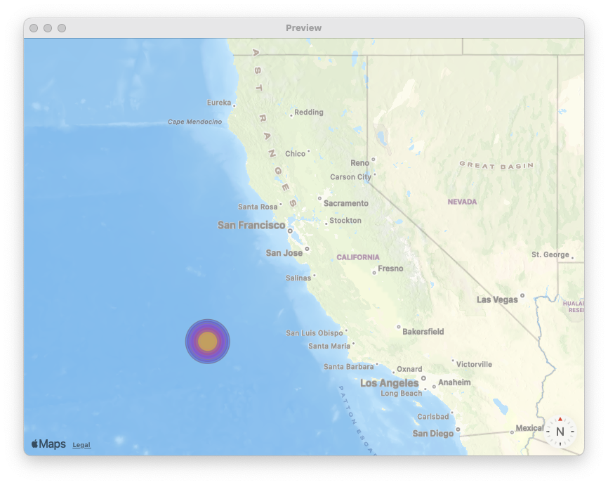
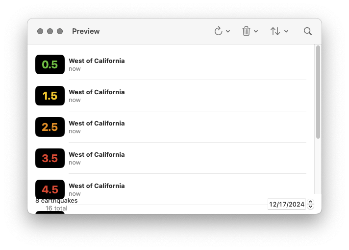

# QuakesUI

Before we build the component tree of our Quakes product, it might be helpful to rebuild the sample project from Apple. There are two main custom components for our product:

* `QuakeList`: A component to display our `Quake` values in a `SwiftUI.List`. We give users the ability to control how they want their values to be sorted. We also give users the ability to filter by name with a search bar.
* `QuakeMap`: A component to display our `Quake` values in a `MapKit.Map`. These values should match the values displayed in `QuakeList`.

We will follow a similar pattern to how we built our Animals product:

* Presenter Components are for “regular” SwiftUI: we don’t integrate with `ImmutableData`.
* Container Components are for integrating with `ImmutableData`.

## QuakeUtils

There are a few utilities on `Quake` that will be helpful for us. Select the `QuakesUI` package and add a new Swift file under `Sources/QuakesUI`. Name this file `QuakeUtils.swift`.

Here is an `Array` of sample values:

```swift
//  QuakeUtils.swift

import CoreLocation
import MapKit
import QuakesData
import SwiftUI

extension Quake {
  static var previewQuakes: Array<Self> {
    [
      .xxsmall,
      .xsmall,
      .small,
      .medium,
      .large,
      .xlarge,
      .xxlarge,
      .xxxlarge
    ]
  }
}
```

Here is a utility to format our `magnitude` property as a `String`:

```swift
//  QuakeUtils.swift

extension Quake {
  var magnitudeString: String {
    self.magnitude.formatted(.number.precision(.fractionLength(1)))
  }
}
```

Here is a utility to format our `time` property as a `String`:

```swift
//  QuakeUtils.swift

extension Quake {
  var fullDate: String {
    self.time.formatted(date: .complete, time: .complete)
  }
}
```

Here is a utility to construct a coordinate:

```swift
//  QuakeUtils.swift

extension Quake {
  var coordinate: CLLocationCoordinate2D {
    CLLocationCoordinate2D(
      latitude: self.latitude,
      longitude: self.longitude
    )
  }
}
```

Here’s a utility to map our `magnitude` property to `Color` values:

```swift
//  QuakeUtils.swift

extension Quake {
  var color: Color {
    switch self.magnitude {
    case 0..<1:
      return .green
    case 1..<2:
      return .yellow
    case 2..<3:
      return .orange
    case 3..<5:
      return .red
    case 5..<7:
      return .purple
    case 7..<Double.greatestFiniteMagnitude:
      return .indigo
    default:
      return .gray
    }
  }
}
```

## StoreKey

Similar to our Animals product, we need to define an `Environment` variable where our `Store` instance will be saved.  Add a new Swift file under `Sources/QuakesUI`. Name this file `StoreKey.swift`.

```swift
//  StoreKey.swift

import ImmutableData
import ImmutableUI
import QuakesData
import SwiftUI

@MainActor fileprivate struct StoreKey : @preconcurrency EnvironmentKey {
  static let defaultValue = ImmutableData.Store(
    initialState: QuakesState(),
    reducer: QuakesReducer.reduce
  )
}

extension EnvironmentValues {
  fileprivate var store: ImmutableData.Store<QuakesState, QuakesAction> {
    get {
      self[StoreKey.self]
    }
    set {
      self[StoreKey.self] = newValue
    }
  }
}
```

We can now use this `Store` instance as the value of our `ImmutableUI.Provider`:

```swift
//  StoreKey.swift

extension ImmutableUI.Provider {
  public init(
    _ store: Store,
    @ViewBuilder content: () -> Content
  ) where Store == ImmutableData.Store<QuakesState, QuakesAction> {
    self.init(
      \.store,
       store,
       content: content
    )
  }
}
```

Here is our `ImmutableUI.Dispatcher`:

```swift
//  StoreKey.swift

extension ImmutableUI.Dispatcher {
  public init() where Store == ImmutableData.Store<QuakesState, QuakesAction> {
    self.init(\.store)
  }
}
```

Here is our `ImmutableUI.Selector`:

```swift
//  StoreKey.swift

extension ImmutableUI.Selector {
  public init(
    id: some Hashable,
    label: String? = nil,
    filter isIncluded: (@Sendable (Store.State, Store.Action) -> Bool)? = nil,
    dependencySelector: repeat DependencySelector<Store.State, each Dependency>,
    outputSelector: OutputSelector<Store.State, Output>
  ) where Store == ImmutableData.Store<QuakesState, QuakesAction> {
    self.init(
      \.store,
       id: id,
       label: label,
       filter: isIncluded,
       dependencySelector: repeat each dependencySelector,
       outputSelector: outputSelector
    )
  }
}

extension ImmutableUI.Selector {
  public init(
    label: String? = nil,
    filter isIncluded: (@Sendable (Store.State, Store.Action) -> Bool)? = nil,
    dependencySelector: repeat DependencySelector<Store.State, each Dependency>,
    outputSelector: OutputSelector<Store.State, Output>
  ) where Store == ImmutableData.Store<QuakesState, QuakesAction> {
    self.init(
      \.store,
       label: label,
       filter: isIncluded,
       dependencySelector: repeat each dependencySelector,
       outputSelector: outputSelector
    )
  }
}
```

These extensions are optional; we *could* build our component tree without them, but we would be passing the Store key path in all these different places by-hand. It would add extra work for our product engineers. Defining these extension also helps prevent product engineers from shipping a bug and accidentally passing an incorrect key path.

## Dispatch

Let’s define a `Dispatch` type for our component tree to dispatch action values. Add a new Swift file under `Sources/QuakesUI`. Name this file `Dispatch.swift`.

```swift
//  Dispatch.swift

import ImmutableData
import ImmutableUI
import QuakesData
import SwiftUI

@MainActor @propertyWrapper struct Dispatch: DynamicProperty {
  @ImmutableUI.Dispatcher() private var dispatcher
  
  init() {
    
  }
  
  var wrappedValue: (QuakesAction) throws -> Void {
    self.dispatcher.dispatch
  }
}
```

Similar to our Animals product, we only expose the `dispatch` function for action values. We do not expose the `dispatch` function for thunk operations. There might be some use cases where dispatching thunk operations from our component tree might be helpful for testing or prototyping, but our opinion is this is an anti-pattern for your production applications: component trees should dispatch action values, not thunk operations.

## Select

Similar to our Animals data models, our Quakes data models adopt `Equatable`. When we build Selectors, the data returned by our Selectors will also conform to `Equatable`. We want the equality operator to be how our Selectors determine data has changed.

Add a new Swift file under `Sources/QuakesUI`. Name this file `Select.swift`. Here are extensions on `ImmutableUI.Selector` for us to use value equality:

```swift
//  Select.swift

import ImmutableData
import ImmutableUI
import QuakesData
import SwiftUI

extension ImmutableUI.DependencySelector {
  init(select: @escaping @Sendable (State) -> Dependency) where Dependency : Equatable {
    self.init(select: select, didChange: { $0 != $1 })
  }
}

extension ImmutableUI.OutputSelector {
  init(select: @escaping @Sendable (State) -> Output) where Output : Equatable {
    self.init(select: select, didChange: { $0 != $1 })
  }
}

extension ImmutableUI.Selector {
  init(
    id: some Hashable,
    label: String? = nil,
    filter isIncluded: (@Sendable (Store.State, Store.Action) -> Bool)? = nil,
    dependencySelector: repeat @escaping @Sendable (Store.State) -> each Dependency,
    outputSelector: @escaping @Sendable (Store.State) -> Output
  ) where Store == ImmutableData.Store<QuakesState, QuakesAction>, repeat each Dependency : Equatable, Output : Equatable {
    self.init(
       id: id,
       label: label,
       filter: isIncluded,
       dependencySelector: repeat DependencySelector(select: each dependencySelector),
       outputSelector: OutputSelector(select: outputSelector)
    )
  }
}

extension ImmutableUI.Selector {
  init(
    label: String? = nil,
    filter isIncluded: (@Sendable (Store.State, Store.Action) -> Bool)? = nil,
    dependencySelector: repeat @escaping @Sendable (Store.State) -> each Dependency,
    outputSelector: @escaping @Sendable (Store.State) -> Output
  ) where Store == ImmutableData.Store<QuakesState, QuakesAction>, repeat each Dependency : Equatable, Output : Equatable {
    self.init(
       label: label,
       filter: isIncluded,
       dependencySelector: repeat DependencySelector(select: each dependencySelector),
       outputSelector: OutputSelector(select: outputSelector)
    )
  }
}
```

These extensions are optional. If these extensions were not defined, product engineers would be responsible for defining their own `didChange` closures when every Selector is defined. There are some advanced use cases where this ability to configure and customize is helpful, but value equality is going to be a very good choice as a default for most products.

We can now begin to define the Selectors of our component tree. These will map to the Selectors we defined from `AnimalsState`. Let’s begin with `SelectQuakes`. This will return a `Dictionary` of `Quake` values for displaying our `QuakeMap` component.

```swift
//  Select.swift

@MainActor @propertyWrapper struct SelectQuakes: DynamicProperty {
  @ImmutableUI.Selector<ImmutableData.Store<QuakesState, QuakesAction>, Dictionary<Quake.ID, Quake>> var wrappedValue: Dictionary<Quake.ID, Quake>
  
  init(
    searchText: String,
    searchDate: Date
  ) {
    self._wrappedValue = ImmutableUI.Selector(
      id: ID(
        searchText: searchText,
        searchDate: searchDate
      ),
      label: "SelectQuakes(searchText: \"\(searchText)\", searchDate: \(searchDate))",
      filter: QuakesFilter.filterQuakes(),
      outputSelector: QuakesState.selectQuakes(
        searchText: searchText,
        searchDate: searchDate
      )
    )
  }
}

extension SelectQuakes {
  fileprivate struct ID : Hashable {
    let searchText: String
    let searchDate: Date
  }
}
```

Let’s take a closer look at the parameters we use to create our Selector:

* Our `outputSelector` takes two parameters: a `searchText` and a `searchDate`. Our selector returns a `Dictionary`. The operation to filter by `String` and `Date` runs in linear time.
* Our `filter` is used to improve performance. We know that only a subset of action values could ever change our `Quake` values: we don’t have to run our `outputSelector` if we know an action value could *not* change our `Quake` values.
* Our `label` will be helpful when we enable debug logging.
* Our `id` is a value that conforms to `Hashable`. We use this value to help define the *value* of our Selector. This is similar — but distinct from — the *identity* of our Selector. The identity of our Selector is tied, through `SwiftUI.State`, to the identity of our component. The identity of our `QuakeMap` component could stay consistent while our user changes the `searchText` and `searchDate` at runtime. If we didn’t pass an `id`, we would see our `QuakeMap` fail to update its `Quake` values when the user updates their selections: this would be a bug. Our `id` value is derived from two values: we define an `ID` type that adopts `Hashable` and wraps `searchText` and `searchDate`.

Let’s build `SelectQuakesValues`. This is the selector we use for our `QuakeList`. It returns an `Array` of `Quake` values. Our user has the ability to choose the options we use for sorting.

```swift
//  Select.swift

@MainActor @propertyWrapper struct SelectQuakesValues: DynamicProperty {
  @ImmutableUI.Selector<ImmutableData.Store<QuakesState, QuakesAction>, Dictionary<Quake.ID, Quake>, Array<Quake>> var wrappedValue: Array<Quake>
  
  init(
    searchText: String,
    searchDate: Date,
    sort keyPath: KeyPath<Quake, some Comparable & Sendable> & Sendable,
    order: SortOrder
  ) {
    self._wrappedValue = ImmutableUI.Selector(
      id: ID(
        searchText: searchText,
        searchDate: searchDate,
        keyPath: keyPath,
        order: order
      ),
      label: "SelectQuakesValues(searchText: \"\(searchText)\", searchDate: \(searchDate), keyPath: \(keyPath), order: \(order))",
      filter: QuakesFilter.filterQuakes(),
      dependencySelector: QuakesState.selectQuakes(
        searchText: searchText,
        searchDate: searchDate
      ),
      outputSelector: QuakesState.selectQuakesValues(
        searchText: searchText,
        searchDate: searchDate,
        sort: keyPath,
        order: order
      )
    )
  }
}

extension SelectQuakesValues {
  fileprivate struct ID<Value> : Hashable where Value : Sendable {
    let searchText: String
    let searchDate: Date
    let keyPath: KeyPath<Quake, Value>
    let order: SortOrder
  }
}
```

We construct our Selector with four values: in addition to `searchText` and `searchDate`, we also pass `keyPath` and `order` to choose how `Quake` values will be sorted. Because sorting is an `O(n log n)` problem, we also define a `dependencySelector` that can run in linear time.

Here is `SelectQuakesCount`:

```swift
//  Select.swift

@MainActor @propertyWrapper struct SelectQuakesCount: DynamicProperty {
  @ImmutableUI.Selector<ImmutableData.Store<QuakesState, QuakesAction>, Int>(
    label: "SelectQuakesCount",
    outputSelector: QuakesState.selectQuakesCount()
  ) var wrappedValue: Int
  
  init() {
    
  }
}
```

Here is `SelectQuakesStatus`:

```swift
//  Select.swift

@MainActor @propertyWrapper struct SelectQuakesStatus: DynamicProperty {
  @ImmutableUI.Selector<ImmutableData.Store<QuakesState, QuakesAction>, Status?>(
    label: "SelectQuakesStatus",
    outputSelector: QuakesState.selectQuakesStatus()
  ) var wrappedValue: Status?
  
  init() {
    
  }
}
```

Here is `SelectQuake`:

```swift
//  Select.swift

@MainActor @propertyWrapper struct SelectQuake: DynamicProperty {
  @ImmutableUI.Selector<ImmutableData.Store<QuakesState, QuakesAction>, Quake?> var wrappedValue: Quake?
  
  init(quakeId: String?) {
    self._wrappedValue = ImmutableUI.Selector(
      id: quakeId,
      label: "SelectQuake(quakeId: \(quakeId ?? "nil"))",
      outputSelector: QuakesState.selectQuake(quakeId: quakeId)
    )
  }
}
```

These three selectors all run in constant time; we won’t see a very impactful performance improvement by defining a `dependencySelector` and a `filter`.

## PreviewStore

Similar to our Animals product, we will define a component for constructing a `Store` reference with some sample data already saved. We will use this when we build Container Components in Xcode Previews.

Add a new Swift file under `Sources/QuakesUI`. Name this file `PreviewStore.swift`.

```swift
//  PreviewStore.swift

import ImmutableData
import ImmutableUI
import QuakesData
import SwiftUI

@MainActor struct PreviewStore<Content> where Content : View {
  @State private var store: ImmutableData.Store<QuakesState, QuakesAction> = {
    do {
      let store = ImmutableData.Store(
        initialState: QuakesState(),
        reducer: QuakesReducer.reduce
      )
      try store.dispatch(
        action: .data(
          .persistentSession(
            .localStore(
              .didFetchQuakes(
                result: .success(
                  quakes: Quake.previewQuakes
                )
              )
            )
          )
        )
      )
      return store
    } catch {
      fatalError("\(error)")
    }
  }()
  private let content: Content
  
  init(@ViewBuilder content: () -> Content) {
    self.content = content()
  }
}

extension PreviewStore: View {
  var body: some View {
    Provider(self.store) {
      self.content
    }
  }
}
```

## Debug

Similar to our Animals product, we want the ability to enable some enhanced debug logging when a component computes its `body` property. We will use launch arguments from Xcode to set a `bool` value on `UserDefaults`.

Add a new Swift file under `Sources/QuakesUI`. Name this file `Debug.swift`.

```swift
//  PreviewStore.swift

import SwiftUI

extension UserDefaults {
  fileprivate var isDebug: Bool {
    self.bool(forKey: "com.northbronson.QuakesUI.Debug")
  }
}

extension View {
  static func debugPrint() {
#if DEBUG
    if UserDefaults.standard.isDebug {
      self._printChanges()
    }
#endif
  }
}
```

## QuakeMap

Most of what we built this chapter looks very similar to our Animals product. Our selectors were specialized for our Quakes product domain, but the patterns and conventions we follow carried over from what we learned before.

Our component tree will follow a similar strategy: common patterns and conventions with specialization for our product domain. Our Presenter Components are built just for our Quakes product, but our Container Components will look — and feel — similar to what we built for our Animals product.

Let’s begin with `QuakeMap`. We construct a `MapKit.Map` to display `Quake` values.

<picture>
 <source media="(prefers-color-scheme: light)" srcset="../Assets/Chapter-12-1.png">
 <source media="(prefers-color-scheme: dark)" srcset="../Assets/Chapter-12-2.png">
 
</picture>

A common pattern with SwiftUI is composition: small components are assembled together. Our app is built from `ImmutableData`, but our Presenter Components are still going to be regular SwiftUI. Our `QuakeMap` presenter will display some components that could be defined as subcomponents. The decision to build from `ImmutableData` is orthogonal to the decision to compose small components or construct “one big” component. For now, let’s start with a small subcomponent that will be displayed in our `Map`.

Add a new Swift file under `Sources/QuakesUI`. Name this file `QuakeMap.swift`. Here is our first declaration:

```swift
//  QuakeMap.swift

import CoreLocation
import MapKit
import QuakesData
import SwiftUI

@MainActor fileprivate struct QuakeCircle {
  private let quake: Quake
  private let selected: Bool
  
  init(
    quake: Quake,
    selected: Bool
  ) {
    self.quake = quake
    self.selected = selected
  }
}
```

This component will help display a circle overlay in our `Map` component. Here is our `body` property:

```swift
//  QuakeMap.swift

extension QuakeCircle {
  var markerSize: CGSize {
    let value = (self.quake.magnitude + 3) * 6
    return CGSize(width: value, height: value)
  }
}

extension QuakeCircle: View {
  var body: some View {
    Circle()
      .stroke(
        self.selected ? .black : .gray,
        style: StrokeStyle(
          lineWidth: self.selected ? 2 : 1
        )
      )
      .fill(
        self.quake.color.opacity(
          self.selected ? 1 : 0.5
        )
      )
      .frame(
        width: self.markerSize.width,
        height: self.markerSize.width
      )
  }
}
```

We can Preview these from Xcode:

```swift
//  QuakeMap.swift

#Preview {
  ForEach(Quake.previewQuakes) { quake in
    HStack {
      QuakeCircle(
        quake: quake,
        selected: false
      ).padding()
      QuakeCircle(
        quake: quake,
        selected: true
      ).padding()
    }
  }
}
```

The next step is to construct this component in a `MapContent` type:

```swift
//  QuakeMap.swift

@MainActor fileprivate struct QuakeMarker {
  private let quake: Quake
  private let selected: Bool
  
  init(
    quake: Quake,
    selected: Bool
  ) {
    self.quake = quake
    self.selected = selected
  }
}

extension QuakeMarker: MapContent {
  var body: some MapContent {
    Annotation(coordinate: self.quake.coordinate) {
      QuakeCircle(quake: self.quake, selected: selected)
    } label: {
      Text(self.quake.name)
    }
    .annotationTitles(.hidden)
    .tag(self.quake)
  }
}
```

We’re not going to spend too much time documenting the behavior of these MapKit types, but we encourage you to explore the documentation and sample code from Apple if you want to learn more.[^1]

Here is the main declaration of our `QuakeMap` root component:

```swift
//  QuakeMap.swift

@MainActor struct QuakeMap {
  private let listSelection: Quake.ID?
  @Binding private var mapSelection: Quake.ID?
  private let searchText: String
  private let searchDate: Date
  
  init(
    listSelection: Quake.ID?,
    mapSelection: Binding<Quake.ID?>,
    searchText: String,
    searchDate: Date
  ) {
    self.listSelection = listSelection
    self._mapSelection = mapSelection
    self.searchText = searchText
    self.searchDate = searchDate
  }
}
```

We construct our `QuakeMap` with four parameters:

* Our `listSelection` is an optional `Quake.ID` value indicating which `Quake` value is currently selected by our `QuakeList`.
* Our `mapSelection` is a `SwiftUI.Binding` to an optional `Quake.ID` value indicating which `Quake` value is currently selected by our `QuakeMap`.
* Our `searchText` is a `String` indicating the text the user entered from our `QuakeList`.
* Our `searchDate` is a `Date` indicating the date the user selected from our `QuakeList`.

We can now define a `body` property to construct our Container:

```swift
//  QuakeMap.swift

extension QuakeMap: View {
  var body: some View {
    let _ = Self.debugPrint()
    Container(
      listSelection: self.listSelection,
      mapSelection: self.$mapSelection,
      searchText: self.searchText,
      searchDate: self.searchDate
    )
  }
}
```

Remember the role of our Container: we integrate with `ImmutableData` for fetching and selecting. Our Container is meant to be lightweight; we do the “heavy lifting” of defining our SwiftUI component tree in our Presenter.

Here is the declaration of our Container:

```swift
//  QuakeMap.swift

extension QuakeMap {
  @MainActor fileprivate struct Container {
    @SelectQuakes private var quakes: Dictionary<Quake.ID, Quake>
    @SelectQuake var listQuake: Quake?
    @SelectQuake var mapQuake: Quake?
    
    private let listSelection: Quake.ID?
    @Binding private var mapSelection: Quake.ID?
    
    init(
      listSelection: Quake.ID?,
      mapSelection: Binding<Quake.ID?>,
      searchText: String,
      searchDate: Date
    ) {
      self._quakes = SelectQuakes(
        searchText: searchText,
        searchDate: searchDate
      )
      self._listQuake = SelectQuake(quakeId: listSelection)
      self._mapQuake = SelectQuake(quakeId: mapSelection.wrappedValue)
      self.listSelection = listSelection
      self._mapSelection = mapSelection
    }
  }
}
```

We pass the same four parameters from our Root through to our Container. This Container needs two selectors:

* `SelectQuakes`: We select the `Dictionary` value of all `Quake` values that match for our `searchText` and `searchDate`.
* `SelectQuake`: We select the `Quake` values representing the current `listSelection` and `mapSelection`.

The argument could be made that `SelectQuake` is superfluous: we could also choose to select the correct `Quake` values from the `Dictionary` returned by `SelectQuakes`. Our `SelectQuake` selector runs in constant time; we don’t lose too much performance by doing things this way. It’s also possible there could be some more advanced use cases where a user could select a `Quake` which is expected to *not* be returned from `SelectQuakes`.

The next step is to construct our Presenter. Here is our `body`:

```swift
//  QuakeMap.swift

extension QuakeMap.Container: View {
  var body: some View {
    let _ = Self.debugPrint()
    QuakeMap.Presenter(
      quakes: self.quakes,
      listQuake: self.listQuake,
      mapQuake: self.mapQuake,
      listSelection: self.listSelection,
      mapSelection: self.$mapSelection
    )
  }
}
```

Here is the declaration of our Presenter:

```swift
//  QuakeMap.swift

extension QuakeMap {
  @MainActor fileprivate struct Presenter {
    private let quakes: Dictionary<Quake.ID, Quake>
    private let listQuake: Quake?
    private let mapQuake: Quake?
    private let listSelection: Quake.ID?
    @Binding private var mapSelection: Quake.ID?
    
    init(
      quakes: Dictionary<Quake.ID, Quake>,
      listQuake: Quake?,
      mapQuake: Quake?,
      listSelection: Quake.ID?,
      mapSelection: Binding<Quake.ID?>
    ) {
      self.quakes = quakes
      self.listQuake = listQuake
      self.mapQuake = mapQuake
      self.listSelection = listSelection
      self._mapSelection = mapSelection
    }
  }
}
```

Here is our `body` property:

```swift
//  QuakeMap.swift

extension CLLocationCoordinate2D {
  fileprivate func distance(to coordinate: CLLocationCoordinate2D) -> CLLocationDistance {
    let a = MKMapPoint(self);
    let b = MKMapPoint(coordinate);
    return a.distance(to: b)
  }
}

extension QuakeMap.Presenter {
  @KeyframesBuilder<MapCamera> private func keyframes(initialCamera: MapCamera) -> some Keyframes<MapCamera> {
    let start = initialCamera.centerCoordinate
    let end = self.listQuake?.coordinate ?? start
    let travelDistance = start.distance(to: end)
    
    let duration = max(min(travelDistance / 30, 5), 1)
    let finalAltitude = travelDistance > 20 ? 3_000_000 : min(initialCamera.distance, 3_000_000)
    let middleAltitude = finalAltitude * max(min(travelDistance / 5, 1.5), 1)
    
    KeyframeTrack(\MapCamera.centerCoordinate) {
      CubicKeyframe(end, duration: duration)
    }
    KeyframeTrack(\MapCamera.distance) {
      CubicKeyframe(middleAltitude, duration: duration / 2)
      CubicKeyframe(finalAltitude, duration: duration / 2)
    }
  }
}

extension QuakeMap.Presenter {
  private var map: some View {
    Map(selection: self.$mapSelection) {
      ForEach(Array(self.quakes.values)) { quake in
        QuakeMarker(quake: quake, selected: quake.id == self.mapSelection)
      }
    }
    .mapCameraKeyframeAnimator(
      trigger: self.listQuake,
      keyframes: self.keyframes
    )
    .mapStyle(
      .standard(
        elevation: .flat,
        emphasis: .muted,
        pointsOfInterest: .excludingAll
      )
    )
  }
}

extension QuakeMap.Presenter: View {
  var body: some View {
    let _ = Self.debugPrint()
    self.map
      .onChange(
        of: self.listSelection,
        initial: true
      ) {
        if self.mapSelection != self.listSelection {
          self.mapSelection = self.listSelection
        }
      }
      .navigationTitle(self.mapQuake?.name ?? "Earthquakes")
      .navigationSubtitle(self.mapQuake?.fullDate ?? "")
  }
}
```

There’s a lot of code here, but it’s mostly all just SwiftUI and MapKit. There’s nothing here that’s specific to `ImmutableData`; most of this code was copied directly from the Apple sample project.

Our `mapSelection` is a Binding: we can read and write values. There are two places we update this value: when the user selects a new `Quake` from the `Map` component and when the user selects a new `Quake` from the `QuakeList` component. If the value from `QuakeList` was updated, we also attempt to animate the area displayed so the `Quake` is visible.[^2]

Here are two Xcode Previews:

```swift
//  QuakeMap.swift

#Preview {
  @Previewable @State var mapSelection: Quake.ID?
  PreviewStore {
    QuakeMap(
      listSelection: nil,
      mapSelection: $mapSelection,
      searchText: "",
      searchDate: .now
    )
  }
}

#Preview {
  @Previewable @State var mapSelection: Quake.ID?
  QuakeMap.Presenter(
    quakes: Dictionary(uniqueKeysWithValues: Quake.previewQuakes.map { ($0.quakeId, $0) }),
    listQuake: nil,
    mapQuake: nil,
    listSelection: nil,
    mapSelection: $mapSelection
  )
}
```

Support for `MapKit` from Xcode Previews might not work as well as more simple SwiftUI components. We recommend choosing “Preview as App” instead of “Preview in Canvas” if you see any problems with rendering.

## QuakeList

Our `QuakeList` component displays a subset of `Quake` values: the user has the option to filter by date and name. We also have the option to delete `Quake` values from our local database and fetch new values from our remote store.

<picture>
 <source media="(prefers-color-scheme: light)" srcset="../Assets/Chapter-12-3.png">
 <source media="(prefers-color-scheme: dark)" srcset="../Assets/Chapter-12-4.png">
 
</picture>

Add a new Swift file under `Sources/QuakesUI`. Name this file `QuakeList.swift`. We’re going to begin with some subcomponents needed in our Presenter. Let’s begin with a row component:

```swift
//  QuakeList.swift

import QuakesData
import SwiftUI

@MainActor fileprivate struct RowContent {
  private let quake: Quake
  
  init(quake: Quake) {
    self.quake = quake
  }
}

extension RowContent: View {
  var body: some View {
    HStack {
      RoundedRectangle(cornerRadius: 8)
        .fill(.black)
        .frame(width: 60, height: 40)
        .overlay {
          Text(self.quake.magnitudeString)
            .font(.title)
            .bold()
            .foregroundStyle(self.quake.color)
        }
      
      VStack(alignment: .leading) {
        Text(self.quake.name)
          .font(.headline)
        Text("\(self.quake.time.formatted(.relative(presentation: .named)))")
          .foregroundStyle(.secondary)
      }
    }
    .padding(.vertical, 8)
  }
}

#Preview {
  ForEach(Quake.previewQuakes) { quake in
    RowContent(quake: quake)
      .padding()
  }
}
```

This is just a Presenter: there is no interaction here with `ImmutableData`.

Our `QuakeList` displays a “footer” component. Here is where we display the number of earthquakes that match our filters, the total number of earthquakes in our system, and a `DatePicker` to choose a calendar date.

```swift
//  QuakeList.swift

@MainActor fileprivate struct Footer {
  private let count: Int
  private let totalQuakes: Int
  @Binding private var searchDate: Date
  
  init(
    count: Int,
    totalQuakes: Int,
    searchDate: Binding<Date>
  ) {
    self.count = count
    self.totalQuakes = totalQuakes
    self._searchDate = searchDate
  }
}

extension Footer: View {
  var body: some View {
    HStack {
      VStack {
        Text("\(self.count) \(self.count == 1 ? "earthquake" : "earthquakes")")
        Text("\(self.totalQuakes) total")
          .foregroundStyle(.secondary)
      }
      .fixedSize()
      Spacer()
      DatePicker(
        "Search Date",
        selection: self.$searchDate,
        in: (.distantPast ... .distantFuture),
        displayedComponents: .date
      )
      .labelsHidden()
      .disabled(self.totalQuakes == .zero)
    }
  }
}

#Preview {
  @Previewable @State var searchDate: Date = .now
  Footer(
    count: 8,
    totalQuakes: 16,
    searchDate: $searchDate
  )
  .padding()
}
```

This is just another Presenter: there is no interaction here with `ImmutableData`.

Our user has the option to sort `Quake` values by `time` or `magnitude`. They can also choose to sort values ascending or descending. It will be a little easier to construct our component if we define these options in two small types:

```swift
//  QuakeList.swift

extension QuakeList {
  fileprivate enum SortOrder: String, CaseIterable, Identifiable, Hashable, Sendable {
    case forward, reverse
    var id: Self { self }
    var name: String { self.rawValue.capitalized }
  }
}

extension QuakeList {
  fileprivate enum SortParameter: String, CaseIterable, Identifiable, Hashable, Sendable {
    case time, magnitude
    var id: Self { self }
    var name: String { self.rawValue.capitalized }
  }
}
```

We can then map these two types to the types needed for our `SelectQuakesValues` Selector:

```swift
//  QuakeList.swift

extension SelectQuakesValues {
  fileprivate init(
    searchText: String,
    searchDate: Date,
    sortOrder: QuakeList.SortOrder,
    sortParameter: QuakeList.SortParameter
  ) {
    switch (sortParameter, sortOrder) {
    case (.time, .forward):
      self.init(searchText: searchText, searchDate: searchDate, sort: \Quake.time, order: .forward)
    case (.time, .reverse):
      self.init(searchText: searchText, searchDate: searchDate, sort: \Quake.time, order: .reverse)
    case (.magnitude, .forward):
      self.init(searchText: searchText, searchDate: searchDate, sort: \Quake.magnitude, order: .forward)
    case (.magnitude, .reverse):
      self.init(searchText: searchText, searchDate: searchDate, sort: \Quake.magnitude, order: .reverse)
    }
  }
}
```

Here is the main declaration of our `QuakeList` root component:

```swift
//  QuakeList.swift

@MainActor struct QuakeList {
  @Binding private var listSelection: Quake.ID?
  private let mapSelection: Quake.ID?
  @Binding private var searchText: String
  @Binding private var searchDate: Date
  @State private var sortOrder: QuakeList.SortOrder = .forward
  @State private var sortParameter: QuakeList.SortParameter = .time
  
  init(
    listSelection: Binding<Quake.ID?>,
    mapSelection: Quake.ID?,
    searchText: Binding<String>,
    searchDate: Binding<Date>
  ) {
    self._listSelection = listSelection
    self.mapSelection = mapSelection
    self._searchText = searchText
    self._searchDate = searchDate
  }
}
```

We construct our `QuakeList` with four parameters:

* Our `listSelection` is a Binding to an optional `Quake.ID` indicating which `Quake` value is currently selected by our `QuakeList`.
* Our `mapSelection` is an optional `Quake.ID` indicating which `Quake` value is currently selected by our `QuakeMap`.
* Our `searchText` is a Binding to a `String` value. This is the text our user entered in the Search Bar component.
* Our `searchDate` is a Binding to a `Date` value. This is the calendar date our user selected in the `Footer` component.

We save two additional `SwiftUI.State` properties: `sortOrder` and `sortParameter`. We will construct a component for the user to update these selections. Should this state be saved globally in `ImmutableData`? Maybe… but we would make the argument this is more appropriately saved as local component state. Remember our “Window Test”: if a user opens two different windows to display the same set of `Quake` values, should the user have the option to choose independent `sortOrder` and `sortParameter` values for each window? We believe our user would be more confused if updating the `sortOrder` in window number one also updated window number two; our user would expect that these windows can customize these values independently.

We can now define a `body` property to construct our Container:

```swift
//  QuakeList.swift

extension QuakeList : View {
  var body: some View {
    let _ = Self.debugPrint()
    Container(
      listSelection: self.$listSelection,
      mapSelection: self.mapSelection,
      searchText: self.$searchText,
      searchDate: self.$searchDate,
      sortOrder: self.$sortOrder,
      sortParameter: self.$sortParameter
    )
  }
}
```

Here is the declaration of our Container:

```swift
//  QuakeList.swift

extension QuakeList {
  @MainActor fileprivate struct Container {
    @SelectQuakesValues private var quakes: Array<Quake>
    @SelectQuakesCount private var totalQuakes: Int
    @SelectQuakesStatus private var status
    
    @Binding private var listSelection: Quake.ID?
    private let mapSelection: Quake.ID?
    @Binding private var searchText: String
    @Binding private var searchDate: Date
    @Binding private var sortOrder: SortOrder
    @Binding private var sortParameter: SortParameter

    @Dispatch private var dispatch
    
    init(
      listSelection: Binding<Quake.ID?>,
      mapSelection: Quake.ID?,
      searchText: Binding<String>,
      searchDate: Binding<Date>,
      sortOrder: Binding<SortOrder>,
      sortParameter: Binding<SortParameter>
    ) {
      self._quakes = SelectQuakesValues(
        searchText: searchText.wrappedValue,
        searchDate: searchDate.wrappedValue,
        sortOrder: sortOrder.wrappedValue,
        sortParameter: sortParameter.wrappedValue
      )
      self._listSelection = listSelection
      self.mapSelection = mapSelection
      self._searchText = searchText
      self._searchDate = searchDate
      self._sortOrder = sortOrder
      self._sortParameter = sortParameter
    }
  }
}
```

We are going to need to dispatch four action values back to `ImmutableData`. It will make things a little easier if we construct four `private` functions to help us:

```swift
//  QuakeList.swift

extension QuakeList.Container {
  private func onAppear() {
    do {
      try self.dispatch(.ui(.quakeList(.onAppear)))
    } catch {
      print(error)
    }
  }
}

extension QuakeList.Container {
  private func onTapRefreshQuakesButton(range: QuakesAction.UI.QuakeList.RefreshQuakesRange) {
    do {
      try self.dispatch(.ui(.quakeList(.onTapRefreshQuakesButton(range: range))))
    } catch {
      print(error)
    }
  }
}

extension QuakeList.Container {
  private func onTapDeleteSelectedQuakeButton(quakeId: Quake.ID) {
    do {
      try self.dispatch(.ui(.quakeList(.onTapDeleteSelectedQuakeButton(quakeId: quakeId))))
    } catch {
      print(error)
    }
  }
}

extension QuakeList.Container {
  private func onTapDeleteAllQuakesButton() {
    do {
      try self.dispatch(.ui(.quakeList(.onTapDeleteAllQuakesButton)))
    } catch {
      print(error)
    }
  }
}
```

We can then pass our properties and functions to our Presenter:

```swift
//  QuakeList.swift

extension QuakeList.Container: View {
  var body: some View {
    let _ = Self.debugPrint()
    QuakeList.Presenter(
      quakes: self.quakes,
      totalQuakes: self.totalQuakes,
      status: self.status,
      listSelection: self.$listSelection,
      mapSelection: self.mapSelection,
      searchText: self.$searchText,
      searchDate: self.$searchDate,
      sortOrder: self.$sortOrder,
      sortParameter: self.$sortParameter,
      onAppear: self.onAppear,
      onTapRefreshQuakesButton: self.onTapRefreshQuakesButton,
      onTapDeleteSelectedQuakeButton: self.onTapDeleteSelectedQuakeButton,
      onTapDeleteAllQuakesButton: self.onTapDeleteAllQuakesButton
    )
  }
}
```

Remember, our Presenter is where we build regular SwiftUI. There’s not going to be anything going on in here that is specifically tied to our `ImmutableData` architecture; that is what our Container is for.

Here is the declaration of our Presenter:

```swift
//  QuakeList.swift

extension QuakeList {
  @MainActor fileprivate struct Presenter {
    private let quakes: Array<Quake>
    private let totalQuakes: Int
    private let status: Status?
    @Binding private var listSelection: Quake.ID?
    private let mapSelection: Quake.ID?
    @Binding private var searchText: String
    @Binding private var searchDate: Date
    @Binding private var sortOrder: SortOrder
    @Binding private var sortParameter: SortParameter
    private let onAppear: () -> Void
    private let onTapRefreshQuakesButton: (QuakesAction.UI.QuakeList.RefreshQuakesRange) -> Void
    private let onTapDeleteSelectedQuakeButton: (Quake.ID) -> Void
    private let onTapDeleteAllQuakesButton: () -> Void
    
    init(
      quakes: Array<Quake>,
      totalQuakes: Int,
      status: Status?,
      listSelection: Binding<Quake.ID?>,
      mapSelection: Quake.ID?,
      searchText: Binding<String>,
      searchDate: Binding<Date>,
      sortOrder: Binding<SortOrder>,
      sortParameter: Binding<SortParameter>,
      onAppear: @escaping () -> Void,
      onTapRefreshQuakesButton: @escaping (QuakesAction.UI.QuakeList.RefreshQuakesRange) -> Void,
      onTapDeleteSelectedQuakeButton: @escaping (Quake.ID) -> Void,
      onTapDeleteAllQuakesButton: @escaping () -> Void
    ) {
      self.quakes = quakes
      self.totalQuakes = totalQuakes
      self.status = status
      self._listSelection = listSelection
      self.mapSelection = mapSelection
      self._searchText = searchText
      self._searchDate = searchDate
      self._sortOrder = sortOrder
      self._sortParameter = sortParameter
      self.onAppear = onAppear
      self.onTapRefreshQuakesButton = onTapRefreshQuakesButton
      self.onTapDeleteSelectedQuakeButton = onTapDeleteSelectedQuakeButton
      self.onTapDeleteAllQuakesButton = onTapDeleteAllQuakesButton
    }
  }
}
```

Our toolbar will construct three buttons: Refresh, Delete, and Sort. Let’s build our Refresh component:

```swift
//  QuakeList.swift

extension QuakeList.Presenter {
  private var refreshMenu: some View {
    Menu("Refresh", systemImage: "arrow.clockwise") {
      Button("All Hour") {
        self.onTapRefreshQuakesButton(.allHour)
      }
      Button("All Day") {
        self.onTapRefreshQuakesButton(.allDay)
      }
      Button("All Week") {
        self.onTapRefreshQuakesButton(.allWeek)
      }
      Button("All Month") {
        self.onTapRefreshQuakesButton(.allMonth)
      }
    }
    .pickerStyle(.inline)
  }
}
```

We construct a `Menu` component. Our user has four different options to fetch data. When our user makes a selection, we forward that option back to our Container and dispatch the correct Action value.

Here is our Delete component:

```swift
//  QuakeList.swift

extension QuakeList.Presenter {
  private var deleteMenu: some View {
    Menu("Delete", systemImage: "trash") {
      Button("Delete Selected") {
        if let quakeId = self.listSelection {
          self.onTapDeleteSelectedQuakeButton(quakeId)
        }
      }
      .disabled(self.listSelection == nil)
      Button("Delete All") {
        self.onTapDeleteAllQuakesButton()
      }
    }
    .pickerStyle(.inline)
    .disabled(self.totalQuakes == .zero)
  }
}
```

If the user is currently selecting a `Quake` value, they have the option to delete that value from the local database. If there is at least one `Quake` value in our global state, they also have the option to delete all `Quake` values from the local database. These are both actions on global state, so we forward those operations back to our Container.

Here is our Sort component:

```swift
//  QuakeList.swift

extension QuakeList.Presenter {
  private var sortMenu: some View {
    Menu("Sort", systemImage: "arrow.up.arrow.down") {
      Picker("Sort Order", selection: self.$sortOrder) {
        ForEach(QuakeList.SortOrder.allCases) { order in
          Text(order.name)
        }
      }
      Picker("Sort By", selection: self.$sortParameter) {
        ForEach(QuakeList.SortParameter.allCases) { parameter in
          Text(parameter.name)
        }
      }
    }
    .pickerStyle(.inline)
    .disabled(self.quakes.isEmpty)
  }
}
```

Our `sortOrder` and `sortParameter` values are both local component state. When the user makes a selection, we don’t forward that back to our Reducer. We pass a Binding to our Presenter and we perform an imperative mutation directly on that Binding. Because the `sortOrder` and `sortParameter` were originally defined as component state in our Root Component, changing those values will update our Container and our Selector.

Here is our `List` component:

```swift
//  QuakeList.swift

extension QuakeList.Presenter {
  private var list: some View {
    ScrollViewReader { proxy in
      List(selection: self.$listSelection) {
        ForEach(self.quakes) { quake in
          RowContent(quake: quake)
        }
      }
      .safeAreaInset(edge: .bottom) {
        Footer(
          count: self.quakes.count,
          totalQuakes: self.totalQuakes,
          searchDate: self.$searchDate
        )
        .padding(.horizontal)
        .padding(.bottom, 4)
      }
      .onChange(of: self.mapSelection) {
        if self.listSelection != self.mapSelection {
          self.listSelection = self.mapSelection
          if let quakeId = self.mapSelection {
            withAnimation {
              proxy.scrollTo(quakeId, anchor: .center)
            }
          }
        }
      }
    }
  }
}
```

Similar to our `QuakeMap`, we update our `listSelection` when the `mapSelection` updated. We also attempt to animate the area displayed so the `Quake` is visible.

Here is our `body` property:

```swift
//  QuakeList.swift

extension QuakeList.Presenter: View {
  var body: some View {
    let _ = Self.debugPrint()
    self.list
      .onAppear(perform: self.onAppear)
      .overlay {
        if self.totalQuakes == .zero {
          ContentUnavailableView("Refresh to load earthquakes", systemImage: "globe")
        } else if self.quakes.isEmpty {
          ContentUnavailableView.search
        }
      }
      .searchable(text: self.$searchText)
      .toolbar {
        self.refreshMenu
        self.deleteMenu
        self.sortMenu
      }
  }
}
```

Here is a Preview of our Root component:

```swift
//  QuakeList.swift

#Preview {
  @Previewable @State var listSelection: Quake.ID?
  @Previewable @State var searchText: String = ""
  @Previewable @State var searchDate: Date = .now
  PreviewStore {
    QuakeList(
      listSelection: $listSelection,
      mapSelection: nil,
      searchText: $searchText,
      searchDate: $searchDate
    )
  }
}
```

Here is a Preview of our Presenter component with zero `Quake` values in our global state:

```swift
//  QuakeList.swift

#Preview {
  @Previewable @State var listSelection: Quake.ID?
  @Previewable @State var searchText: String = ""
  @Previewable @State var searchDate: Date = .now
  @Previewable @State var sortOrder: QuakeList.SortOrder = .forward
  @Previewable @State var sortParameter: QuakeList.SortParameter = .time
  QuakeList.Presenter(
    quakes: [],
    totalQuakes: 0,
    status: nil,
    listSelection: $listSelection,
    mapSelection: nil,
    searchText: $searchText,
    searchDate: $searchDate,
    sortOrder: $sortOrder,
    sortParameter: $sortParameter,
    onAppear: {
      print("onAppear")
    },
    onTapRefreshQuakesButton: { range in
      print("onTapRefreshQuakesButton: \(range)")
    },
    onTapDeleteSelectedQuakeButton: { quakeId in
      print("onTapDeleteSelectedQuakeButton: \(quakeId)")
    },
    onTapDeleteAllQuakesButton: {
      print("onTapDeleteAllQuakesButton")
    }
  )
}
```

Here is a Preview of our Presenter component with zero `Quake` values returned from our Selector:

```swift
//  QuakeList.swift

#Preview {
  @Previewable @State var listSelection: Quake.ID?
  @Previewable @State var searchText: String = ""
  @Previewable @State var searchDate: Date = .now
  @Previewable @State var sortOrder: QuakeList.SortOrder = .forward
  @Previewable @State var sortParameter: QuakeList.SortParameter = .time
  QuakeList.Presenter(
    quakes: [],
    totalQuakes: 16,
    status: nil,
    listSelection: $listSelection,
    mapSelection: nil,
    searchText: $searchText,
    searchDate: $searchDate,
    sortOrder: $sortOrder,
    sortParameter: $sortParameter,
    onAppear: {
      print("onAppear")
    },
    onTapRefreshQuakesButton: { range in
      print("onTapRefreshQuakesButton: \(range)")
    },
    onTapDeleteSelectedQuakeButton: { quakeId in
      print("onTapDeleteSelectedQuakeButton: \(quakeId)")
    },
    onTapDeleteAllQuakesButton: {
      print("onTapDeleteAllQuakesButton")
    }
  )
}
```

Here is a Preview of our Presenter component with our sample `Quake` values returned from our Selector:

```swift
//  QuakeList.swift

#Preview {
  @Previewable @State var listSelection: Quake.ID?
  @Previewable @State var searchText: String = ""
  @Previewable @State var searchDate: Date = .now
  @Previewable @State var sortOrder: QuakeList.SortOrder = .forward
  @Previewable @State var sortParameter: QuakeList.SortParameter = .time
  QuakeList.Presenter(
    quakes: Quake.previewQuakes,
    totalQuakes: 16,
    status: nil,
    listSelection: $listSelection,
    mapSelection: nil,
    searchText: $searchText,
    searchDate: $searchDate,
    sortOrder: $sortOrder,
    sortParameter: $sortParameter,
    onAppear: {
      print("onAppear")
    },
    onTapRefreshQuakesButton: { range in
      print("onTapRefreshQuakesButton: \(range)")
    },
    onTapDeleteSelectedQuakeButton: { quakeId in
      print("onTapDeleteSelectedQuakeButton: \(quakeId)")
    },
    onTapDeleteAllQuakesButton: {
      print("onTapDeleteAllQuakesButton")
    }
  )
}
```

## Content

We’re almost done. Let’s build a root component that ties it all together. Add a new Swift file under `Sources/QuakesUI`. Name this file `Content.swift`.

```swift
//  Content.swift

import QuakesData
import SwiftUI

public struct Content {
  @State private var listSelection: Quake.ID?
  @State private var mapSelection: Quake.ID?
  @State private var searchText: String = ""
  @State private var searchDate: Date = .now
  
  public init() {
    
  }
}

extension Content: View {
  public var body: some View {
    let _ = Self.debugPrint()
    NavigationSplitView {
      QuakeList(
        listSelection: self.$listSelection,
        mapSelection: self.mapSelection,
        searchText: self.$searchText,
        searchDate: self.$searchDate
      )
    } detail: {
      QuakeMap(
        listSelection: self.listSelection,
        mapSelection: self.$mapSelection,
        searchText: self.searchText,
        searchDate: self.searchDate
      )
    }
  }
}

#Preview {
  PreviewStore {
    Content()
  }
}
```

We save four values to our local component state. If one of the values is updated from `QuakeList`, we can then construct `QuakeMap` with the new values. If `mapSelection` is updated from `QuakeMap`, we can then construct `QuakeList` with the new value.

---

Here is our `QuakesUI` package:

```text
QuakesUI
└── Sources
    └── QuakesUI
        ├── Content.swift
        ├── Debug.swift
        ├── Dispatch.swift
        ├── PreviewStore.swift
        ├── QuakeList.swift
        ├── QuakeMap.swift
        ├── QuakeUtils.swift
        ├── Select.swift
        └── StoreKey.swift
```

Our Quakes product has some big differences compared to our Animals product. Our Animals product used a local database for reading and writing data. Our Quakes product uses a remote server for reading data and a local database for writing data. The good news is that our component tree does not need to know about this: `ImmutableData` is an abstraction-layer. From the component tree, both products interact with `ImmutableData` in similar ways: we select data with Selectors and we dispatch actions on user events.

[^1]: https://developer.apple.com/documentation/mapkit/mapkit_for_swiftui
[^2]: https://developer.apple.com/forums/thread/771084
