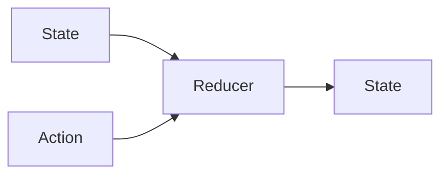

# Performance

Let’s think back to the fundamental role Reducers play in Redux and `ImmutableData`:

A Reducer maps a State and an Action to a new State. The State and Action values are *immutable*; it’s not the job of a Reducer to attempt to *modify* the State in-place. The job of a Reducer is to return a *new* State value.

Isn’t that slow? If the memory footprint of one State value is N bytes, does that imply that every time our Root Reducer runs we must copy all N bytes?

Let’s go back and learn a little more about the evolution of Flux and Redux, the evolution of Swift, and how some specialized data structures can improve the performance of our Reducers.

## TreeDictionary

The original Flux Architecture did not require Data Stores to contain only immutable data. Flux did not *require* mutable data models, but the common tutorials and examples were presented on mutable data models. An Action value would be dispatched to a Store, and a Store would perform an imperative mutation on a reference to a mutable data model: an Array or a Dictionary.[^1] Similar to Objective-C, the JavaScript standard library collections were reference types.

One year after Flux was announced, Lee Byron introduced the Immutable JS framework with some ambitious goals: adding immutable value semantics on JavaScript objects while *also* optimizing for performance.[^2]

Conventional wisdom might tell you that if you want to copy a Dictionary of N elements *by value*, you must copy N elements. This is linear time: the amount of space and time to perform a copy scales linearly with the amount of elements in the Dictionary. If a Dictionary contains N elements, and you wish to add one new element while *also* preserving the original Dictionary, you must copy N elements to construct a new Dictionary.

The insight of Immutable JS was to use HAMT data structures as the “backing store” of a new Immutable Dictionary type.[^3] This type followed value semantics: immutability was enforced as the type was built. What HAMTs delivered was *fast* performance: structural sharing gave product engineers a `O(log n)` operation to perform copies. At scale, this was a big improvement over the `O(n)` operation to copy all N elements of our Dictionary. Because our Immutable Dictionary follows values semantics, these two values are now independent: adding one new element to our copy does not mutate our original.

It was now possible to build Flux stores with Immutable Data without performing an `O(n)` operation on every Action that was dispatched to our Store. Redux took this one step further by *requiring* immutable data models in Stores.[^4] Immutable data improved predictability and testability: Reducers were pure functions without side effects. Immutable Data also gave Redux the opportunity to perform some performance optimizations: checking if two state values might have changed could now be performed with a reference equality check in constant time, as opposed to a value equality check in linear time.

Swift ships with first-class support for value types: structs and enumerations. In languages that were primarily object-oriented, adding value semantics to your application often meant adding new code on top of the language itself: Immutable JS brought value semantics to JavaScript collections and Remodel brought value semantics to Objective-C objects.[^5] In Swift, value semantics are provided by the language itself: we don’t need a library or framework.

In a Swift Reducer, we can transform a `Dictionary` and return a new `Dictionary`. These are value types: the original `Dictionary` is unchanged. The `Dictionary` provided by the Swift standard library will perform a `O(n)` operation to copy its values. To preserve value semantics while *also* optimizing performance, we would like a data structure similar to Immutable JS: an immutable Dictionary with a logarithmic operation to perform copies.

The [`Swift-Collections`][^6] repo is maintained by Apple engineers, but ships outside the Swift standard library. The `TreeDictionary` data structure from `Swift-Collections` is built from CHAMP data structures.[^7] Like the HAMT data structures in Immutable JS, the `TreeDictionary` data structure can perform copies in logarithmic time. Compared to linear time, this is a huge improvement when our State saves many values.

We built two sample products that save a `Dictionary` value in State: Our Animals product saved a `Dictionary` of `Category` values and a `Dictionary` of `Animal` values, and our Quakes product saved a `Dictionary` of `Quake` values. For the most part, migrating to `TreeDictionary` is easy; it’s not a 100-percent drop-in replacement, but it’s pretty close. The basic APIs for reading and writing values remain the same.

## CowBox

Let’s look a little deeper into the performance of `Dictionary`. Suppose we define a Reducer that performs an identity transform on State: this is a Reducer that returns its State parameter with no mutations. We might think this identity transformation is a copy operation: `O(n)` time.

Suppose we then need to perform an equality check: we need to test that our copy is equal to our original value. We might think this is an `O(n)` operation: we test for value equality by iterating through all N values in our `Dictionary`.

Swift Collections, including `Dictionary`, perform an important optimization: these are copy-on-write data structures. When we copy a collection value, we copy by reference. We share data between both copies. When we perform a mutation on a copy, we then copy by value. This implies that our Reducer that returns an identity transformation can return in constant time: to make a copy of a `Dictionary` containing N values, we only have to copy a pointer. To preserve value semantics, we “copy-on-write” before a mutation takes place; here is where the `O(n)` operation happens.[^8]

Copy-on-write data structures can also improve performance when checking for value equality. If two copy-on-write data structures point to the same data reference, these copy-on-write data structures must be equal by value: we can return `true` in constant time. Redux, which required data to be modeled with immutable data, used a similar technique to optimize performance. Testing if two substates of our Redux state could have changed can use a reference equality check in constant time. When we build our `ImmutableData` state from copy-on-write data structures, we can take advantage of a similar optimization: checking if two substates could have changed can check for reference equality, which is constant time.

Data structures like `Dictionary` and `TreeDictionary` implement copy-on-write, but the Swift language *itself* does not write that code for us. Engineers that need a copy-on-write data structure can write the code themselves to manage the object reference where data is stored.[^8] It’s not so bad, but it’s not so great, either.

The `Swift-CowBox` repo makes it easy to add copy-on-write semantics to custom Swift structs.[^9] The `CowBox` macros attach to your struct declaration. All the boilerplate to manage the copy-on-write data storage is written for you at compile time by `CowBox`. This means we not only get faster copying of our custom data models, we also get faster checking for value equality. This can all add up to big performance wins when building SwiftUI applications.[^10]

---

The `chapter-18` branch migrates `AnimalsState` and `QuakesState` to `TreeDictionary` and `CowBox`. Please reference this commit to see these data structures in action.

Are these data structures the right choice for your own products? It depends. `TreeDictionary` and `CowBox` can have legit performance improvements when dealing with large amounts of complex data models, but there are performance tradeoffs. For small amounts of simple data models, these advanced data structures might not help improve performance: the overhead of the data structure itself might be more expensive than the performance improvements.

If you plan to experiment with these data structures, our advice is to read the appropriate documentation to understand more about the performance tradeoffs. We also recommend measuring your performance with benchmarks. Measure CPU and memory before and after your migration to quantify how these data structures could be impactful in your own products.

[^1]: https://www.youtube.com/watch?v=i__969noyAM
[^2]: https://www.youtube.com/watch?v=I7IdS-PbEgI
[^3]: https://en.wikipedia.org/wiki/Hash_array_mapped_trie
[^4]: https://redux.js.org/faq/immutable-data
[^5]: https://engineering.fb.com/2016/04/13/ios/building-and-managing-ios-model-objects-with-remodel/
[^6]: https://github.com/apple/swift-collections
[^7]: https://github.com/apple/swift-collections/pull/31
[^8]: https://www.youtube.com/watch?v=m9JZmP9E12M
[^9]: https://github.com/Swift-CowBox/Swift-CowBox
[^10]: https://github.com/Swift-CowBox/Swift-CowBox-Sample
