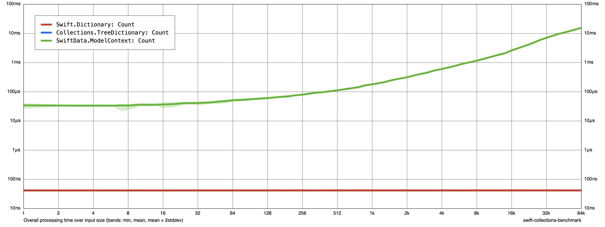
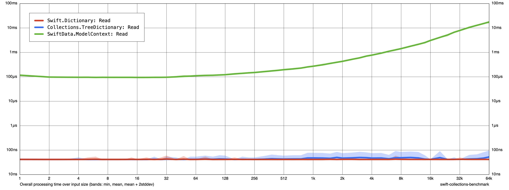
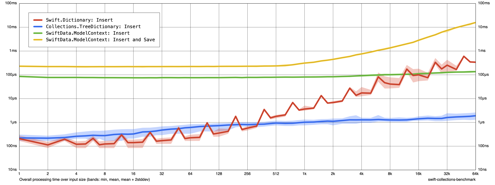
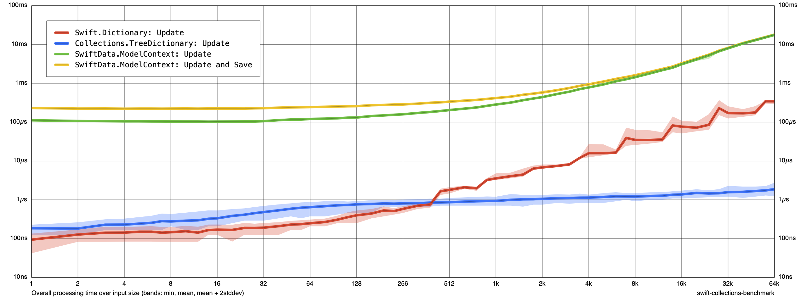
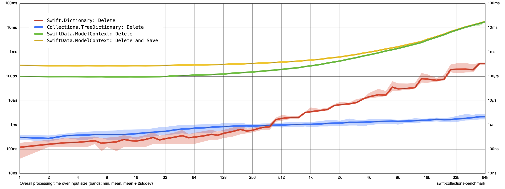
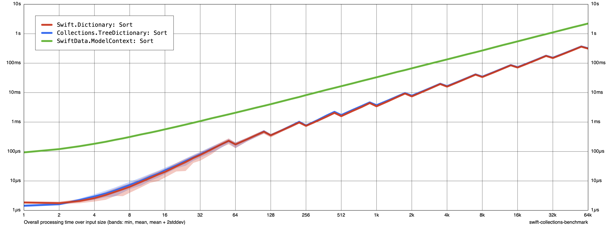

# Benchmarks

When we built our Quakes product, we saw how much faster the version built from `ImmutableData` was than the original version from Apple built on SwiftData. The original version not only performed expensive operations in SwiftData, those operations were blocking on `main`. Building from `ImmutableData` gave us a natural abstraction layer; the SwiftData operations to persist data on our filesystem could all take place asynchronously and concurrently without blocking `main`.

Our Reducer is still a synchronous operation, and this operation still blocks `main`, but the immutable data structures we use to model our state are *very* lightweight compared to building our state in a SwiftData `ModelContext`. This is even taking into account that our Reducer returns *copies* of immutable data; our Reducer does not mutate our state value in-place.

Let’s run some experiments to see for ourselves how efficient these immutable data structures are. We’re going to use two open-source repos for measuring benchmarks: [`CollectionsBenchmark`][^1] from Apple and [`Benchmarks`][^2] from Ordo One. If you’re not experienced with these repos, that’s ok. Running the benchmarks for yourself is optional. We’re going to focus this chapter on analyzing the results.

If you want to follow along with the benchmarks to see for yourself where these measurements came from, you can checkout the [`ImmutableData-Benchmarks`](https://github.com/Swift-ImmutableData/ImmutableData-Benchmarks) repo.

Our experiments will test three different data structure collections we could choose for the shared mutable state of our SwiftUI applications:

* `ModelContext`: This is a reference type from SwiftData. Our data model elements are also reference types.
* `Dictionary`: This is a value type from the Swift Standard Library. Our data model elements are also value types.
* `TreeDictionary`: This is a value type from the [`Swift-Collections`][^3] repo. Our data model elements are also value types.

Here is the data model element we use for testing `ModelContext`:

```swift
@Model final class ModelElement : Hashable {
  var a: Int64
  var b: Int64
  var c: Int64
  var d: Int64
  var e: Int64
  var f: Int64
  var g: Int64
  var h: Int64
  var i: Int64
  var j: Int64
}
```

Here is the data model element we use for testing `Dictionary` and `TreeDictionary`:

```swift
struct StructElement : Hashable {
  var a: Int64
  var b: Int64
  var c: Int64
  var d: Int64
  var e: Int64
  var f: Int64
  var g: Int64
  var h: Int64
  var i: Int64
  var j: Int64
}
```

Inspired by Jared Khan, these data models have a memory footprint of 80 bytes: ten times the width of one pointer on a 64-bit architecture.[^4]

Now that we defined three different data structure collections and the data model elements in those collections, we can define the operations we want to measure on those collections. We begin by constructing a collection of N elements. We then perform the following operations on that collection:

* We count the number of elements.
* We read one existing element.
* We insert one new element.
* We update one existing element.
* We delete one existing element.
* We sort all N elements.

We measure CPU and memory for every operation using `CollectionsBenchmark` and `Benchmarks`. To measure CPU, we run `CollectionsBenchmark` multiple times with increasing values of N. To measure memory, we run `Benchmarks` to measure the memory footprint when N is at our maximum.

## Count

Let’s start by creating a collection of N elements and then measuring the performance of returning its element count. Here are our results from `CollectionsBenchmark`:

<picture>
 
</picture>

`Dictionary` and `TreeDictionary` both return their element count in constant time: as the size of these collections grows, the time spent to count the elements stays about the same. This is great: this data structure scales well with large data.

`ModelContext` needs more time to return its element count, and this time grows linearly with the size of the collection. By the time our collection is 64k elements, we are spending literal *orders of magnitude* more time waiting.

Here is what CPU and memory look like from `Benchmarks` when our collection is 64k elements:

### Time (total CPU)

| Test                                                |      p0 |     p25 |     p50 |     p75 |     p90 |     p99 |    p100 | Samples |
|:----------------------------------------------------|--------:|--------:|--------:|--------:|--------:|--------:|--------:|--------:|
| Benchmarks:Collections.TreeDictionary: Count (μs) * |       2 |       3 |       3 |       3 |       3 |       7 |       7 |     100 |
| Benchmarks:Swift.Dictionary: Count (μs) *           |       3 |       3 |       4 |       4 |       4 |       8 |       8 |     100 |
| Benchmarks:SwiftData.ModelContext: Count (μs) *     |   18096 |   18235 |   18301 |   18399 |   18612 |   24969 |   25139 |     100 |

### Memory (resident peak)

| Test                                                |      p0 |     p25 |     p50 |     p75 |     p90 |     p99 |    p100 | Samples |
|:----------------------------------------------------|--------:|--------:|--------:|--------:|--------:|--------:|--------:|--------:|
| Benchmarks:Collections.TreeDictionary: Count (M)    |      23 |      33 |      33 |      33 |      33 |      33 |      33 |     100 |
| Benchmarks:Swift.Dictionary: Count (M)              |      14 |      32 |      32 |      32 |      32 |      32 |      32 |     100 |
| Benchmarks:SwiftData.ModelContext: Count (M)        |     240 |    1050 |    1886 |    2722 |    3221 |    3513 |    3555 |     100 |

The memory footprint of `Dictionary` and `TreeDictionary` is the same: about 32MB. The memory footprint of `ModelContext` is over an order of magnitude larger: the median memory footprint from our sample size of 100 is over 1800MB.

## Read

Let’s create a collection of N elements and then measure the performance of reading one element. Here are our results from `CollectionsBenchmark`:

<picture>
 
</picture>

`Dictionary` and `TreeDictionary` both return the element in constant time. There does look to be a little more “noise” from `TreeDictionary` at large values of N, but we don’t see a linear growth as N scales.

`ModelContext` needs more time to return its element, and this time grows linearly with the size of the collection. Similar to our operation to count elements, we are spending orders of magnitude more time waiting at large values of N.

Here is what CPU and memory look like from `Benchmarks` when our collection is 64k elements:

### Time (total CPU)

| Test                                               |      p0 |     p25 |     p50 |     p75 |     p90 |     p99 |    p100 | Samples |
|:---------------------------------------------------|--------:|--------:|--------:|--------:|--------:|--------:|--------:|--------:|
| Benchmarks:Collections.TreeDictionary: Read (μs) * |       2 |       3 |       3 |       3 |       3 |       6 |       6 |     100 |
| Benchmarks:Swift.Dictionary: Read (μs) *           |       3 |       3 |       4 |       4 |       4 |      10 |      11 |     100 |
| Benchmarks:SwiftData.ModelContext: Read (μs) *     |   20115 |   20234 |   20316 |   20464 |   20660 |   24150 |   27103 |     100 |

### Memory (resident peak)

| Test                                               |      p0 |     p25 |     p50 |     p75 |     p90 |     p99 |    p100 | Samples |
|:---------------------------------------------------|--------:|--------:|--------:|--------:|--------:|--------:|--------:|--------:|
| Benchmarks:Collections.TreeDictionary: Read (M)    |      23 |      33 |      33 |      33 |      33 |      33 |      33 |     100 |
| Benchmarks:Swift.Dictionary: Read (M)              |      14 |      32 |      32 |      32 |      32 |      32 |      32 |     100 |
| Benchmarks:SwiftData.ModelContext: Read (M)        |     241 |    1055 |    1892 |    2720 |    3228 |    3519 |    3568 |     100 |

This looks similar to our operation to count elements. Our total memory footprint for these collections remains about the same.

## Insert

Let’s create a collection of N elements and then measure the performance of inserting one new element. Here are our results from `CollectionsBenchmark`:

<picture>
 
</picture>

Here is where things start to get interesting. Let’s start with `Dictionary`. Our `Dictionary` is a value type. Our Reducer transforms our global state by returning a *new* immutable value. As discussed in our previous chapter, we can expect `Dictionary` to perform a linear amount of work when we perform a copy with a mutation applied: we “copy-on-write” all N elements to construct a new value.

We see much better results from `TreeDictionary`. As discussed in our previous chapter, `TreeDictionary` is a value type that uses HAMT data structures. This means that performing a copy with a mutation applied performs `O(log n)` work. At small values of N, it does look like we pay a small performance penalty for `TreeDictionary`, but this overhead is worth it by the time our collection is 512 elements. By the time our collection is 64k elements, our `TreeDictionary` is performing its operation orders of magnitude faster than `Dictionary`.

We measure two different operations for `ModelContext`: the operation to insert a new element *without* saving, and the operation to insert a new element *with* saving. The operation to insert without saving is constant time. At small values of N, this operation is orders of magnitude slower than `Dictionary` and `TreeDictionary`. At large values of N, it looks like the `O(n)` operation in `Dictionary` begins to catch up: `ModelContext` performs faster when our collection is 64k elements. `TreeDictionary` grows with N, but it grows logarithmically: at 64k elements, `TreeDictionary` is performing its operation orders of magnitude faster than `ModelContext`.

Where `ModelContext` begins to slow down is when we insert a new element and then save our context. This becomes a `O(n)` operation starting at about 512 elements. By the time our collection is 64k elements, `ModelContext` is an order of magnitude slower than `Dictionary`.

Here is what CPU and memory look like from `Benchmarks` when our collection is 64k elements:

### Time (total CPU)

| Test                                                      |      p0 |     p25 |     p50 |     p75 |     p90 |     p99 |    p100 | Samples |
|:----------------------------------------------------------|--------:|--------:|--------:|--------:|--------:|--------:|--------:|--------:|
| Benchmarks:Collections.TreeDictionary: Insert (μs) *      |       3 |       3 |       3 |       4 |       6 |       8 |      10 |     100 |
| Benchmarks:Swift.Dictionary: Insert (μs) *                |     891 |     928 |     936 |     947 |     961 |     988 |     993 |     100 |
| Benchmarks:SwiftData.ModelContext: Insert (μs) *          |     146 |     165 |     282 |     307 |     349 |     372 |     378 |     100 |
| Benchmarks:SwiftData.ModelContext: Insert and Save (μs) * |   18317 |   18629 |   18727 |   18891 |   19284 |   25992 |   25992 |     100 |

### Memory (resident peak)

| Test                                                      |      p0 |     p25 |     p50 |     p75 |     p90 |     p99 |    p100 | Samples |
|:----------------------------------------------------------|--------:|--------:|--------:|--------:|--------:|--------:|--------:|--------:|
| Benchmarks:Collections.TreeDictionary: Insert (M)         |      23 |      30 |      30 |      30 |      30 |      30 |      30 |     100 |
| Benchmarks:Swift.Dictionary: Insert (M)                   |      14 |      35 |      35 |      39 |      39 |      39 |      39 |     100 |
| Benchmarks:SwiftData.ModelContext: Insert (M)             |     254 |    1209 |    2202 |    3196 |    3794 |    4148 |    4185 |     100 |
| Benchmarks:SwiftData.ModelContext: Insert and Save (M)    |     241 |    1044 |    1879 |    2716 |    3215 |    3525 |    3558 |     100 |

Our `TreeDictionary` uses HAMT data structures and structural sharing. In addition to saving time, this also saves memory compared to a data structure like `Dictionary` that copies all N values when returning a new copy with a mutation applied.

## Update

Let’s create a collection of N elements and then measure the performance of updating one existing element. Here are our results from `CollectionsBenchmark`:

<picture>
 
</picture>

This looks similar to what we saw in our previous operation, except that updating an existing element in `ModelContext` is a `O(n)` operation *before* the save operation takes place. `Dictionary` is still a `O(n)` operation. `TreeDictionary` still performs best at large values of N.

Here is what CPU and memory look like from `Benchmarks` when our collection is 64k elements:

### Time (total CPU)

| Test                                                      |      p0 |     p25 |     p50 |     p75 |     p90 |     p99 |    p100 | Samples |
|:----------------------------------------------------------|--------:|--------:|--------:|--------:|--------:|--------:|--------:|--------:|
| Benchmarks:Collections.TreeDictionary: Update (μs) *      |       4 |       4 |       4 |       5 |       7 |       9 |      10 |     100 |
| Benchmarks:Swift.Dictionary: Update (μs) *                |     912 |     942 |     961 |     975 |     998 |    1141 |    1236 |     100 |
| Benchmarks:SwiftData.ModelContext: Update (μs) *          |   20081 |   20349 |   20431 |   20595 |   20922 |   27410 |   27523 |     100 |
| Benchmarks:SwiftData.ModelContext: Update and Save (μs) * |   20481 |   20660 |   20742 |   20873 |   21119 |   27820 |   28453 |     100 |

### Memory (resident peak)

| Test                                                      |      p0 |     p25 |     p50 |     p75 |     p90 |     p99 |    p100 | Samples |
|:----------------------------------------------------------|--------:|--------:|--------:|--------:|--------:|--------:|--------:|--------:|
| Benchmarks:Collections.TreeDictionary: Update (M)         |      23 |      33 |      33 |      33 |      33 |      33 |      33 |     100 |
| Benchmarks:Swift.Dictionary: Update (M)                   |      14 |      43 |      43 |      43 |      43 |      43 |      43 |     100 |
| Benchmarks:SwiftData.ModelContext: Update (M)             |     252 |    1217 |    2210 |    3213 |    3802 |    4163 |    4199 |     100 |
| Benchmarks:SwiftData.ModelContext: Update and Save (M)    |     249 |    1043 |    1888 |    2716 |    3223 |    3515 |    3559 |     100 |

The memory usage looks similar to our previous results.

## Delete

Let’s create a collection of N elements and then measure the performance of deleting one existing element. Here are our results from `CollectionsBenchmark`:

<picture>
 
</picture>

This looks similar to what we saw in our previous operation: `ModelContext` and `Dictionary` both grow linearly and `TreeDictionary` performs best at large values of N.

Here is what CPU and memory look like from `Benchmarks` when our collection is 64k elements:

### Time (total CPU)

| Test                                                      |      p0 |     p25 |     p50 |     p75 |     p90 |     p99 |    p100 | Samples |
|:----------------------------------------------------------|--------:|--------:|--------:|--------:|--------:|--------:|--------:|--------:|
| Benchmarks:Collections.TreeDictionary: Delete (μs) *      |       4 |       4 |       4 |       5 |       7 |      10 |      19 |     100 |
| Benchmarks:Swift.Dictionary: Delete (μs) *                |     908 |     923 |     935 |     947 |     960 |    1000 |    1130 |     100 |
| Benchmarks:SwiftData.ModelContext: Delete (μs) *          |   19293 |   20283 |   20349 |   20464 |   20726 |   27640 |   28067 |     100 |
| Benchmarks:SwiftData.ModelContext: Delete and Save (μs) * |   16519 |   20775 |   20873 |   21021 |   21299 |   27460 |   27549 |     100 |

### Memory (resident peak)

| Test                                                      |      p0 |     p25 |     p50 |     p75 |     p90 |     p99 |    p100 | Samples |
|:----------------------------------------------------------|--------:|--------:|--------:|--------:|--------:|--------:|--------:|--------:|
| Benchmarks:Collections.TreeDictionary: Delete (M)         |      23 |      32 |      33 |      33 |      33 |      33 |      33 |     100 |
| Benchmarks:Swift.Dictionary: Delete (M)                   |      14 |      36 |      40 |      40 |      40 |      40 |      40 |     100 |
| Benchmarks:SwiftData.ModelContext: Delete (M)             |     254 |    1218 |    2212 |    3204 |    3804 |    4159 |    4201 |     100 |
| Benchmarks:SwiftData.ModelContext: Delete and Save (M)    |     248 |    1069 |    1914 |    2741 |    3238 |    3542 |    3571 |     100 |

The memory usage looks similar to our previous results.

## Sort

Let’s create a collection of N elements and then measure the performance of sorting all elements. Here are our results from `CollectionsBenchmark`:

<picture>
 
</picture>

Sorting is an `O(n log n)` operation. We expect this to grow as the size of our collection grows. We do seem to notice that sorting `Dictionary` and `TreeDictionary` values seems to return an order of magnitude faster than performing a sorted fetch on a `ModelContext`.

Here is what CPU and memory look like from `Benchmarks` when our collection is 64k elements:

### Time (total CPU)

| Test                                               |      p0 |     p25 |     p50 |     p75 |     p90 |     p99 |    p100 | Samples |
|:---------------------------------------------------|--------:|--------:|--------:|--------:|--------:|--------:|--------:|--------:|
| Benchmarks:Collections.TreeDictionary: Sort (μs) * |  335467 |  336331 |  336331 |  336855 |  337117 |  337904 |  339169 |     100 |
| Benchmarks:Swift.Dictionary: Sort (μs) *           |  326249 |  327680 |  328204 |  328729 |  328991 |  329777 |  330451 |     100 |
| Benchmarks:SwiftData.ModelContext: Sort (μs) *     | 2229116 | 2254438 | 2267021 | 2271216 | 2279604 | 2321547 | 2338431 |     100 |

### Memory (resident peak)

| Test                                               |      p0 |     p25 |     p50 |     p75 |     p90 |     p99 |    p100 | Samples |
|:---------------------------------------------------|--------:|--------:|--------:|--------:|--------:|--------:|--------:|--------:|
| Benchmarks:Collections.TreeDictionary: Sort (M)    |      27 |      36 |      36 |      36 |      37 |      37 |      37 |     100 |
| Benchmarks:Swift.Dictionary: Sort (M)              |      34 |      34 |      34 |      34 |      34 |      34 |      34 |     100 |
| Benchmarks:SwiftData.ModelContext: Sort (M)        |     336 |    1165 |    2015 |    2844 |    3341 |    3645 |    3672 |     100 |

It’s difficult to make a strong judgement about memory usage of `ModelContext` when sorting compared to memory usage of `ModelContext` when inserting or updating. If you wanted to measure more closely, you could experiment with increasing the sample size to see if you can control for any noise in our measurements. What we’re most concerned about is that our immutable data structures — `Dictionary` and `TreeDictionary` — consume orders of magnitude less memory than `ModelContext`.

---

Our original and primary goal when choosing `ImmutableData` instead of SwiftData was semantics. Building SwiftUI directly on SwiftData means our mental model for managing state is imperative and our data models are mutable. Building SwiftUI directly on `ImmutableData` means our mental model for managing state is declarative and our data models are immutable.

If `ImmutableData` gave us value semantics and a declarative programming model, the argument could be made we would prefer `ImmutableData` *even if* SwiftData offered better performance. If `ImmutableData` gives us values semantics, a declarative programming model, *and* better performance than SwiftData, we can strongly recommend this architecture for your own products and teams.

[^1]: https://github.com/apple/swift-collections-benchmark
[^2]: https://github.com/ordo-one/package-benchmark
[^3]: https://github.com/apple/swift-collections
[^4]: https://jaredkhan.com/blog/swift-copy-on-write#many-structs
